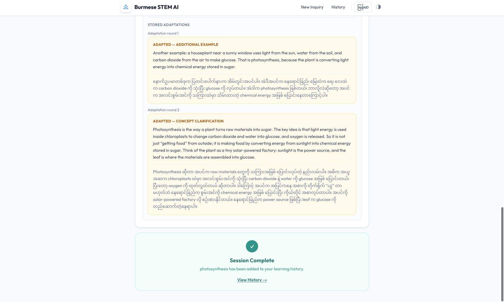

# Step 17 — Photosynthesis design artefact scenario

Status: **Completed with qualifications**, 3 October 2026 (Pacific/Auckland).
Technical workflow and recorded boundary checks passed. Content adequacy is
only partially supported by provisional AI-assisted inspection. This is not
a participant study, independent expert assessment, or learning-gain result.

## 1. Identity and execution boundary

| Field | Recorded value |
| --- | --- |
| Method / run | DA-SCN / `RUN-B01-20261003-SCENARIO-02` |
| Evidence | E042 report; E043 recorded-evidence verification; E044 manifest |
| Governing instructions | [Protocol §9](../../00_protocol/evaluation_protocol.md#9-end-to-end-photosynthesis-scenario), master plan §26 |
| Production baseline | B01, commit `37faefa236829aa3d79e023faa1fb72a086b5c2a`; actual root `burmese_stem_ai`, not a copied checkout |
| HEAD at execution | `54cc1881e00e41a6344a4aa6a533624cf4b86cc5`; existing Step 16 documentation changes retained |
| Build | Existing root production build `IcyjNSC9EIpEI8VngSibk`; no rebuild or source fix during this scenario |
| Start / end | 2026-10-03 11:43:50.702 / 11:49:44.945 NZDT; UTC timestamps retained in metadata |
| Runtime | Node v26.4.0; npm 11.17.0; MongoDB 8.2.6; Next.js 16.3.4 |
| Browser | Chrome 154.0.8037.97, actual viewport 1654 × 992; no viewport override; English UI / light theme |
| Preferences | `supportLanguage=bilingual`, `explanationLevel=beginner`, `learningStyle=guided`; full snapshot includes `uiLanguage=en`, `theme=light` |
| Model | Configured `gpt-5.4-mini`; provider-reported `gpt-5.4-mini-2026-03-17` in all five responses |
| Provider boundary | Live requests forwarded unchanged; strict JSON schema, `store=false`, configured 20,000 ms timeout, no automatic retry or fixture substitution |
| Persistence | New empty, loopback-only `burmese_scenario_test` database; dedicated artificial learner, exported as `SCENARIO-LEARNER-01` |
| Scope | Public HTTP including identity proxy, real services/DAOs/MongoDB, browser rendering and navigation; three clearly separated API-only boundary actions |
| Integrity | 66 recorded production file hashes unchanged before/after; lock/prompts/schema identities in metadata; zero source checkouts copied |

The exact protocol **at execution** is retained in the raw directory. Later
navigation/status updates do not overwrite its hash or acceptance criteria.
The recording seam observes requests, responses and storage. It does not
choose routes or replace provider content. Requests were made sequentially.
Provider counts are direct observations, not inferred from response speed.

## 2. Evidence guide

All formal run files are under
[raw/RUN-B01-20261003-SCENARIO-02](raw/RUN-B01-20261003-SCENARIO-02/).

- [metadata.json](raw/RUN-B01-20261003-SCENARIO-02/metadata.json): environment, full production identities, protocol/reference hashes, worktree and times.
- [http.jsonl](raw/RUN-B01-20261003-SCENARIO-02/http.jsonl): 18 numbered public HTTP records with exact submitted bodies, responses, elapsed time and provider counts. No authentication/cookie headers exported.
- [provider.jsonl](raw/RUN-B01-20261003-SCENARIO-02/provider.jsonl): five exact non-secret generation contracts and provider responses, including returned text, model version and usage. Authorization is never logged.
- [state.jsonl](raw/RUN-B01-20261003-SCENARIO-02/state.jsonl): post-request storage snapshots keyed by HTTP request ID.
- [database_snapshot.json](raw/RUN-B01-20261003-SCENARIO-02/database_snapshot.json): final stored state.
- [browser_observations.jsonl](raw/RUN-B01-20261003-SCENARIO-02/browser_observations.jsonl): 24 timestamped observations with accessibility content and URLs, plus matching `SCN-*-accessibility.txt` files.
- [screenshots](raw/RUN-B01-20261003-SCENARIO-02/screenshots/): 24 viewport JPEGs and three supplementary full-page JPEGs. They are views of the same scenario, not 27 independent evaluations.
- [verification.json](raw/RUN-B01-20261003-SCENARIO-02/verification.json): 15 recorded-evidence checks, 15 Pass / 0 Fail. This is reanalysis of the captured run, not a fresh Vitest/application execution.
- [manifest.sha256](raw/RUN-B01-20261003-SCENARIO-02/manifest.sha256): report, raw records, scripts, preserved preflights, selected reference inputs and actual root production identities.

### Preflights and recorder corrections

The sandbox-only [startup attempt](raw/aborted_startup_01/README.md) failed to
allocate a local port (`EPERM`) before any server or provider execution.
The separately retained [preflight run 01](raw/RUN-B01-20261003-SCENARIO-01/README.md)
revealed that a recorder `data` listener consumed the Preferences request
before Next could read it. That evaluation defect was fixed in the recorder;
preflight had zero model calls and no session. It is excluded from application
pass/fail conclusions. The formal run began with an empty isolated database.

Early formal screenshots were initially saved to the preflight folder by a
helper's retained directory binding. They were moved by their observed formal
URL without changing their bytes. [capture_relocation.json](raw/RUN-B01-20261003-SCENARIO-02/capture_relocation.json)
records that repair and an incorrect action-label correction. The initial
preflight preference screenshot was overwritten, so only its original textual
observation survives; it is not claimed as complete screenshot evidence.

The [first verifier result](raw/RUN-B01-20261003-SCENARIO-02/verification_attempt_01.json)
had one incorrect expectation for a nonexistent `limitReached` API field.
The [correction](raw/RUN-B01-20261003-SCENARIO-02/verification_correction.md)
checks B01's actual cap contract. The original result is retained. No
application input, output, storage or production source was changed to pass.

## 3. Expected and actual scenario actions

“Pass” below means the stated technical observation passed. It does not
certify STEM correctness, Burmese naturalness, or educational benefit.
Content qualifications are separate in §5.

| Action / case | Expected | Actual and evidence | Assessment |
| --- | --- | --- | --- |
| A / SCN-A | Save Burmese support with useful English retention, beginner explanation and full preferences | `Burmese + English Terms`, Beginner, Guided inspected in SCN-A01; HTTP 2 PATCH 200. Session snapshot and final profile match exactly | Technical Pass |
| B / SCN-B | Submit unchanged inquiry; identify concept/context with one generation | Exact input: `What is photosynthesis, and how do plants make food?`; HTTP 3 POST 201; `photosynthesis` / `plant biology`; one live call; fresh round 0 | Technical Pass; SCN-B01/B02/C01 |
| C / SCN-C | Four initial sections plus revealable Hint, bilingual content | Simple, real-world, technical and reflection sections present; Show Hint revealed bilingual text in SCN-C02. All five fields retained in HTTP 3 and storage | Structure Pass; content Partial (§5) |
| D / SCN-D | Medium → optional Stage 6B skip → default another example; persist 0 → 1 | SCN-D01 shows five choices and skip; HTTP 5 body has `overallSupportNeed=medium`, no difficulty; route `stage_5_scaffold`, support `another_example`, one call/event/adaptation, `in_progress`; SCN-D03 | Technical Pass; example novelty limited |
| E / SCN-E | Needs Support + concept_unclear → revised core meaning and scaffold, 1 → 2 | HTTP 6; `concept_clarification`; one call, second event/adaptation, `review_recommended`. Solar-powered-factory analogy and explicit making-versus-taking-food contrast; SCN-E01–E04 | Technical Pass; provisional content qualifications retained |
| Cap UI observation | Show limit feedback and prevent another generated round | SCN-E04 shows `Maximum support provided` and `Finish for Now`; no Stage 6A response choices at round 2 | Pass for bounded UI; extra response unavailable in UI |
| SCN-CAP-API-01 | Separately test further support request at cap: event only, no round 3 | HTTP 7 / separate API file: Needs Support, `stage_5_scaffold`, null adaptation, 2 → 2, third event, `review_recommended`, zero provider calls; original two adaptations unchanged | API-only Pass; not a UI action |
| F / SCN-F | Choose High at cap only if offered; otherwise record limitation | High **not offered** by round-2 UI. No High learner click invented. API-only branch below was then performed; reload SCN-F01 reconstructs it | UI action Not applicable / unavailable |
| SCN-FADE-API-01 | High fades with no generation/increment; explicit Finish still necessary | HTTP 8 / separate API file: `fade`, fourth event 2 → 2, null adaptation, `understanding=high`, `status=in_progress`, zero calls. SCN-F01 displays `Finish Learning` | API-only Pass; not completion or objective mastery |
| G / SCN-G | Ask fixed relevant follow-up; use current concept/latest support | Exact question: `Why do plants need sunlight for photosynthesis?`; HTTP 10 / provider call 4; answer returned 200 in both languages, one stored follow-up. Input contains active concept, round-2 scaffold, latest route `fade`, original snapshot; SCN-G01/G02 | Technical Pass; single-question content observation only |
| H / SCN-H | Unrelated gravity question must not replace topic or become general chat | Exact question: `How does gravity work?`; HTTP 11 returns 422 `FOLLOW_UP_OUT_OF_SCOPE`, `newSessionRecommended=true`, one scope-classification call. Entire stored session unchanged; follow-up count stays 1, not 2; SCN-H01/H02 | Controlled outcome Pass |
| I / SCN-I | History exposes concept/domain, self-reported support and status | HTTP 12 has one owned session; SCN-I01 shows photosynthesis / plant biology / No support needed / In Progress / Resume. After Finish, HTTP 15 and SCN-I02 show Completed / Review | Technical Pass; one-session ordering/scoping observation only |
| J / SCN-J | Resume unchanged session, Finish explicitly, reopen completed Review | HTTP 13 retrieves exact persisted fields before Finish. HTTP 14 PATCH `status=completed` has zero calls. HTTP 16/18 and SCN-J01/J03/J04/J05 retain both adaptations, four events and relevant follow-up | Technical Pass |
| SCN-COMPLETED-API-01 | Reject a post-completion response without mutation/generation | HTTP 17 returns 409 `SESSION_RESPONSE_CONFLICT`; full document unchanged and zero provider calls. UI has no response choices, so this is separately labelled API evidence | API-only Pass |

The separately identified API branches deliberately contribute responses 3 and
4 to the same session so reconstruction can be observed. They are not passed
off as learner browser actions. No alternative question, seeded learning
session, changed preference, retry, or corrected generated text was used.

### State and provider-call trail

| HTTP ID / operation | Round | Events | Adaptations | Stored follow-ups | Status | New provider calls |
| --- | ---: | ---: | ---: | ---: | --- | ---: |
| 3 initial | 0 | 0 | 0 | 0 | in_progress | 1 |
| 5 Medium / skip | 1 | 1 | 1 | 0 | in_progress | 1 |
| 6 Needs Support / concept_unclear | 2 | 2 | 2 | 0 | review_recommended | 1 |
| 7 capped support, API only | 2 | 3 | 2 | 0 | review_recommended | 0 |
| 8 High / fade, API only | 2 | 4 | 2 | 0 | in_progress | 0 |
| 10 relevant follow-up | 2 | 4 | 2 | 1 | in_progress | 1 |
| 11 unrelated follow-up rejected | 2 | 4 | 2 | 1 | in_progress | 1 |
| 13 Resume | 2 | 4 | 2 | 1 | in_progress | 0 |
| 14 explicit Finish | 2 | 4 | 2 | 1 | completed | 0 |
| 16 Review | 2 | 4 | 2 | 1 | completed | 0 |
| 17 completed response rejected | 2 | 4 | 2 | 1 | completed | 0 |

Final session UUID: `a62cb72b-eb3f-4538-a74a-74ee467834d7`. This identifies
synthetic evidence, not a real participant. Session UUIDs are retained;
learner identity/cookie values are not exported.

Server request-to-response observations were approximately 4,174 ms initial,
2,932 ms first adaptation, 2,402 ms second adaptation, 2,480 ms relevant
follow-up and 1,390 ms unrelated classification. These are single sequential
operation observations, not pooled latency statistics, SLA passes or another
performance experiment. All five live requests returned HTTP 200 from the
provider, with no transport failure or timeout observed.

## 4. Seven-stage trace and conceptual comparison

| Framework stage | Observed implementation | Boundary |
| --- | --- | --- |
| 1 terminology | Initial output identifies photosynthesis | Not a deterministic ATE algorithm or an extraction-accuracy benchmark |
| 2 context | `plant biology`; inquiry and follow-ups retain plant-food context | One unambiguous inquiry; ambiguity/correction routes not exercised here |
| 3 language strategy | Both `en`/`my` generated and rendered, English STEM terms retained | Exact selection rationale not externally observable; over-retention remains possible |
| 4 concept meaning | Initial simple/technical meaning; concept clarification revises meaning | Structured acceptance is not scientific certification |
| 5 scaffolding | Real-world example, reflection and hint; another example; analogy | First adaptation changes setting but repeats much of the original mechanism |
| 6A / 6B learner response | Medium/Needs Support buttons followed by optional bounded help choices or skip | Scripted self-reports; no real learner understanding measured |
| 7 adaptation | Application-selected routes, persisted round/event transitions, capped/fade branches | High at round 2 unavailable in UI; server behaviour tested separately |

The [conceptual walkthrough](../../01_conceptual/scenario/photosynthesis_scenario.md)
remains a distinct historical CA-SCN artefact. It used supplied session
content and did not establish the exact feedback trigger. This fresh DA-SCN
run records the Medium/skip and Needs Support/concept_unclear requests and
provider counts directly. Its exact generated outputs are different evidence;
they do not replace the original walkthrough or retroactively resolve its
unobserved learner actions. Same topic/framework does not make these sources
statistically independent datasets.

The bounded follow-up, History and lifecycle screens support the seven-stage
interaction. They do not constitute an eighth stage or unrestricted chat.
The stage-responsibility and theory rationale remains in
[Step 16's literature-grounded argument](../informed_argument/traceability.md).

## 5. Provisional content observations

These observations are **Codex analysis**, not Nathan's review, signature,
native-speaker certification, or a fresh independent expert judgement. The
earlier simulation endorsement concerns earlier simulation outputs, not this
newly generated session. No human scores or approvals are invented here.

The [frozen content reference notes](../simulation/content_reference_notes.md),
SIM-REFERENCES-01 / SIM01 / R01, were hashed before generation. Their expected
plant-level inputs, carbohydrate production, energy conversion and oxygen
release remain unchanged. R01 was reopened on 3 October to check the saved
text. One **post-generation supplemental source**, SCN-R02, is explicitly
recorded below; it is not silently added to the frozen reference set.

| Observation | Recorded rationale | Qualification |
| --- | --- | --- |
| SCN-CQ01 initial meaning | Both languages describe plants making food and converting light to stored chemical energy; oxygen appears in the technical section. Root water uptake is separate from taking food from soil | Introductory glucose shorthand is acceptable only at this stated scope; the biochemical pathway is more complex (R01) |
| SCN-CQ02 technical scope | Initial English and Burmese technical paragraphs mention plants, algae and bacteria immediately before chloroplast-based reactions without restricting the latter to plants/algae | This wording can imply that photosynthetic bacteria also have chloroplasts. Bacteria are prokaryotes without membrane-bound organelles (SCN-R02). This is a **scope-clarity concern**, not an assertion that the text explicitly states bacteria have chloroplasts. Content receives no unconditional Pass |
| SCN-CQ03 adaptation difference | Round 1 changes a green-leaf example to a houseplant at a sunny window, but largely repeats the same inputs/glucose/energy account. Round 2 adds the making-versus-taking-food contrast and a solar-powered-factory analogy | First-example novelty is limited despite different strings. The analogy distinguishes power source and raw materials, but is not a detailed explanation of biological mechanisms or proof of improved comprehension |
| SCN-CQ04 Burmese/English balance | Burmese sentence structure carries the main explanation; useful technical terms include photosynthesis, carbon dioxide, glucose and chloroplast(s). Visible Unicode rendering is readable at this desktop size | Nontechnical English also remains: root, leaf, air, water, input, raw materials and power source. Chemical energy is central but not explicitly paired with a Burmese definition. Selectivity and beginner readability are only partially supported; exact naturalness/fidelity requires qualified judgement |
| SCN-CQ05 relevant follow-up | Both languages answer sunlight's role as an energy source and connect it to sugar production; saved answer remains concept-scoped | Natural sunlight is used in this scenario, not a claim that artificial light can never support photosynthesis. One answer cannot establish general scope-classification accuracy |

Examples were inspected in the saved bilingual payloads and screenshots.
No translation, prompt or output was edited. No claim is made about learner
gain, optimality of two rounds, mastery after High, all STEM domains, mobile
behaviour, or participant usability.

### Source locators and additions

- **R01, frozen benchmark rechecked**: Clark, M. A., Douglas, M., & Choi, J. (2018). *Biology 2e*, §8.1, Main Structures and Summary of Photosynthesis / Basic Photosynthetic Structures / The Two Parts of Photosynthesis. [OpenStax original section](https://openstax.org/books/biology-2e/pages/8-1-overview-of-photosynthesis). Reaccessed 3 October 2026. Supports plant inputs/products, energy conversion and the qualified introductory summary.
- **SCN-R02, supplemental after-generation check**: Clark, M. A., Douglas, M., & Choi, J. (2018). *Biology 2e*, §4.2, Components of Prokaryotic Cells. [OpenStax original section](https://openstax.org/books/biology-2e/pages/4-2-prokaryotic-cells). Accessed 3 October 2026. Supports the bacteria/organelles distinction used to flag SCN-CQ02; not a new frozen marking rule or Burmese glossary.

If human content review is subsequently added, record it as a separate dated
addendum/evidence ID rather than replacing this captured report:

- Reviewer name/date: ____________________
- Relevant STEM / English / Burmese competence: ____________________
- Initial support judgement and rationale: ____________________
- Round-1 / round-2 judgement and rationale: ____________________
- Burmese terminology, English retention and follow-up judgement: ____________________
- Sources consulted and amendments: ____________________

## 6. U1–U9 and deviations

These are scenario-specific observations, not a replacement U1–U9 study.
The earlier [structured usability inspection](../usability/usability_inspection.md)
and its six Pass / three Partial outcomes remain unchanged.

| Criterion | This scenario observation / evidence | Limit |
| --- | --- | --- |
| U1 task clarity | Labelled STEM inquiry and fixed question visible on Home, SCN-B01 | One concept/identity, desktop only |
| U2 information structure | Simple/example/technical/reflection sections, revealed Hint and separately labelled adaptations, SCN-C01/C02/J05 | Structure is not content-quality certification |
| U3 response workflow | Medium → optional choices → skip; Needs Support → selected concept difficulty, SCN-D01/E02 | Not every Stage 6B route; High at cap unavailable |
| U4 feedback visibility | Preparing explanation/support/answer, returned adaptations, cap feedback and completion captured, SCN-B02/D02/E03/E04/G01/J03 | No provider-failure Retry path exercised |
| U5 navigation consistency | Preferences modal save, History, Resume and Review reached without a dead end, SCN-A01/I01/I02/J01/J04 | Modal focus, cross-device and full keyboard navigation not re-tested |
| U6 bilingual readability | Both language payloads visibly rendered with mixed English terms, SCN-C01/C02/J05 | Desktop glyph observation only; content judgement separate in SCN-CQ04; no mobile inspection |
| U7 state visibility | Both stored adaptations and four self-reported route/round events visible in Resume/Review, SCN-E04/F01/J01/J05 | Hint disclosure resets to Show Hint after reload; stored content intact. API-only capped event labels the selected route Additional scaffold despite no new adaptation; 2 → 2 records the bound |
| U8 error clarity | Safe out-of-scope message recommends a new session without mutation, SCN-H02 | Provider/DB failure recovery, Burmese UI errors and Retry not re-exercised. Rejected question remains in input until navigation, not stored as another follow-up |
| U9 consistency | Shared navigation, self-report labels and Resume-versus-Review lifecycle pattern observed in English/light UI, SCN-I01/I02/J04 | Other locales/themes, mobile, screen-reader and full keyboard matrix not re-tested; existing §18.1 qualifications retained |

The known preferences focus and Burmese-locale error issues were not fixed or
claimed retested here. Instrumentation/verification errors in §2 are retained
separately from application outcomes.

## 7. Answers to the nine scenario evaluation questions

1. **Important stages implemented?** All seven responsibilities can be traced in this executed example; language selection logic is partly unobservable and High-at-cap is not a browser action.
2. **Language strategy matched?** Bilingual presentation and retained technical terms are demonstrated; beginner-friendly selectivity remains Partial.
3. **Structured explanation?** Yes technically: four initial sections and a revealed Hint, plus two stored adaptations.
4. **Response changes support?** Yes: default example then concept clarification. This demonstrates routing/content change, not learner improvement; first adaptation novelty is limited.
5. **Bounded?** Yes in this run: 0 → 1 → 2, then two 2 → 2 events and no third generation. Cap/fade are separate API checks.
6. **Follow-up scoped?** Yes for these fixed two questions: one answer saved, unrelated gravity rejected without session mutation.
7. **State preserved?** Yes for persisted content/preferences/concept/routes/round/follow-up across reload, Resume, Finish and Review; transient hint disclosure/draft/error state is not asserted to persist.
8. **Framework elements missing?** No missing numbered stage identified in this case. UI High at cap is unavailable; qualified content adequacy and learner benefit are not established.
9. **Untraceable implemented features?** No new stage was needed. Preferences, History and bounded follow-up are supporting implementation features already justified in Step 16, not separate learning-efficacy evidence.

## 8. Conclusion and next action

The fresh live-provider scenario demonstrates an executable, durable,
application-controlled seven-stage interaction for this Photosynthesis input.
All 15 recorded technical checks and the three separately labelled API
boundaries pass. **Overall design/content conclusion: partially supported**,
with the language, novelty, technical-scope and UI reachability qualifications
above. No earlier FURPS result is promoted by this single run.

Step 17's recording criteria are complete: every action has an actual outcome,
unavailable UI actions are explicit, generated text and storage trails are
retained, and prior conceptual/simulation evidence remains distinct. Isolated
servers were stopped; the synthetic database directory is retained locally
for recovery, not copied into the repository. The scenario tab was closed.

Next: **Step 18 — Design Artefact SLR Evaluation**. Prepare the separate
literature matrix/synthesis with primary source locators, transfer limitations
and links to the accumulated design evidence. Step 18 is not completed by the
two content-reference checks in this scenario.

