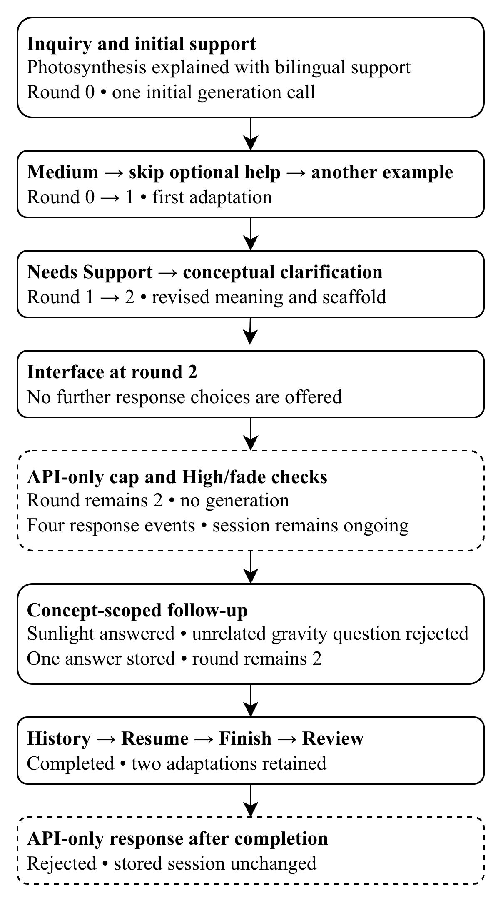

# Evaluating Adaptive LLM Scaffolding for Burmese-Speaking STEM Learners

**Nay Lin Htet**

¹ Master of Information Technology Student, Faculty of Science, University of Auckland

## Abstract

Burmese-speaking STEM learners may require contextual support for English terminology and unfamiliar concepts. A Context-Aware Adaptive STEM Scaffolding Framework and a bilingual large language model application were evaluated through complementary conceptual and design methods. Conceptual evaluation combined GenAI critique, literature analysis, informed argument and a photosynthesis scenario. Design evaluation comprised functionality and usability assessment, static and dynamic analysis, bounds analysis, simulation, black-box and white-box testing, literature comparison and a live scenario. Application-controlled routing, response persistence and session continuity were supported under tested conditions. Among 91 delivered outputs, 18 were rated pass, 71 partial and two fail. Supplementary assessment of 32 saved outputs identified bilingual errors without revising these ratings. Six usability criteria were rated pass and three partial. The contribution is an evaluated integration of terminology support, structured conceptual explanation and bounded, learner-responsive assistance. Educational effectiveness and the pedagogical suitability of support levels and the two-adaptation limit were not established.

## Keywords

- Adaptive STEM Scaffolding
- STEM Terminology Support
- Burmese-Speaking Learners
- Large Language Models
- Bilingual Learning
- Educational Information Systems

## 1. Introduction

Burmese-speaking STEM learners may need English STEM terms and unfamiliar concepts explained in context, rather than translated word for word. An approach combining terminology support, conceptual explanation and help based on learner responses was evaluated. The proposed support was assessed, but how often learners experience these difficulties and how serious they are were not measured. Three research questions guided the evaluation.

1. RQ1 — How can specialized English STEM terminology be supported for Burmese-speaking learners?
2. RQ2 — How can LLM-based support help learners understand STEM concepts beyond translation?
3. RQ3 — How can LLM-based scaffolding provide structured and adaptive support for Burmese-speaking STEM learners?

Two artefacts were examined. Seven support responsibilities are defined in the Context-Aware Adaptive STEM Scaffolding Framework and implemented in a bilingual large language model (LLM) proof-of-concept application. Learners enter a STEM inquiry, receive structured support, report their support need and can request a revision within a fixed limit. Responses and support history are stored for later review.

Conceptual evaluation included GenAI critique, literature analysis, informed argument and a photosynthesis scenario. Design evaluation included criteria-based inspection, static and dynamic analysis, bounds analysis, simulation, black-box and white-box testing, literature comparison and a fresh scenario. Methods were selected from the analytical, experimental, testing and descriptive categories of Hevner et al. (2004). [Venable et al. (2016)](https://doi.org/10.1057/ejis.2014.36) distinguish evaluation in controlled settings from evaluation in real use. Most activities used controlled tests, scripted inquiries or structured inspection. Behavior was assessed under these conditions, but usefulness during everyday study was not established. No participant learning experiment or independent expert interview was conducted.

## 2. Conceptual Artefact Evaluation

The framework's responsibilities and design rationale were examined through four methods. Assumptions were challenged through a GenAI interview. Relevant prior studies and their limits were examined through literature comparison. Reasons for the proposed design and possible objections were considered through informed argument. Whether the stages could be applied coherently was examined through a photosynthesis scenario.

### 2.1 Artefact Selection and Evaluation Criteria

Seven responsibilities are coordinated in the framework. These are identifying STEM terminology, interpreting technical context, selecting language support, explaining core meaning, providing scaffolding, collecting learner responses and adapting support. Together, they address the three research questions. Figure 1 shows the original framework before its feedback decisions were clarified using evaluation findings. In the refined design, language support, core meaning or intended context can be reconsidered without adding an eighth stage. The stages represent design responsibilities, not seven separate model calls.

**Figure 1. Context-Aware Adaptive STEM Scaffolding Framework before refinement.**


*Note.* The original framework is shown unchanged. Later refinements allow language support, core explanations and intended meaning to be revisited within fixed limits. These additional routes are not shown in the diagram.

Five criteria were used to assess whether the requirements were addressed, and the educational rationale was reasonable (Table 1). Coverage of support responsibilities, relationships between stages, consistency with theory and literature, and use in a scenario were examined. Each method provided evidence within its own limits. Requirement coverage means that necessary support responsibilities are included. It does not mean that exactly seven stages are the only valid design.

**Table 1. Conceptual Evaluation Criteria and Methods**

| Criterion | Evaluation question | Methods |
| --- | --- | --- |
| C1 — Requirement coverage | Does the framework assign responsibilities for terminology, explanation and adaptive assistance? | GenAI critique, literature analysis, informed argument, conceptual scenario |
| C2 — Logical coherence | Are stage relationships, feedback decisions and limited revisiting of earlier stages reasonable? | GenAI critique, informed argument, conceptual scenario |
| C3 — Theoretical consistency | Are task needs, responsive support, gradual withdrawal and self-report limits recognized? | Literature analysis, informed argument, GenAI critique |
| C4 — Literature consistency | Are relevant studies, limits of applying their findings here and unsupported assumptions identified? | Literature analysis, informed argument, GenAI critique as supplementary challenge |
| C5 — Scenario applicability | Can the seven stages be applied meaningfully to a learning situation? | Conceptual scenario, informed argument |

*Note.* These criteria assess whether the framework addresses the support responsibilities required by RQ1–RQ3. They do not measure learning outcomes.

### 2.2 GenAI Interview

Nine fixed questions were asked in a fresh Temporary Chat without browsing. GPT-5.6 Sol with High reasoning was displayed in the interface, but the provider version was not independently verified. The persona of a critical evaluator of a conceptual artefact in information systems research was assigned through the context prompt. Strengths and weaknesses were to be identified, evidence separated from judgements and assumptions, and the supplied artefact assessed before redesigns were suggested. The framework, requirements, theories and photosynthesis scenario were supplied as text. The original framework, not later refinements, was assessed. Responses and their analysis were retained separately.

Responses were grouped as support, concern, missing element, unsupported assumption, suggested improvement or out of scope, then linked to the conceptual criteria. Requirement coverage and support beyond translation were recognized. Risks in self-report, interpretation, explanation quality and adaptation decisions were also identified. Core explanation and additional assistance were distinguished, helping clarify their roles. Suggestions were compared with literature, informed argument and scenario findings before acceptance. The original judgements are retained in Table 2. Confident wording was not treated as proof. The interview challenged assumptions but did not provide expert testimony or evidence of learner benefit.

Interview scope and principal findings are summarized in Table H1. The complete context prompt and all recorded responses are provided in Appendix I.

### 2.3 Academic Literature Evaluation

An existing set of 17 studies was used for conceptual literature evaluation. No new search was conducted. Nineteen findings were linked to the seven responsibilities and concerns raised in the GenAI critique. Each comparison considered what was supported, whether findings from other settings could apply here and what this meant for the framework. The proposed design was evaluated without claiming that no similar approach exists elsewhere.

Native-language technical help has been studied in Sinhala programming education ([Athukorala & De Silva, 2025](https://doi.org/10.7763/IJCTE.2025.V17.1378)). However, those findings cannot be applied directly to Burmese STEM learners. Retaining selected English terms is supported by research on scientific-paper translation ([Kleidermacher & Zou, 2026](https://doi.org/10.18653/v1/2026.findings-eacl.204)). The reported preferences do not establish whether beginners understand those terms. Teacher-guided multilingual interaction in [Kuzu (2026)](https://doi.org/10.1007/s10758-026-09974-7) highlights another limit. Selecting help from a menu without a teacher is not equivalent to teacher-guided support.

Responsibilities for context, language and assistance were supported by these comparisons, but the exact stages, routes and two-round policy were not validated. Some comparisons used secondary summaries rather than original studies. Those comparisons were therefore not independent checks of the original research. Differences in language, learners and setting also limit how far the findings can be applied here.

The conceptual literature comparison is summarized in Table H1.

### 2.4 Informed Argument

Informed argument was applied to the original seven-stage framework shown in Figure 1, before refinement. Each responsibility and its relationships were examined for usefulness, consequences of removal and remaining objections. Scholarly sources were used, following descriptive evaluation in information systems research ([Hevner et al., 2004](https://doi.org/10.2307/25148625), p. 86, Table 2). Later application routes and limits were not treated as features of the original framework.

Whether technology suits its intended tasks should be considered ([Goodhue & Thompson, 1995](https://doi.org/10.2307/249689)). This supports task-focused terminology, explanation and assistance, but task–technology fit was not measured. The wrong concept could be explained without term and context interpretation. Domain terminology requires attention , although context can also help determine a term's meaning. The one-way link in the diagram may therefore be insufficient in ambiguous cases. Selected English terms can be useful in scientific translation ([Kleidermacher & Zou, 2026](https://doi.org/10.18653/v1/2026.findings-eacl.204)), but their retention needs a clear rationale. Without conceptual explanation, examples may not communicate the underlying meaning. Structured support has an instructional rationale in considering cognitive demands ([Sweller, 1988](https://doi.org/10.1207/s15516709cog1202_4)), but cognitive load was not measured. Fluent generated content is not necessarily reliable ([Ji et al., 2023](https://doi.org/10.1145/3571730)).

Support adjusted to learner need, gradual withdrawal and transfer of responsibility are central to scaffolding ([van de Pol et al., 2010](https://doi.org/10.1007/s10648-010-9127-6)). Examples and hints alone do not establish these qualities. The response-to-adaptation link provides a basis for revising scaffolding, but the choice of adaptation is not explained in the original diagram. Self-reported understanding may also be inaccurate ([Dunlosky & Rawson, 2012](https://doi.org/10.1016/j.learninstruc.2011.08.003)). Feedback would be lost if response collection or adaptation were removed, but appropriate support and fading are not established by the loop alone. Term identification and conceptual explanation were rated conceptually justified. The other five responsibilities were justified with qualification. Clearer explanation/scaffolding roles, language-selection principles and adaptation decisions were therefore needed.

The informed-argument summary and scholarly basis are provided in Table H1.

### 2.5 Scenario Evaluation

The photosynthesis scenario was used to assess whether the seven conceptual stages could be applied coherently to a STEM-learning situation, not to test software execution. Photosynthesis and its plant-biology context were identified, and Burmese explanations with selected English terms were provided, illustrating Stages 1–3. Core meaning was explained in Stage 4. Examples, reflection and a hint illustrated Stage 5. Self-report choices represented Stage 6, while an additional rice-plant example represented Stage 7. A return from adaptation to scaffolding was therefore illustrated.

All seven responsibilities had meaningful roles in the scenario. However, reasons for retaining particular English terms and the learner response triggering the additional example were not specified. These gaps limit assessment of language selection and response-to-adaptation decisions. The scenario supports conceptual applicability, not measured learning or optimal adaptation. A separate application walkthrough is reported in Section 3.5.

The conceptual scenario's findings and limitations are summarised in Table H1.

### 2.6 Triangulation, Refinement, and Conceptual Evaluation Summary

Combining terminology, explanation and responsive assistance beyond translation was supported across the methods. Accurate diagnosis of learner need and the best adaptation decisions were not established. In the refinement, Stage 4 core explanation was separated from Stage 5 additional support. Stage 6 was defined as self-reported need. Language, meaning or intended context could be revisited in Stage 7 within a fixed limit. These routes and limits are design rules, not validated teaching recommendations.

Original method judgements and the combined conclusions are separated in Table 2. C1 is fully supported for responsibility coverage, while C2–C5 are partially supported. Some methods used the same literature or scenario. Agreement therefore does not always provide independent evidence. The responsibilities have a reasoned basis, but exactly seven stages have not been shown to be necessary.

**Table 2. Conceptual Evaluation Results**

| Method / object | Recorded finding | Limits of the evidence | Requirement contribution |
| --- | --- | --- | --- |
| GenAI critique of original framework | Support responsibilities fully covered. Stage relationships and theory acceptable with minor issues. Scope mostly complete. Scenario applicable with minor issues | One model critique without browsing. Unclear support decisions and self-report risks remain. No human-expert or learner evidence | RQ1–RQ3 — challenges the proposed terminology, explanation and response/adaptation responsibilities |
| Earlier literature corpus | Nineteen findings linked prior research to terminology support, context interpretation, bilingual explanations and adaptive assistance | Findings from other languages and subjects may not apply here. Exact stages, routes and two-adaptation limit untested by those studies. No new search | RQ1–RQ3 — literature support for the responsibilities, not measured effectiveness |
| Informed argument of original framework | Term identification and conceptual explanation conceptually justified. Five other responsibilities justified with qualification. Stage relationships and remaining objections examined | Language-selection and adaptation rules unclear. Task suitability, support matched to competence and appropriate fading not established | RQ1 — terms/context/language, RQ2 — explanation/support, RQ3 — response/adaptation |
| Conceptual photosynthesis scenario | All seven responsibilities illustrated. Core meaning distinguished from scaffolding. Self-report choices, another example and a repeated check illustrated feedback | Reasons for retained English terms and the response triggering adaptation unspecified. Appropriate matching of support to learner need not established | RQ1 — terms/context/language, RQ2 — explanation/scaffolding, RQ3 — response/adaptation relationships |
| Current synthesis | Responsibility coverage (C1) fully supported. Stage relationships, theory, literature and scenario applicability (C2–C5) partially supported | Combines four methods, not an additional independent evaluation. Improved learning not demonstrated | RQ1–RQ3 — responsibility coverage supported, coherence, theory, literature and scenario support qualified |

*Note.* “Fully supported” means the criterion was supported within the evaluation's scope. “Partially supported” means support was found, but important gaps remain. Neither rating demonstrates educational effectiveness. Each method's rating scale is retained, not averaged. The interview's fourth criterion concerned scope and limits rather than literature consistency, so those judgements are kept separate.

## 3. Design Artefact Evaluation

Overlapping explanation/scaffolding roles and unclear adaptation decisions were identified in conceptual evaluation. These roles were separated in the application, learner self-reports clarified and support routes limited.

In Stages 1–5, terminology is identified, context interpreted, language support selected, core meaning explained and scaffolding provided. Responses are collected in Stage 6 and support adapted in Stage 7. Stage 6A records overall self-reported need. Optional Stage 6B records the help requested.

High, Medium and Needs Support are offered in Stage 6A. After Medium or Needs Support, Stage 6B offers a simpler explanation, another example, language help, conceptual clarification or intended-meaning correction. Routes follow application rules. If Stage 6B is skipped, another example is provided for Medium and a simpler explanation for Needs Support. High records fade without generating support or using a round. Up to two adaptations are stored. Later responses are recorded without a third adaptation. Finish completes the session separately. Two concept-specific follow-ups are allowed without using adaptation rounds. Language help can display both languages without changing saved preferences. History, Resume and Review restore stored interactions.

Production code was kept unchanged. Local evaluation used macOS 26.6.2, Node.js 26.4.0, npm 11.17.0, Next.js 16.3.4, MongoDB 8.2.6 and Vitest/V8 4.1.11. Live generation used the OpenAI Responses API, configured as `gpt-5.4-mini` and reporting `gpt-5.4-mini-2026-03-17`. Strict structured output and a 20-second timeout were configured, without custom sampling or automatic retry. Live-provider, simulated-provider, database and browser results were kept separate.

Codex was used to assist with evaluation preparation, automated execution, preliminary analysis and drafting. All scientific and English–Burmese assessments were subsequently checked by the author against the original outputs and relevant references. Final findings and decisions were confirmed by the author. This was not an independent second assessment.

### 3.1 FURPS Criteria and Usability Inspection

FURPS covers functionality, usability, reliability, performance and supportability. Thirteen functionality and nine usability criteria were assessed (Table 3), without separate grades for other dimensions. Expectations were defined before testing. Technical behavior and content quality were rated separately. Scientific correctness, context, language, explanation and adaptation were examined, not output structure alone.

Desktop/simulated mobile layouts, English/Burmese interfaces, light/dark themes and keyboard interaction were inspected in Chrome (Tables F1–F2). Home, preferences, initial support and Stage 6B covered all eight combinations. Other states covered selected combinations. Delayed simulated responses exposed waiting states without external calls.

**Table 3. Functionality and Usability Criteria**

| Criterion | Evaluation focus | Checks | Outcome / RQ |
| --- | --- | --- | --- |
| F1 — Inquiry handling | Session creation and safe rejection of invalid input | HTTP requests, output validation, stored-session retrieval | partial, RQ1–RQ3, enabling |
| F2 — Terminology/context | Intended STEM meaning and correction of misunderstanding | Interpretation/correction routes, simulation, content review | partial, RQ1 |
| F3 — Bilingual support | Preferences, language-help display and useful English terms | Display checks, unchanged saved preferences, terminology review | partial, RQ1 |
| F4 — Structured support | Explanation, example, technical detail, reflection and revealable hint | Output contracts, browser inspection, content review | partial, RQ2 |
| F5 — Learner response | Three self-reports, five optional help choices and valid input combinations | Route/input tests and persisted events | partial, RQ3 |
| F6 — Adaptive support | Rule-based route, useful revision and no generation after High | Route tests, simulation and content review | partial, RQ1–RQ3, depends on route |
| F7 — Adaptation bound | Rounds 0–2 and consistent response/adaptation records | Limit, completion and simultaneous-request database tests | partial, RQ3 |
| F8 — Scoped follow-up | Current concept, unrelated-topic rejection, 500-character and two-question limits | HTTP, service and persistence tests | partial, RQ3 |
| F9 — Persistence | Stored support, responses, interpretations and safe updates | Retrieval and database tests | partial, RQ3, enabling |
| F10 — History | Learner ownership, newest-first ordering and accurate state | HTTP and interface inspection | partial, RQ3, enabling |
| F11 — Review/Resume | Restored session state, completion and limits | Session-transition tests and scenario | partial, RQ3, enabling |
| F12 — Preferences | Saved settings and unchanged preferences for earlier sessions | Validation, save/reload and saved-preference tests | partial, RQ1/RQ3, enabling |
| F13 — Error handling | Controlled failures/recovery without invalid writes | Injected faults, malformed outputs and browser recovery | partial, RQ1–RQ3, enabling |
| U1 — Task clarity | Inquiry purpose and entry evident | Home and keyboard inspection | pass, RQ1–RQ3, enabling |
| U2 — Information structure | Explanation areas and hint distinguishable | Organisation of initial, revised and follow-up support | pass, RQ2, enabling |
| U3 — Interaction clarity | Response choices, skip/back and consequences clear | Two-level response and keyboard inspection | pass, RQ3, enabling |
| U4 — Feedback visibility | Pending/adapting and revised support visible | Loading, routes, fade/cap and recovery | pass, RQ3, enabling |
| U5 — Navigation consistency | History, Review, Resume and preferences reachable | Navigation and modal focus | partial, RQ3, enabling |
| U6 — Bilingual readability | Readable characters and line wrapping without cut-off text | Screen sizes, interface languages, themes and bilingual display | pass, RQ1/RQ2, visual only |
| U7 — State visibility | Self-report, route, limits and completion distinct | Status, events and interpretation displays | pass, RQ3, enabling |
| U8 — Error clarity | Localized error and recovery action understandable | Failure, retry and ownership inspection | partial, RQ1/RQ3, enabling |
| U9 — Consistency | Labels/interactions consistent across configurations | Language, theme, screen width and keyboard checks | partial, RQ1–RQ3, enabling |

*Note.* “enabling” means that an interaction or storage function supports the workflow, not that the educational requirement was met. Bilingual readability refers to visual presentation, not accuracy of meaning. Usability ratings are based on technical inspection, not a participant study or full accessibility audit.

Six usability criteria were pass and three partial. Modal keyboard focus and English-only errors in the Burmese interface caused difficulties but allowed workarounds. A correction label was a cosmetic issue. Infrastructure failures when saving preferences were not assessed.

### 3.2 Analytical Evaluation

Static, dynamic and bounds analysis examined code structure, runtime behavior and state limits respectively.

#### 3.2.1 Static Analysis

Fourteen checks examined separation of software layers, input validation, learner ownership, storage and error handling. Lint, TypeScript, tests and production-build checks were also completed. An integration test was initially blocked by an environment issue. It passed when rerun without code changes.

#### 3.2.2 Dynamic Analysis

Session state and recovery were examined through thirteen runtime cases and twelve browser captures. Two cases remained partial pass because provider calls were inferred rather than directly counted. A test assertion was corrected, but the first attempt was retained. Fifteen initial requests had a median response time of 3.331 seconds, ranging from 2.593–4.640 seconds. These requests were run one at a time locally, not under load.

#### 3.2.3 Optimization / Bounds Analysis

Seventeen cases with fixed responses and real MongoDB passed checks for fade, the adaptation limit, completion and simultaneous requests. Updates prevented a third stored adaptation. However, simultaneous requests made two provider calls for one saved adaptation. The limit therefore guarantees neither a spending limit nor the best support amount.

Scopes, timings and observations are summarised in Tables B1–B2.

### 3.3 Simulation

Sixteen fixed STEM inquiries followed three response paths, with seven additional language/context cases (Appendix A). Scientific expectations were defined beforehand. Handlers, services and storage were tested with a live provider and isolated database, excluding browser/public-proxy requests. Of 55 attempts, 44 were technical pass, eight returned controlled ambiguity without sessions, and three were fail. Cancellation was delayed to 52.825 seconds. Two corrections were rejected because interpretations were unchanged. Unreached steps produced no delivered output.

Of 91 delivered outputs, 18 were rated pass, 71 partial and two fail (Tables C1–C3). Assessment used postgraduate STEM knowledge, native Burmese fluency and advanced English proficiency, without an independent second assessor or verified expertise in every domain. In the physics explanation of gravity, mass was confused with weight and translated using a phrase meaning “in a large group”. In chemistry, an ion was incorrectly described as having no net electric charge, contradicting the English definition and a later statement about charge. In the physics explanation of electric current, charge flow was described as movement speed rather than the amount of charge passing a point each second. The stored gravity and ion errors remained after later adaptations.

#### 3.3.1 Supplementary Bilingual Error Assessment

Burmese meaning and clarity were checked in 104 matching English–Burmese passages from 32 selected outputs. Every delivered main concept and all three language-help cases were included. Categories were adapted from [Freitag et al. (2021)](https://doi.org/10.1162/tacl_a_00437) and the [MQM Council (n.d.)](https://www.themqm.org/mqm-pillars/the-mqm-core-typology/). Unexplained English and problems shared by both languages were added as categories. Examples of the assessed meaning and terminology issues are presented in Table C5.

Four issues across three outputs were labelled major and 27 minor issues. Major issues changed or seriously obscured scientific meaning. Minor issues reduced clarity but left meaning recoverable. Ten concerns shared by both languages were not counted as translation errors (Tables C4–C5). Gravity and ion errors explain existing fail ratings. Unclear pH wording was labelled major in one passage, but the output remained partial. Original totals of 18 pass, 71 partial and two fail were unchanged.

Scientific meaning and bilingual judgements were checked by the author. No independent second assessor, standard MQM score or validated Burmese glossary was available. Outputs were deliberately selected, not randomly sampled. The findings therefore do not show how common these errors were across all simulation outputs.

### 3.4 Black-Box and White-Box Testing

Public HTTP requests and browser actions were tested in 24 cases. Twenty-one were pass, two partial and one fail (Table D1). New versus repeated support was unassessed in two cases. Missing identity returned an anonymous cookie and HTTP 200 instead of expected HTTP 400, without observed access to another learner's session. A separate check failed because clarification for unresolved ambiguity used an adaptation round.

Routing, ownership, errors, older sessions and simultaneous requests were tested using simulated responses and isolated MongoDB. The latest `npm test` and `npm run test:coverage` executions passed 518 deterministic tests. Twelve MongoDB integration tests had passed separately and were not rerun for this coverage update. The suite contains 530 distinct tests, including 39 route/round combinations. Across 42 files, V8 coverage was 99.38% statements, 97.56% branches, 100% functions and 99.89% lines (Tables E1–E2). Coverage identifies exercised code, not live-content quality. Database/browser execution was not included in these percentages.

### 3.5 Informed Argument and Scenario

Of eight literature-based arguments, two were supported and six partially supported (Table H2). Design choices were compared with observations and objections following [Hevner et al. (2004)](https://doi.org/10.2307/25148625). Task–Technology Fit supports matching help to tasks, but suitability for learners was not measured ([Goodhue & Thompson, 1995](https://doi.org/10.2307/249689)). Whether support matches learner competence cannot be established from self-report or history ([van de Pol et al., 2010](https://doi.org/10.1007/s10648-010-9127-6)). Controls were introduced in response to generated-content risks ([Ji et al., 2023](https://doi.org/10.1145/3571730)). Protection of stored state was supported by tests, not those sources. Bilingual errors further limit the conclusions.

**Figure 2. Recorded Photosynthesis walkthrough.**



*Note.* Solid boxes show browser actions and support. Dashed boxes show API-only checks. High records fade without generation or completion. Finish completes the session. This is one technical scenario, not a learner study. Detailed checks and content findings are reported in Appendix G.

Two adaptations, four response events, one follow-up and completion were recorded in a photosynthesis walkthrough. Fifteen technical checks passed (Figure 2, Tables G1–G2). The adaptation limit and post-completion behavior were checked through application programming interface (API) requests rather than learner clicks. Stored state was restored through Resume/Review. Content remains partial after author verification because of overly broad scientific wording, unexplained nontechnical English and similar examples.

### 3.6 Academic Literature Evaluation

Thirteen literature comparisons examined relevant capabilities, conflicting evidence and limits of applying findings here (Table H3). Sinhala programming assistance provides a native-language example ([Athukorala & De Silva, 2025](https://doi.org/10.7763/IJCTE.2025.V17.1378)). Selected English terms can be retained in scientific translation, but suitability for Burmese beginners remains unproven ([Kleidermacher & Zou, 2026](https://doi.org/10.18653/v1/2026.findings-eacl.204)). Ratings concern literature support, not content quality. Secondary summaries limit some comparisons. Better performance and the fade/limit policy were not validated.

### 3.7 Design Evaluation Summary

Methods, results, limitations and research-question links are summarised in Table 4.

Video recordings of evaluation test execution are available as [supplementary video evidence](https://drive.google.com/drive/u/4/folders/16fkMYiHQj4K9qTBOexPOnay0k-ZXJnxE).

**Table 4. Design Evaluation Results**

| Method | Recorded result | Material qualification | Requirement contribution |
| --- | --- | --- | --- |
| Static analysis | Fourteen structure and verification checks completed | Integration passed on rerun without code changes after an environment issue. Earlier coverage included only services/database access | RQ1–RQ3 — input validation, ownership and storage checks |
| Dynamic analysis | Thirteen runtime cases, twelve-screen manual inspection, fifteen initial timings, median 3.331 s | Provider calls were inferred in two partial cases. A test assertion was corrected, retaining the first attempt. No load testing | RQ1–RQ3 — observed context, support, response and session recovery |
| Bounds analysis | Seventeen cases passed with fixed responses and a real database | Concurrent requests made two provider calls but saved one adaptation. The round limit does not guarantee a spending limit | RQ3 — adaptation limit and stored fade/limit responses |
| Simulation | 55 attempts — 44 technical pass, eight controlled initial ambiguities, three technical fail | One cancellation was delayed. Two corrections returned unchanged interpretations and were rejected. Later steps were not reached | RQ1 — ambiguity/repair, RQ2 — generated support, RQ3 — live response paths |
| Delivered-content assessment | 91 outputs — 18 pass, 71 partial, two fail | One assessor. Mass/weight and ion-charge errors remain in stored text | RQ1 — terminology/language, RQ2 — scientific explanation, RQ3 — adaptation appropriateness |
| Supplementary bilingual assessment | 32 saved outputs, 104 paired passages, four major and 27 minor issues, ten concerns shared by both languages | Author-verified assessment of deliberately selected outputs, no independent second assessor. Original content ratings unchanged | RQ1 — terms/translation meaning, RQ2 — scientific meaning, RQ3 — language-help limits |
| Black-box testing | 24 assessed cases — 21 pass, two partial, one fail | New versus repeated support unassessed in two cases. Missing identity behaved unexpectedly. Remaining ambiguity consumed a round in another check | RQ1–RQ3 — observable contracts, including failed identity/ambiguity expectations |
| White-box testing | Six internal check groups supported, 518 deterministic tests passed and 12 earlier database passes retained. Coverage across 42 files | Mock outputs cannot establish live-content quality. Some paths remain untested. Browser/database checks are outside coverage totals | RQ1–RQ3 — internal rules/routes, RQ3 — storage/session recovery |
| usability inspection | Nine criteria — six pass, three partial, 133 captures | Modal focus/translation issues rated severity 2, ambiguity label severity 1. Preference-save failure untested. No participants | RQ1/RQ2 — readable support, RQ3 — understandable response/state interaction |
| Design informed argument | Eight arguments — two supported, six partially supported | Literature supports the rationale, not measured learning or independent confirmation | RQ1–RQ3 — reasons for design choices and remaining objections |
| Fresh photosynthesis scenario | Fifteen technical checks pass, two adaptations, four events, one stored follow-up | High, cap and post-completion checked through API only. Author-verified content remains partial due to broad claims, unexplained English and similar examples | RQ1–RQ3 — one integrated workflow, with terminology/explanation qualifications |
| Design literature comparison | Thirteen comparisons — one strong, nine moderate, two limited, one contradictory/uncertain | Some studies had limited access or relevance here. Better content and an ideal adaptation limit were not demonstrated | RQ1–RQ3 — relevant prior systems and unvalidated support rules |

*Note.* For technical checks, pass means expected behavior was confirmed, fail means a required check failed, and partial means evidence or coverage was incomplete. Content ratings follow Table C2. These assessments measure different things and are not combined into one success rate. Later successful checks do not erase earlier failures.

## 4. Results and Interpretation

Technical behavior, successful delivery, content quality and design rationale are considered separately. Educational effects were not measured.

### 4.1 Consolidated Results

The original combined analysis contains 225 findings, including criteria ratings and further analysis of earlier results. These are not 225 independent tests or participants. Routing, response/adaptation storage and session recovery were supported by external observations, bounds tests and internal checks. Provider calls during fade and at the adaptation limit were directly counted in later checks, extending earlier indirect observations. Follow-up used the corrected concept without changing adaptation state. The findings apply to tested conditions, not every possible use.

The supplementary bilingual assessment was recorded separately. Existing gravity and ion errors, unclear pH wording and further language problems were identified. Ten concerns involved scientific meaning in both languages, not translation errors. Content limitations were clarified but learning outcomes were not established. The 41 recorded issues and 104 examined passages are not additional independent simulation runs.

Outputs can have the required structure yet contain scientific or Burmese-language errors or repeat earlier support. The two content fail ratings remain despite better later outputs. Sessions were not created for eight ambiguous initial responses, and three live attempts failed. These results limit confidence in interpretation and adaptation. The combined workflow was demonstrated in the fresh scenario, but author-verified content remains partial and some checks used only the API. Stored state can be protected through error handling without guaranteeing useful help.

All thirteen functionality criteria remain partial. Six usability criteria were pass and three partial. Technical checks alone do not show that educational requirements were met. A design rationale can be supported by literature without demonstrating learner benefit. Bounds tests, coverage, screenshots and content ratings were not averaged because different qualities were measured. Earlier attempts, differences between expected and observed behavior, and later analyses were kept separate. Content, delivery and interface problems remain unresolved despite support for tested controls.

### 4.2 Research Question Traceability

Twenty-four documented chains linked problems, requirements, questions, objectives and artefacts to evaluation criteria and findings. Methods and outcomes are mapped to the questions in Tables 2–4. The problems, requirements and objectives behind each conclusion are shown in Table 5. All three questions remain partially supported. A complete mapping does not mean that every requirement was met.

**Table 5. Research Questions, Artefact Mechanisms and Evaluation Conclusions**

| Problem / issue | Requirement, question and objective | Artefact mechanisms | Support and remaining gap |
| --- | --- | --- | --- |
| Difficult English STEM terms, limited Burmese resources and misleading word-for-word translations | RQ1 — explain English STEM terms in context using Burmese, retaining useful English terms. Objective — support STEM terminology in both languages | Term and context interpretation, selective bilingual explanations and a limited concept-correction route | partially supported — routes implemented, but Burmese errors and unsuccessful corrections limit accuracy. Reliable term extraction and reduced language barriers remain unproven |
| Translation alone does not explain STEM concepts | RQ2 — explain concepts clearly with examples, not translation alone. Objective — support conceptual STEM explanation | Core explanations, examples, technical detail, reflection prompts, hints and revised explanations | partially supported — explanations delivered, but errors and repeated examples remain. Improved understanding and retention were not measured |
| Fixed or unstructured help does not adequately respond to learner needs | RQ3 — provide structured help based on learner responses. Objective — support adaptive scaffolding | Self-reports, optional help choices, predefined routes, two-adaptation limit, stored history and concept-scoped follow-up | partially supported — storage and session recovery checks passed. Delivery, identity and interface issues remain. Competence assessment, appropriate fading and ideal adaptation limit unproven |

*Note.* Full research questions appear in Section 1. Criteria and findings in Tables 1–4 support these conclusions. The problems explain the research motivation, not their measured frequency. Implemented features and successful technical checks do not establish educational effectiveness.

For RQ1, a reasonable approach to terminology was provided through context interpretation and selective bilingual support. Concept-correction and language-help routes were implemented. However, corrections returning unchanged interpretations were rejected, and Burmese terminology errors remained. Reliable automatic term extraction and reduced language barriers were not established.

For RQ2, support beyond word-for-word translation was provided through core explanations, examples, reflection and hints. Content quality was limited by incorrect definitions and repeated examples. Understanding and retention were not measured. Explanations were made available, but whether learners understood them was not established.

For RQ3, predefined routes were selected from self-reported need, generation was limited and response history was stored. These controls were supported by simultaneous-request and session-transition tests. Support matched to assessed competence, appropriate withdrawal, transfer of responsibility and an ideal two-adaptation limit were not demonstrated. Self-report, reaching the adaptation limit and choosing Finish are different actions. Completing a session does not show mastery.

Terminology and meaning problems in the bilingual assessment further limit RQ1 and RQ2. Unclear wording and scientific concerns shared by both languages remained after language help, limiting claims about adaptation quality under RQ3. All three conclusions remain partially supported. Earlier ratings are not independently confirmed by reassessing the same outputs.

### 4.3 What the Evaluation Does and Does Not Show

The application's routing, storage and session recovery were supported under tested conditions. Consistently accurate content and reliable correction of misunderstood concepts were not established. Following [Venable et al. (2016)](https://doi.org/10.1057/ejis.2014.36), controlled evaluation is distinguished from everyday learner use. Selected cases, variable model responses and limited configurations prevent generalization to all uses. More detail, not independent confirmation, is obtained by reassessing the same outputs.

No learner study, independent expert review, assessment of suitable support levels or full accessibility audit was conducted. Recovery from preference-save failures and whether support differed from earlier explanations in two cases remain untested. Some literature comparisons used abstracts or summaries, which do not validate Burmese terms. Concurrent requests can make extra provider calls despite the two-adaptation limit. Cancellation can also exceed the configured twenty seconds. Better content than other systems and improved learning were not demonstrated.

The bilingual sample deliberately included outputs with known concerns. Its error counts cannot represent all outputs. Identified issues and proposed Burmese wording were checked by the author, but not by an independent second assessor. A major issue in one passage does not replace the original whole-output rating or technical test result.

## 5. Conclusion

Contextual STEM terminology support, explanations beyond translation and help based on learner responses were combined in the framework and application. The design rationale was supported by literature. Routing, storage and session recovery were supported by technical tests and observations under tested conditions. Operation of the design was demonstrated, not consistently accurate or effective tutoring.

All three research questions remain partially supported. Burmese terminology errors, scientific errors, unsuccessful concept corrections and interface problems remain. Some errors were clarified through supplementary bilingual assessment, but original ratings were unchanged and overall translation quality was not established. Support is guided by learner self-reports, not measured competence. Fade is recorded after High without generating support or completing the session. The two-adaptation limit and separate Finish action are design choices, not evidence of mastery or ideal support levels.

Content errors, delivery failures and interface problems should be corrected in future work. Each revised version should be recorded and affected tests rerun. Independent content review and studies with learners are then needed to assess usefulness, learning and whether support matches learner needs.

## References

Athukorala, K. S. N., & De Silva, D. I. (2025). Bridging language barriers in programming education: Java programming assistance tool for Sinhala native speakers. *International Journal of Computer Theory and Engineering, 17*(3), 151–169. [https://doi.org/10.7763/IJCTE.2025.V17.1378](https://doi.org/10.7763/IJCTE.2025.V17.1378)

Dunlosky, J., & Rawson, K. A. (2012). Overconfidence produces underachievement: Inaccurate self evaluations undermine students' learning and retention. *Learning and Instruction, 22*(4), 271–280. [https://doi.org/10.1016/j.learninstruc.2011.08.003](https://doi.org/10.1016/j.learninstruc.2011.08.003)

Freitag, M., Foster, G., Grangier, D., Ratnakar, V., Tan, Q., & Macherey, W. (2021). Experts, errors, and context: A large-scale study of human evaluation for machine translation. *Transactions of the Association for Computational Linguistics, 9*, 1460–1474. [https://doi.org/10.1162/tacl_a_00437](https://doi.org/10.1162/tacl_a_00437)

Goodhue, D. L., & Thompson, R. L. (1995). Task-technology fit and individual performance. *MIS Quarterly, 19*(2), 213–236. [https://doi.org/10.2307/249689](https://doi.org/10.2307/249689)

Hevner, A. R., March, S. T., Park, J., & Ram, S. (2004). Design science in information systems research. *MIS Quarterly, 28*(1), 75–105. [https://doi.org/10.2307/25148625](https://doi.org/10.2307/25148625)

Ji, Z., Lee, N., Frieske, R., Yu, T., Su, D., Xu, Y., Ishii, E., Bang, Y. J., Madotto, A., & Fung, P. (2023). Survey of hallucination in natural language generation. *ACM Computing Surveys, 55*(12), Article 248. [https://doi.org/10.1145/3571730](https://doi.org/10.1145/3571730)

Kleidermacher, H. C., & Zou, J. (2026). Science across languages: Assessing LLM multilingual translation of scientific papers. In V. Demberg, K. Inui, & L. Marquez (Eds.), *Findings of the Association for Computational Linguistics: EACL 2026* (pp. 3932–3947). Association for Computational Linguistics. [https://doi.org/10.18653/v1/2026.findings-eacl.204](https://doi.org/10.18653/v1/2026.findings-eacl.204)

Kuzu, T. E. (2026). AI-supported translanguaging processes in primary school: Empirical insights into ChatGPT's role in multilingual interactions. *Technology, Knowledge and Learning*. Advance online publication. [https://doi.org/10.1007/s10758-026-09974-7](https://doi.org/10.1007/s10758-026-09974-7)

MQM Council. (n.d.). *The MQM core typology*. Retrieved October 6, 2026, from [https://www.themqm.org/mqm-pillars/the-mqm-core-typology/](https://www.themqm.org/mqm-pillars/the-mqm-core-typology/)

Sweller, J. (1988). Cognitive load during problem solving: Effects on learning. *Cognitive Science, 12*(2), 257–285. [https://doi.org/10.1207/s15516709cog1202_4](https://doi.org/10.1207/s15516709cog1202_4)

Tran, H. T. H., Martinc, M., Caporusso, J., Delaunay, J., Doucet, A., & Pollak, S. (2026). Recent advances in automatic term extraction: A comprehensive survey. *ACM Computing Surveys, 58*(9), Article 226. [https://doi.org/10.1145/3787584](https://doi.org/10.1145/3787584)

van de Pol, J., Volman, M., & Beishuizen, J. (2010). Scaffolding in teacher–student interaction: A decade of research. *Educational Psychology Review, 22*(3), 271–296. [https://doi.org/10.1007/s10648-010-9127-6](https://doi.org/10.1007/s10648-010-9127-6)

Venable, J., Pries-Heje, J., & Baskerville, R. (2016). FEDS: A framework for evaluation in design science research. *European Journal of Information Systems, 25*(1), 77–89. [https://doi.org/10.1057/ejis.2014.36](https://doi.org/10.1057/ejis.2014.36)

## Appendix A. Fixed Simulation Inquiries

**Table A1. Main Simulation Input Corpus**

| Domain | Exact inquiry |
| --- | --- |
| Biology | What is photosynthesis, and how do plants make food? |
| Biology | What is DNA? |
| Biology | What is osmosis? |
| Physics | What is gravity? |
| Physics | What is electric current? |
| Physics | What is momentum? |
| Chemistry | What is pH? |
| Chemistry | What is an ion? |
| Chemistry | What is a catalyst? |
| Computing | What is inheritance in object-oriented programming? |
| Computing | What is an algorithm? |
| Engineering | What is carbon fibre? |
| Ambiguous | What is a cell? |
| Ambiguous | What is current? |
| Ambiguous | What is a network? |
| Ambiguous | What is inheritance? |

*Note.* Each inquiry was attempted once on each path in Table A3, giving 48 main attempts. Seven additional attempts tested language help and intended-concept correction. No session was created after a controlled ambiguous initial response, so later steps were neither executed nor counted as successful. The inquiries were selected for evaluation, not to represent all STEM inquiries or learners. Different text may be generated on another run.

### A.1 Supplementary inputs and response paths

The main inquiries are listed in Table A1. Inputs, technical outcomes and content ratings are linked through case identifiers in the following tables. Each A, B or C suffix identifies a separate run, not a learner.

**Table A2. Supplementary Language and Context Inputs**

| Case | Exact inquiry | Clarification | Language |
| --- | --- | --- | --- |
| SIM-LANG-01 | What is electric current? | Not supplied | bilingual |
| SIM-LANG-02 | What is electric current? | Not supplied | english |
| SIM-LANG-03 | What is electric current? | Not supplied | burmese |
| SIM-CM-13 | What is a cell? | I mean a biological cell | bilingual |
| SIM-CM-14 | What is current? | I mean electric current | bilingual |
| SIM-CM-15 | What is a network? | I mean a computer network | bilingual |
| SIM-CM-16 | What is inheritance? | I mean inheritance in object-oriented programming | bilingual |

**Table A3. Planned Main Simulation Paths**

| Path | Recorded sequence | Purpose |
| --- | --- | --- |
| A | Initial support, High, Finish | Fade without another generated output |
| B | Initial support, Medium with optional help skipped, High, Finish | Default another-example adaptation |
| C | Initial support, simpler explanation, conceptual clarification, cap check | Two adaptations and the stored-round limit |

## Appendix B. Analytical Evaluation Records

Code structure, runtime behavior and session limits were examined through analytical evaluation. Observed behavior is distinguished from content quality and guaranteed performance.

**Table B1. Analytical Evaluation Summary**

| Method and scope | Principal result | Important qualification |
| --- | --- | --- |
| Static analysis — 14 checks, supported by lint, TypeScript, build and test verification | Software-layer separation, validation, learner-owned storage and controlled error handling were supported | An integration test was initially blocked by an environment issue. It passed when rerun without code changes. Earlier coverage included services/database access only |
| Dynamic analysis — 13 workflow cases and 12 browser observations | Creation, adaptation, corrected context, concept-specific follow-up, Review/Resume and recovery were observed | Two fade/limit cases remained partial pass because provider calls were inferred rather than directly counted |
| Timing — 15 sequential initial requests across five inquiries | Median 3.331 s, range 2.593–4.640 s | Local initial-generation timing, not load performance or an established service-level target |
| Bounds — 17 cases with fixed responses and a real database | Stored adaptations remained within rounds 0–2, including simultaneous requests | Two provider calls were made for one saved adaptation. The round limit does not guarantee a spending limit |

**Table B2. Illustrative Runtime and Boundary Observations**

| Situation | Observed result | Interpretation |
| --- | --- | --- |
| High self-report | Fade recorded, no adaptation or round increment, Finish remains separate | No additional generated support, not evidence of mastery |
| Further support after round two | Response recorded without a third adaptation | The application enforces its stored-round bound |
| Reload an unfinished session | Adaptations, responses and limit feedback restored | Continuity under the inspected conditions |
| Controlled provider failure and recovery | Safe HTTP 502, question retained, successful resubmission after normal configuration restored | Recovery observed without invalid data being stored |
| Two simultaneous adaptation requests | One update accepted and one rejected as a conflict, but two provider calls | Safe storage updates do not prevent duplicate generation |

## Appendix C. Simulation Results and Content Assessment

Fixed inputs and paths are listed in Appendix A. Artificial identities, and an isolated database were used with a live provider. Technical execution, original content ratings and supplementary bilingual findings were assessed separately and were not combined into one score.

**Table C1. Technical Simulation Outcomes**

| Outcome | Attempts | Meaning and noticeable example |
| --- | --- | --- |
| Technical pass | 44 | Expected routes and stored state were confirmed. High generated no output, and adaptations were stored within the two-adaptation limit |
| Controlled initial ambiguity | 8 | Current/network inquiries without context returned ambiguity and created no session. These were not delivered explanations or content pass ratings |
| Technical fail | 3 | An electric-current request was cancelled at 52.825 s despite a 20 s timer. Biological-cell and programming-inheritance corrections were rejected because interpretations remained unchanged |

Only delivered support received content ratings. Fade, limit responses and unreached steps added no outputs. Scientific correctness, contextual relevance, English/Burmese quality, explanation beyond translation and suitability of adaptation were assessed. Each applicable dimension received 2 for adequate, 1 for limited quality/minor issues or 0 for a serious error or missing content. Adaptation was not scored for initial outputs.

**Table C2. Original Delivered-Output Content Ratings**

| Rating | Outputs | Decision rule |
| --- | --- | --- |
| pass | 18 | Every applicable dimension scored 2 |
| partial | 71 | At least one dimension scored 1, with no 0 |
| fail | 2 | At least one dimension scored 0. The gravity and ion initial outputs contained material Burmese errors |

**Table C3. Selected Examples Across Simulation Paths**

| Tested support or boundary | Recorded example | Content or technical judgement |
| --- | --- | --- |
| Initial explanation | A photosynthesis output connected light energy, water/carbon dioxide and sugar production in both languages | Original content pass |
| Another example after Medium | A chloride-ion example used Cl⁻ and explained excess electrons and negative charge | Original content pass. It did not overwrite the failed initial ion definition |
| Simpler explanation | An ion revision clearly restated electron/proton imbalance | Original content partial because little additional help with the concept was provided |
| Conceptual clarification | A photosynthesis revision added energy conversion and a factory analogy | Original content partial. Chemical energy and explanatory vocabulary still needed Burmese support |
| Language help, bilingual preference (SIM-LANG-01) | Electric current was described explicitly as charge per second, but charge/circuit/rate lacked useful Burmese pairing | Original content partial |
| Language help, English preference (SIM-LANG-02) | The bilingual override worked, but Burmese speed wording conflicted with a later correct charge-per-second statement | Original content partial |
| Language help, Burmese preference (SIM-LANG-03) | The revision distinguished current from charge, but both languages retained speed-like wording without a clear quantity-per-time explanation | Original content partial |
| Intended-meaning correction | Cell and inheritance clarifications failed when the returned interpretation did not change | Technical fail. No correction adaptation was delivered for content assessment |
| Fade and cap | No support was generated after High. Requests at the limit added a response record without round three | Technical behaviour only, not additional content ratings |

### C.1 Focused Bilingual Error Assessment

Thirty-two saved outputs were selected using known content concerns. Every delivered main concept, all three language-help cases and selected adaptations were included. All 104 matching passages were examined using categories informed by Freitag et al. (2021) and MQM Council (n.d.). Accessibility and problems shared by both languages were added as local categories. Selection was not random, and earlier findings were known. English was used for comparison, not assumed to be scientifically correct. Author verification was completed, but no approved Burmese glossary or independent second assessment was available.

**Table C4. Supplementary Annotation Summary**

| Category | Findings | What was assessed |
| --- | --- | --- |
| Meaning / accuracy | 9 | Reversed statements or changed quantities, rates or conditions |
| Terminology | 6 | Incorrect or inconsistent technical terms |
| Omission / addition | 1 | A useful term explanation lost between languages |
| Fluency / script | 8 | Awkward wording and unintended third-language fragments |
| Accessibility / retention | 7 | Unexplained English vocabulary in beginner/language-help support |
| Shared content limitation | 10 | Scientific conditions missing or unclear in both languages, not translation errors |

Of 41 recorded issues, four were major across three outputs, 27 were minor and ten were concerns shared by both languages. Major or minor issues were identified in 21 selected outputs. No specific issue was identified in six outputs, and only shared concerns were identified in five. These were not new pass ratings. The other 59 delivered outputs were not examined here.

**Table C5. Illustrative English/Burmese Findings**

| Example | English excerpt | Burmese excerpt | Assessment | Revision direction |
| --- | --- | --- | --- | --- |
| Photosynthesis, initial explanation | capture light energy and store it as sugar | အလင်းရဲ့ စွမ်းအင်ကို ဖမ်းယူပြီး သကြားအဖြစ် သိမ်းထားတတ်ပြီး | Meaning preserved in the compared passage. Original output pass | Retained English STEM terms were not automatically counted as errors |
| Gravity, simple definition | objects with mass | အလေးချိန်ရှိတဲ့ အရာဝတ္ထုတွေ | major — mass becomes weight | Use ဒြပ်ထု (mass), not weight |
| Gravity, technical definition | interaction between masses | အစုလိုက်အပြုံလိုက်ရှိတဲ့ အရာဝတ္ထုတွေ | major — physical mass is described as a group or collection | Use ဒြပ်ထုရှိသော အရာဝတ္ထုများ |
| Ion, technical definition | acquires a nonzero net charge | net charge မရှိတော့ဘဲ | major — Burmese incorrectly states that net charge is absent | State that net charge is nonzero, not absent |
| pH, simple definition | pH 7 is neutral | pH 7 ဆိုရင် မကြားနေတဲ့ အခြေအနေပါ။ | major under local passage rules — neutrality is unclear and contradicts the correct hint | Use clear neutral wording and specify the 25 °C condition |
| Current, initial language-help case | how much charge is moving each second | charge ဘယ်လောက်မြန်မြန် ရွေ့နေသလဲ | minor — charge quantity per second becomes movement speed | Explain charge amount crossing a point per second |
| Current, English-preference language revision | flow of electric charge | electric charge စီးဆင်းတဲ့ အရှိန် | minor — speed terminology remains although a later sentence gives correct units | Use စီးဆင်းနှုန်း with an explicit quantity-per-time explanation |
| Photosynthesis, conceptual revision | stored chemical energy | သိမ်းဆည်းထားနိုင်တဲ့ chemical energy | minor — meaning preserved, but a key term is not explained in Burmese | Pair chemical energy with ဓာတုစွမ်းအင် |
| Photosynthesis, initial explanation | a green pigment called chlorophyll | အရွက်ထဲက chlorophyll က အလင်းစွမ်းအင်ကို ဖမ်းယူပြီး | minor omission — chlorophyll is retained without the green-pigment description | Explain chlorophyll as an အစိမ်းရောင်ရောင်ခြယ်ပစ္စည်း |
| Current, Burmese-preference initial example | bulb lights up | မီးလုံး روشن ဖြစ်လာတာပါ။ | minor — an Arabic-script fragment interrupts Burmese | Replace the fragment with မီးလုံး လင်းလာသည်။ |
| Current, Burmese-preference language revision | how fast charge is passing a point | charge ဘယ်လောက်မြန်မြန် ဖြတ်သန်းနေသလဲ | shared-content concern — speed-like wording is used in both languages | Revise both versions to charge quantity per unit time |

*Note.* Scientific meaning and English–Burmese consistency were personally checked by the author against saved outputs and relevant references, using postgraduate-level STEM knowledge and bilingual proficiency. No independent second assessor was involved. Excerpts are copied exactly from saved outputs. Suggested revisions were not applied to stored text. Both gravity issues belong to one failed output. The original pH rating remains partial despite a major passage-level issue. Totals remain 18 pass, 71 partial and two fail. Reused evidence, assessor limitations and deliberate selection prevent claims about overall translation accuracy or learner benefit.

## Appendix D. Black-Box Testing Records

Externally visible behavior was checked through public HTTP requests and browser actions using controlled provider responses. Of 24 cases, 21 were pass, two partial and one fail. Observations are grouped below, not counted as additional cases.

**Table D1. External Behavior and Material Qualifications**

| Area tested | Illustrative observation | Outcome or limitation |
| --- | --- | --- |
| Inquiry and structured support | Valid inquiry created retrievable support. Empty/malformed input was rejected. A 1,000-character inquiry was accepted and 1,001 rejected | pass within tested inputs |
| Response routes and bounds | High faded, all five optional help routes and skip were tested, and requests at the limit added no third adaptation | Default/selected adaptation cases remained partial because new versus repeated support was not assessed |
| Follow-up and continuity | Relevant answer persisted without changing adaptation state. Unrelated query was rejected. Two questions were allowed, a third rejected. Review/Resume restored stored history | pass for tested external contracts |
| Preference and error handling | New settings were saved without changing earlier session preferences. Simulated provider/malformed-output failures returned safe errors without invalid writes | pass, not evidence of live-content quality |
| Ownership and absent identity | Foreign sessions were inaccessible, but absent identity returned an anonymous cookie and HTTP 200 empty History rather than expected HTTP 400 | One case remains fail. No foreign-session leak was observed |
| Retained subchecks | No round use was expected for unresolved ambiguity, but a generated clarification used one. Initial browser-check conditions were later corrected | The failed check and earlier observations remain recorded. Rechecks do not erase them |

## Appendix E. White-Box Testing and Coverage

The latest root-application run passed 518 deterministic tests in 39 test files. Twelve isolated MongoDB tests in two files had passed separately and were not rerun for this coverage update. The suite contains 530 distinct tests, including 39 route/round combinations. Production code was unchanged. Repeated commands are not additional tests.

**Table E1. Structural Areas Exercised**

| Area | Representative assertion | Recorded result |
| --- | --- | --- |
| Routing and two-adaptation bound | High caused no provider call or increment. Support at the cap created no round three. Optional routes and invalid inputs were checked | Structural group pass |
| Ownership and lifecycle | Other learners' sessions were protected. Repeated Finish caused no further change. Completed sessions rejected responses. Older sessions remained retrievable | Structural group pass |
| Concept-scoped follow-up | Corrected concept/latest support were used. Unrelated questions and exceeded number/length limits were handled without changing adaptation state | Structural group pass |
| Provider and output contracts | Timeout, refusal, missing text, invalid JSON and malformed structured output, including bilingual fields, were rejected before persistence. Unexpected helper failures were converted to safe domain errors without saving or retrying | Structural group pass |
| Persistence and concurrency | Corrections, responses and adaptations were stored consistently. Competing requests respected adaptation/follow-up limits and ownership | Structural group pass, using real database checks |
| Preferences and language override | Valid settings were saved, invalid writes rejected, earlier session preferences unchanged and both languages displayed for language help | Structural group pass |

**Table E2. Application-Wide V8 Coverage**

| Metric | Covered / total | Coverage |
| --- | --- | --- |
| Statements | 970 / 976 | 99.38% |
| Branches | 801 / 821 | 97.56% |
| Functions | 200 / 200 | 100% |
| Lines | 921 / 922 | 99.89% |

*Note.* Coverage includes 42 executable files. The adaptation service reached 100% statement, branch, function and line coverage. Its unexpected helper errors were injected through mocks, not observed from a live provider. Separate database/browser observations are not added to V8 totals. Coverage shows exercised code, not complete correctness, accurate Burmese or educational effectiveness. Some paths elsewhere remain untested.

## Appendix F. Structured Usability Inspection

Desktop 1440 × 900 and simulated mobile 390 × 844 layouts, English/Burmese interfaces, light/dark themes and keyboard interaction were inspected. Home, preferences, initial support and Stage 6B were checked in all eight combinations. Other states were checked across selected combinations. Waiting states were inspected using delayed simulated responses without external calls. No participant study, physical-phone test, satisfaction assessment or full accessibility audit was conducted.

Browser captures containing cookies must be kept securely. Sensitive details must be removed and the copies checked before sharing. Recording evidence does not itself give permission to release those captures.

**Table F1. Usability Outcomes and Observed Examples**

| Criterion | Outcome | Illustrative observation |
| --- | --- | --- |
| Task clarity | pass | Labelled inquiry and keyboard submission made the starting action clear |
| Information structure | pass | Explanation, example, technical detail, reflection and hint were distinguishable |
| Interaction clarity | pass | Three self-reports, five optional help choices and skip/back were usable |
| Feedback visibility | pass | Pending/adapting, fade, cap and completion feedback were visible |
| Navigation consistency | partial | History/Review/Resume worked, but keyboard focus was not kept within or restored after the preferences modal |
| Bilingual readability | pass | Burmese characters and mixed-language text wrapped without significant cut-off. Visual readability, not meaning, was checked |
| State visibility | pass | Routes, limits and history were distinguishable, but one ambiguity label was inconsistent |
| Error clarity | partial | Recovery controls worked, but errors were explained only in English within the Burmese interface |
| Consistency | partial | Modal focus, untranslated errors and the ambiguity label remained inconsistent |

*Note.* Six criteria were pass and three partial. Table F2 identifies the material interface issues affecting these ratings.

**Table F2. Material Interface Issues**

| Issue | Task effect | Severity |
| --- | --- | --- |
| Preference modal did not contain or restore focus | Keyboard navigation reached background controls, requiring extra navigation | 2 |
| English-only errors in Burmese interface | Recovery meaning was unavailable in the selected language although retry controls worked | 2 |
| Generic Concept Correction label during unresolved ambiguity | Correction was suggested by the label, although unresolved meaning was accurately recorded | 1 |

*Note.* Severity 1 means a cosmetic issue, 2 a difficulty with a workaround and 3 a blocked task or seriously misleading behavior. Error presentation after an infrastructure failure when saving preferences was not assessed.

## Appendix G. Photosynthesis Scenario Records

A separate walkthrough was conducted with beginner, guided and Burmese-with-English-term preferences. Fifteen technical checks passed within one session, not fifteen independent scenarios. Two adaptations, four response events, one stored follow-up and completion were recorded.

**Table G1. Scenario Workflow and Observation Boundaries**

| Action | Observed result | Boundary |
| --- | --- | --- |
| Initial inquiry and hint | Photosynthesis/plant biology and five bilingual support fields were created. Hint was revealed | Browser observation with stored-state checks |
| Medium, optional help skipped | Another example was stored at round one | Browser action. Earlier support was largely repeated |
| Needs Support, conceptual clarification | Core meaning and factory analogy revised at round two. Limit and Finish appeared | Browser action. No further response choice was offered |
| Cap and High at cap | Each added a response event without another adaptation or provider call | Separate API checks, not learner clicks. High did not complete the session |
| Relevant/unrelated follow-up | Sunlight question answered and stored. Gravity question rejected without changing the session | Concept-scoped support, not general chat |
| History, Resume, Finish and Review | Stored interaction restored. Session completed through Finish. Further response rejected | Browser recovery plus a separate post-completion API check |

**Table G2. Scenario Content Assessment**

| Observation | Qualification |
| --- | --- |
| Light energy and material inputs distinguished | Main meaning matched across languages, but wording could wrongly imply that photosynthetic bacteria have chloroplasts |
| Round-two factory analogy clarified making rather than taking food | Earlier support was largely repeated in the first additional example. Understanding was not established by the analogy |
| Burmese support retained useful STEM terms | Nontechnical English such as root, leaf and raw materials also remained. Chemical energy needed an explicit Burmese explanation |
| Sunlight follow-up explained energy for sugar production | One relevant answer does not show that every related or unrelated question would be correctly classified |

Content remains partial after author verification. This walkthrough is separate from the original 91-output simulation assessment and does not erase its failures.

## Appendix H. Supporting Conceptual and Design Evaluations

Evaluation through critique, literature, informed argument and scenarios is summarised below. These activities are not additional software tests or independent learner studies. Scholarly sources and access limitations are explained in Sections 2 and 3.

**Table H1. Conceptual Evaluation Activities**

| Activity and scope | Principal finding | Boundary or refinement |
| --- | --- | --- |
| GenAI interview — nine fixed questions and 47 coded findings | Requirement coverage and support beyond translation were recognized. Self-report, adaptation decisions and overlapping explanation/scaffolding roles were challenged | Critique, not expert testimony. Clearer explanation/scaffolding roles and limited revisiting of earlier stages were informed by the findings |
| Literature comparison — existing 17-study corpus, 19 findings | Contextual terminology, selective language support and structured assistance were justified in principle | Findings from other languages/subjects and secondary summaries have limits. Exact stage relationships and adaptation rules were not validated |
| Informed argument — original seven-stage framework | Term identification and conceptual explanation were conceptually justified. Five responsibilities were justified with qualification. Later refinements were excluded | Tran et al. (2026), Goodhue and Thompson (1995), Sweller (1988), Ji et al. (2023), Kleidermacher and Zou (2026), van de Pol et al. (2010), and Dunlosky and Rawson (2012) support design reasons and objections, not learner outcomes |
| Conceptual photosynthesis scenario | All seven stages applied meaningfully. Core explanation and scaffolding distinguished. Another example illustrated adaptation returning to scaffolding | Language-selection reasons and the triggering learner response unspecified. Applicability illustrated, not measured learning or optimal adaptation |

*Note.* Table 2 reports the final conceptual evaluation synthesis. The complete GenAI interview prompts and responses are reproduced in Appendix I.

**Table H2. Design Informed-Argument Conclusions**

| Mechanism examined | Scholarly basis, design inference and limitation | Conclusion |
| --- | --- | --- |
| Terminology/context and intended-meaning correction | Tran et al. (2026) and Goodhue and Thompson (1995). The intended concept may still be misunderstood or left uncorrected | partially supported |
| Selective bilingual language support | Kleidermacher and Zou (2026) and Goodhue and Thompson (1995). Term retention does not guarantee clear Burmese support | partially supported |
| Core explanation and additional support | Athukorala and De Silva (2025) and van de Pol et al. (2010). Structured content can remain inaccurate or repetitive | partially supported |
| Optional stated-need collection | van de Pol et al. (2010) and Goodhue and Thompson (1995). Stated need is recorded, but competence is not measured | supported for stated-need collection only |
| Limited adaptation and fade | van de Pol et al. (2010). Routing and storage controls work, but suitable support levels and adaptation limits remain unproven | partially supported |
| Concept-scoped follow-up | Goodhue and Thompson (1995), applied to the supporting task. Tested topic limits do not establish accuracy for every question | supported for the tested scoped mechanism |
| History and preference continuity | Goodhue and Thompson (1995), applied to task continuity. Storage works, but interface problems and unmeasured task suitability remain | partially supported |
| Application-controlled boundaries | Controls were introduced in response to generated-content risks described by Ji et al. (2023). Stored-state protection was supported by tests, not directly validated by that literature. Duplicate calls and delivery failures remain | partially supported |

**Table H3. Design Literature Comparison Summary**

| Rationale rating | Comparisons | Interpretation |
| --- | --- | --- |
| strong | 1 | Critical evaluation of specialized/low-resource output was well justified. Output quality was not certified |
| moderate | 9 | Native-language help, structured explanation, multilingual interaction and adaptive support had relevant prior examples, but findings may not apply here |
| limited | 2 | Term-identification and workflow evidence did not establish extraction accuracy or suitability for learners |
| contradictory/uncertain | 1 | Stopping generation after High and the two-adaptation limit were not validated as teaching decisions |

Five previously reviewed systems were included in the thirteen comparisons. No comparison system was newly run. A literature-based rationale, working software and educational usefulness are different claims. Conclusions for each research question and their limitations are mapped in Table 5.

## Appendix I. Complete GenAI Interview Prompts and Responses

The context prompt, initial acknowledgement and all nine fixed question–response exchanges used for the conceptual evaluation in Section 2.2 are reproduced below in their recorded order. Prompt and response wording is unchanged. No clarification questions were asked.

### I.1 Master Context Prompt

```text
I am conducting a structured GenAI interview as one evaluation method for an Information Systems research project.

Your role is to act as a critical evaluator of a conceptual artefact. Do not redesign the artefact unless I explicitly ask you to suggest improvements. First evaluate what is provided.

IMPORTANT RULES

1. Base your evaluation on the research context, requirements, theories, and conceptual artefact supplied below.
2. Do not browse or search the web.
3. Do not invent academic references, citations, empirical results, or learner evidence.
4. Clearly distinguish:
   - what follows directly from the supplied artefact;
   - your analytical judgment;
   - any assumption you need to make.
5. Be critical rather than automatically agreeing with the design.
6. Identify both strengths and weaknesses.
7. Do not claim that the artefact improves real learner outcomes unless evidence is provided.
8. Treat learner-reported understanding as a self-report signal, not objective evidence of actual learning.
9. Keep the evaluation focused on the intended research scope.
10. I will ask fixed interview questions one at a time. Answer only the question being asked.

RESEARCH CONTEXT

The research concerns an adaptive LLM-based educational Information System for Burmese-speaking STEM learners.

The problem is that Burmese-speaking learners may have difficulty understanding specialized English STEM terminology and concepts when language barriers and unfamiliar technical concepts occur together. Direct translation may not provide enough technical context, conceptual explanation, structured educational support, or learner-responsive assistance.

RESEARCH QUESTIONS

RQ1:
How can specialized English STEM terminology be supported for Burmese-speaking learners?

RQ2:
How can LLM-based support help learners understand STEM concepts beyond translation?

RQ3:
How can LLM-based scaffolding provide structured and adaptive support for Burmese-speaking STEM learners?

REQUIREMENTS

Requirement 1 — Terminology and Language Support:
Identify specialized STEM terminology, interpret its technical context, and provide context-sensitive Burmese support while preserving useful English technical terms where appropriate.

Requirement 2 — Conceptual Support:
Provide explanations and examples beyond direct translation so that the learner receives conceptual support.

Requirement 3 — Structured and Adaptive Scaffolding:
Provide structured learning support, collect learner response, and adapt subsequent support according to learner need.

THEORETICAL FOUNDATION

Task–Technology Fit (TTF):
TTF is used to align technological capabilities with learner tasks.

The study operationalizes this through three study-specific dimensions:
1. Language-support fit
2. Conceptual-support fit
3. Adaptive-interaction fit

Scaffolding Theory:
Scaffolding Theory informs how educational assistance should be structured and adjusted.

Two important characteristics are:
- Contingency: support changes according to learner need.
- Fading: support is reduced when less assistance is required.

CONCEPTUAL ARTEFACT TO EVALUATE

Name:
Context-Aware Adaptive STEM Scaffolding Framework

Purpose:
The framework describes how an LLM-based educational Information System should transform a learner's natural-language STEM inquiry into context-sensitive, structured, and adaptive educational support.

Framework stages:

1. Identify STEM Terminology
   Identify the principal specialized STEM concept or terminology in the learner's inquiry.

2. Interpret Technical Context
   Interpret the concept within the relevant STEM domain and learning context rather than treating it as an isolated word.

3. Select Language Support
   Determine whether support should use Burmese explanation, preserve an English technical term, use bilingual presentation, or combine these approaches.

4. Explain STEM Concept
   Explain the underlying STEM meaning rather than only translating the word or phrase.

5. Provide Scaffolding
   Provide structured support such as a simple explanation, real-world example or analogy, technical explanation, reflective prompt, and optional hint.

6. Collect Learner Response
   Collect a learner self-report indicating the current level of understanding or need for additional support.

7. Adapt Support
   Adjust subsequent support according to the learner response. Support may be simplified, clarified, expanded, presented through an alternative example, reduced, or concluded.

SEQUENCING

Learner STEM Inquiry
→ Identify STEM Terminology
→ Interpret Technical Context
→ Select Language Support
→ Explain STEM Concept
→ Provide Scaffolding
→ Collect Learner Response
→ Adapt Support

Adapt Support then updates subsequent scaffolding, forming a feedback loop.

PRINCIPAL DECISION POINTS

1. Language-support selection:
   Decide the appropriate Burmese/English strategy based on terminology and context.

2. Learner-response evaluation:
   Decide whether support should increase, change form, fade, or conclude.

SCOPE BOUNDARIES

The framework supports:
- STEM terminology understanding;
- contextual Burmese/English support;
- conceptual explanation;
- structured scaffolding;
- learner-responsive adaptation.

It is not intended to define:
- a full Learning Management System;
- teacher dashboards;
- a quiz engine;
- social-learning features;
- an unrestricted general-purpose chatbot;
- a complete personalized-learning platform.

EVALUATION CRITERIA

C1 — PIRQOA Coverage:
Does the framework address the three research requirements and RQ1–RQ3?

C2 — Logical Coherence:
Are the stages, dependencies, sequencing, and feedback relationship logically coherent?

C3 — Theoretical Consistency:
Is the framework consistent with Task–Technology Fit and Scaffolding Theory, including contingency and fading?

C4 — Completeness and Boundary Clarity:
Are important stages or decision points missing, redundant, underspecified, or outside the intended scope?

C5 — Scenario Applicability:
Can the framework guide a realistic STEM-learning interaction from learner inquiry through adaptive support?

Do not provide the full evaluation yet.

Confirm that you understand:
1. the research problem;
2. RQ1–RQ3;
3. the framework stages;
4. C1–C5;
5. the rule that learner-reported understanding is not objective evidence of learning.

Then wait for Question 1.
```

#### Initial Acknowledgement

```text
Understood. I will evaluate only the supplied research context, requirements, theoretical foundation, conceptual artefact, and evaluation criteria, without web browsing or invented evidence.

I understand:

1. Research problem: Burmese-speaking STEM learners may face a combined challenge of specialized English terminology and unfamiliar technical concepts. Direct translation alone may therefore be insufficient because learners may also need technical context, conceptual explanation, structured support, and learner-responsive assistance.

2. RQ1–RQ3:
   - RQ1: Supporting specialized English STEM terminology for Burmese-speaking learners.
   - RQ2: Using LLM-based support to assist conceptual understanding beyond translation.
   - RQ3: Providing structured and adaptive LLM-based scaffolding responsive to learner need.

3. Framework stages: The artefact progresses from identifying STEM terminology, interpreting technical context, selecting appropriate Burmese/English language support, explaining the STEM concept, providing structured scaffolding, collecting a learner self-report, and adapting subsequent support through a feedback loop.

4. C1–C5: I will evaluate the artefact in terms of PIRQOA coverage, logical coherence, theoretical consistency, completeness and boundary clarity, and scenario applicability.

5. Learner-reported understanding: I will treat it strictly as a self-report signal used for adaptation, not as objective evidence that learning or conceptual understanding has actually occurred.

I will also distinguish what is directly stated in the artefact from my analytical judgment and from any assumptions I need to make.

Ready for Question 1.
```

### I.2. Question 1 — PIRQOA Coverage

#### Prompt

```text
Question 1 — PIRQOA Coverage

Evaluate the Context-Aware Adaptive STEM Scaffolding Framework against C1: PIRQOA Coverage.

For each of RQ1, RQ2, and RQ3:

1. identify which framework stages address it;
2. explain why those stages are relevant;
3. identify any requirement that is only partially covered or missing;
4. identify any framework stage that does not clearly trace to a requirement.

Use this exact output structure:

RQ1
- Relevant stages:
- Coverage judgment: Fully covered / Partially covered / Not covered
- Reasoning:
- Gap or concern:

RQ2
- Relevant stages:
- Coverage judgment: Fully covered / Partially covered / Not covered
- Reasoning:
- Gap or concern:

RQ3
- Relevant stages:
- Coverage judgment: Fully covered / Partially covered / Not covered
- Reasoning:
- Gap or concern:

Overall C1 judgment:
- Strengths:
- Weaknesses:
- Most important issue, if any:

Do not evaluate the other criteria yet.
```

#### Response

```text
RQ1
- Relevant stages: Stage 1 — Identify STEM Terminology; Stage 2 — Interpret Technical Context; Stage 3 — Select Language Support; Stage 4 — Explain STEM Concept.
- Coverage judgment: Fully covered
- Reasoning: The supplied Requirement 1 calls for identifying specialized STEM terminology, interpreting its technical context, and providing context-sensitive Burmese support while preserving useful English technical terms where appropriate. Stages 1–3 directly correspond to these functions. Stage 1 identifies the terminology, Stage 2 situates it within its STEM context, and Stage 3 determines whether Burmese, English, bilingual, or combined support is appropriate. Stage 4 also contributes because terminology support is not treated merely as lexical translation; the technical meaning of the term is explained. Analytical judgment: Taken together, these stages provide a clear trace from RQ1 to Requirement 1 and to explicit framework functionality.
- Gap or concern: No element of Requirement 1 is clearly missing at the conceptual level. However, the framework specifies that a language-support strategy is selected without defining within C1 how appropriateness would be established. This does not make RQ1 uncovered, but it means the framework establishes the required capability rather than demonstrating that the selected language support will actually be effective for learners.

RQ2
- Relevant stages: Stage 2 — Interpret Technical Context; Stage 4 — Explain STEM Concept; Stage 5 — Provide Scaffolding; Stage 7 — Adapt Support.
- Coverage judgment: Fully covered
- Reasoning: Requirement 2 requires explanations and examples beyond direct translation. Stage 4 addresses this most directly by explaining the underlying STEM meaning. Stage 2 supports this by placing the concept within the relevant technical domain rather than treating it as an isolated term. Stage 5 extends conceptual support through simple explanations, examples or analogies, technical explanations, reflective prompts, and hints. Stage 7 can then modify the explanation when further support is indicated. Analytical judgment: These functions clearly distinguish the proposed system from a direct translation mechanism and therefore provide strong conceptual coverage of RQ2.
- Gap or concern: The framework covers the provision of conceptual support, but it does not establish that the learner has objectively understood the concept. Stage 6 supplies only a learner self-report signal, so any subsequent claim that the conceptual explanation produced actual learning would require evidence outside the artefact. This is not a missing Requirement 2 function, but it limits what can be inferred from the framework's coverage.

RQ3
- Relevant stages: Stage 5 — Provide Scaffolding; Stage 6 — Collect Learner Response; Stage 7 — Adapt Support, together with the feedback loop from Adapt Support to subsequent scaffolding.
- Coverage judgment: Fully covered
- Reasoning: Requirement 3 specifies three main functions: structured learning support, collection of learner response, and adaptation of subsequent support according to learner need. Stage 5 supplies structured scaffolding; Stage 6 explicitly collects a learner response; and Stage 7 changes subsequent assistance by simplifying, clarifying, expanding, changing examples, reducing support, or concluding it. The feedback loop makes adaptation iterative rather than a one-time terminal decision. Analytical judgment: This provides a direct and coherent trace from Requirement 3 to RQ3 at the conceptual-framework level.
- Gap or concern: The adaptive mechanism relies explicitly on learner self-report as its stated input. That is sufficient to satisfy the stated requirement to collect a learner response, but it is a relatively narrow basis for determining learner need. The framework therefore covers adaptive scaffolding conceptually without providing objective evidence that its adaptation corresponds to actual learning or misunderstanding.

Overall C1 judgment:
- Strengths: There is strong traceability between the three research questions, the three requirements, and the seven framework stages. RQ1 is principally represented by terminology identification, contextual interpretation, and language-support selection; RQ2 by contextual interpretation, conceptual explanation, and explanatory scaffolding; and RQ3 by scaffolding, learner-response collection, adaptation, and the feedback loop. There are also useful cross-links: Stage 2 contributes to both terminology and conceptual support, while Stage 7 can support continued conceptual assistance as well as adaptive scaffolding.
- Weaknesses: Coverage is primarily functional and conceptual. The framework specifies what the system should do, but this alone does not establish that terminology support is appropriately selected, that conceptual understanding has occurred, or that adaptation accurately reflects actual learner need. In particular, learner self-report should not be interpreted as objective learning evidence.
- Most important issue, if any: No framework stage is clearly orphaned from the stated requirements. All seven stages can be traced to Requirement 1, 2, or 3. The most important qualification is therefore not a missing requirement but the distinction between coverage of the required system functions and evidence that those functions produce learner understanding or learning outcomes.
```

### I.3. Question 2 — Logical Coherence

#### Prompt

```text
Question 2 — Logical Coherence

Evaluate the framework against C2: Logical Coherence.

Examine the intended sequence:

Learner STEM Inquiry
→ Identify STEM Terminology
→ Interpret Technical Context
→ Select Language Support
→ Explain STEM Concept
→ Provide Scaffolding
→ Collect Learner Response
→ Adapt Support
→ Updated Scaffolding

For each transition:

1. explain whether the dependency is logically reasonable;
2. identify any stage that may need to occur earlier, later, or iteratively;
3. identify any missing transition;
4. identify any circular or ambiguous relationship.

Pay particular attention to:
- terminology → context;
- context → language support;
- language support → conceptual explanation;
- explanation → scaffolding;
- scaffolding → learner response;
- learner response → adaptation;
- adaptation → subsequent scaffolding.

Use this structure:

Transition analysis:
1. ...
2. ...

Sequencing strengths:
- ...

Sequencing concerns:
- ...

Missing or ambiguous relationships:
- ...

Overall C2 judgment:
Strong / Acceptable with minor issues / Needs revision / Major coherence problem

Explain the judgment.

Do not redesign the framework unless needed to explain a specific identified issue.
```

#### Response

```text
Transition analysis:
1. Learner STEM Inquiry → Identify STEM Terminology
   The dependency is logically reasonable. The framework begins with the learner’s natural-language inquiry and identifies the principal specialized STEM concept or term within it. This follows directly from the stated purpose of transforming an inquiry into targeted STEM support.
   Analytical judgment: This is a coherent starting point because later language and conceptual support require some identification of what technical content needs attention. A minor ambiguity is that an inquiry may contain multiple interdependent technical terms, while the stage description refers to the “principal” terminology or concept. That does not break the sequence, but it may make the transition less clear in multi-concept questions.
2. Identify STEM Terminology → Interpret Technical Context
   This dependency is logically reasonable. Identifying a technical term before interpreting its domain-specific meaning helps prevent treating the term as an isolated lexical item. This directly supports the research problem that translation alone may be insufficient.
   Analytical judgment: The relationship is coherent but may be partly iterative rather than strictly linear. In some inquiries, recognizing which expression counts as the relevant specialized terminology may itself depend on interpreting the surrounding technical context. Thus, terminology identification can inform context interpretation, while context interpretation may also refine terminology identification.
   Concern: The current sequence presents this as one-directional even though there may be a reciprocal dependency.
3. Interpret Technical Context → Select Language Support
   This transition is logically strong. The framework explicitly states that Burmese/English support should be context-sensitive. Interpreting the STEM domain and learning context before deciding whether to use Burmese explanation, preserve English terminology, or use bilingual presentation therefore has a clear dependency.
   Analytical judgment: Context is an appropriate input to language-support selection because the usefulness of retaining an English technical term may differ according to the concept and how it is being used.
   Concern: “Learning context” is mentioned in Stage 2 but is underspecified. It is therefore unclear exactly what contextual information is available to the language-support decision. This is an ambiguity in the dependency, rather than a contradiction in the sequence.
4. Select Language Support → Explain STEM Concept
   This dependency is logically reasonable. Once the system has determined how Burmese and English should be combined, that strategy can shape how the conceptual explanation is presented. This maintains the distinction between selecting the language form of support and supplying the underlying STEM meaning.
   Analytical judgment: The ordering is defensible, but the relationship may also require iteration. A language-support strategy that appears suitable initially may need adjustment once the complexity of the actual explanation becomes apparent or once the learner responds to it. The framework’s later adaptation stage can partially accommodate this, although it is not explicit whether Stage 7 can revisit Stage 3 as well as Stage 5.
5. Explain STEM Concept → Provide Scaffolding
   The transition is broadly logical because the conceptual explanation provides substantive content that can then be structured through examples, analogies, technical elaboration, reflective prompts, or hints.
   Analytical judgment: This is the most potentially ambiguous transition in the main sequence. Stage 4 and Stage 5 are conceptually distinct, but their operational boundary is not completely clear. A “simple explanation,” “technical explanation,” or example listed under scaffolding could itself constitute part of explaining the STEM concept. Therefore, explanation and scaffolding may overlap rather than always occurring as two cleanly separated consecutive activities.
   Concern: The sequence risks implying that a complete explanation occurs first and scaffolding is added afterwards, whereas scaffolding may be the mechanism through which the explanation is delivered. This is an ambiguity, not necessarily a coherence failure.
6. Provide Scaffolding → Collect Learner Response
   This transition is logically reasonable. Some form of instructional support must be presented before the learner can report whether further assistance is needed. Stage 6 therefore provides feedback on the support supplied in Stage 5.
   Analytical judgment: The sequence correctly establishes an interaction cycle rather than adapting without learner input. However, the framework specifies learner self-report as the response signal. This can indicate perceived understanding or perceived need but does not objectively establish whether the preceding scaffolding produced actual understanding.
7. Collect Learner Response → Adapt Support
   This is a clear and necessary dependency. Stage 7 requires information about learner need, and Stage 6 supplies the stated signal for making that decision. The possible responses—simplifying, clarifying, expanding, changing examples, reducing support, or concluding—logically follow from an evaluation of learner-reported need.
   Analytical judgment: The transition operationalizes learner-responsive adaptation at a conceptual level. The principal ambiguity is how the response is mapped to an adaptation decision. The framework identifies the decision point but does not specify the decision logic. That is an underspecification rather than an illogical dependency.
8. Adapt Support → Updated/Subsequent Scaffolding
   This transition is logically central to the framework. Without returning adaptation into subsequent support, Stage 7 would be a terminal classification rather than part of an adaptive interaction. The stated feedback loop therefore gives the framework a coherent iterative structure.
   Analytical judgment: The direction of the loop is sensible, but its destination is somewhat ambiguous. The artefact states that Adapt Support “updates subsequent scaffolding,” which strongly implies a return to Stage 5. Yet some adaptations could logically require revisiting earlier stages—for example, changing the Burmese/English strategy could involve Stage 3, while correcting a contextual misunderstanding could involve Stage 2 or Stage 4. The framework does not explicitly state whether such earlier-stage re-entry is permitted.

Sequencing strengths:
- The overall flow moves coherently from analysis of the learner inquiry, through selection and delivery of support, to learner feedback and adaptation.
- The ordering of context before language-support selection is especially coherent with the requirement for context-sensitive Burmese/English support.
- The framework does not place adaptation before learner feedback; Stage 6 provides an explicit input to Stage 7.
- The feedback loop prevents the sequence from being purely linear and gives the artefact a recognizable adaptive interaction cycle.
- The major dependencies are intelligible: terminology informs context interpretation, context informs language choices, support precedes learner response, and learner response informs subsequent support.

Sequencing concerns:
- Terminology identification and contextual interpretation may be mutually informing, although the current representation shows only a one-way dependency.
- Concept explanation and scaffolding overlap conceptually. Examples, simple explanations, and technical explanations are listed as scaffolding mechanisms but can also constitute the conceptual explanation itself.
- Language-support selection may need to be revisited iteratively, rather than being treated solely as a one-time decision before the first explanation.
- The adaptive loop clearly updates scaffolding, but it is less clear whether adaptation can trigger reconsideration of context, language strategy, or conceptual explanation.
- The learner-response stage provides a self-report signal only. The sequence is coherent for adapting to reported need, but the transition should not be interpreted as confirming actual learning.
Missing or ambiguous relationships:
- The most important ambiguous relationship is where the adaptation loop returns. “Subsequent scaffolding” suggests Stage 5, but some listed adaptations—particularly clarification or changing presentation—could plausibly require revisiting Stages 3 or 4.
- There is no explicit feedback relationship from Interpret Technical Context back to Identify STEM Terminology, despite the possibility that contextual interpretation could change which terminology is considered central.
- The boundary between Explain STEM Concept and Provide Scaffolding is not fully specified, creating potential functional overlap.
- The framework identifies learner-response evaluation as a decision point, but the transition from a particular self-report to a particular adaptive action is not defined. Analytical judgment: For a conceptual framework, this does not necessarily require detailed algorithmic rules, but the relationship remains underspecified.
- Assumption: I am interpreting “Updated Scaffolding” as another iteration of Stage 5 because that is the explicit destination described in the supplied artefact. If “adapt support” is intended to re-enter any earlier stage, that is not currently stated clearly.

Overall C2 judgment:
Acceptable with minor issues
The core sequence is logically coherent: the system interprets the inquiry before choosing support, delivers conceptual and scaffolded assistance before collecting learner feedback, and uses that feedback to alter subsequent assistance. There is no fundamental contradiction or circular dependency that prevents the framework from functioning conceptually.
The main issues concern iteration and boundary clarity rather than the overall logic. In particular, terminology identification and contextual interpretation may need reciprocal interaction; explanation and scaffolding have some functional overlap; and the feedback loop does not clearly specify whether adaptation can revisit earlier decisions such as language-support selection or conceptual explanation. These issues make the sequence less precise, but they do not amount to a major coherence problem.
```

### I.4. Question 3 — Theoretical Consistency

#### Prompt

```text
Question 3 — Theoretical Consistency

Evaluate the framework against C3: Theoretical Consistency.

Use only the theoretical descriptions supplied in the master prompt.

Evaluate Task–Technology Fit through:
- language-support fit;
- conceptual-support fit;
- adaptive-interaction fit.

Evaluate Scaffolding Theory through:
- structured assistance;
- contingency;
- fading.

For each theoretical element:

1. identify the relevant framework stage(s);
2. explain whether the relationship is clear;
3. identify any theoretical mismatch or overclaim;
4. identify anything the framework claims that the supplied theory does not justify.

Important:
Learner-reported understanding is a self-report signal and must not be treated as objective evidence of competence or learning.

Use this structure:

Task–Technology Fit
- Language-support fit:
- Conceptual-support fit:
- Adaptive-interaction fit:
- TTF concerns:

Scaffolding Theory
- Structured assistance:
- Contingency:
- Fading:
- Scaffolding concerns:

Potential overclaims:
- ...

Overall C3 judgment:
Strong / Acceptable with minor issues / Needs revision / Major theoretical inconsistency

Explain the judgment.
```

#### Response

```text
Task–Technology Fit
- Language-support fit: Relevant stages: Stages 1–3, with Stage 7 potentially contributing during later adaptation. Stage 1 identifies the specialized terminology requiring support, Stage 2 interprets its technical context, and Stage 3 selects an appropriate Burmese/English strategy. This creates a clear conceptual relationship with the study-specific TTF dimension of language-support fit: the technological capability is directed toward the learner task of understanding specialized English STEM terminology in context. Analytical judgment: The relationship is clear at the design level. However, the framework demonstrates an intended mechanism for achieving fit; it does not demonstrate that the selected language strategy is actually well fitted to a particular learner. The supplied TTF description therefore supports alignment as a design objective, not a claim of demonstrated effectiveness.
- Conceptual-support fit: Relevant stages: Stages 2, 4, and 5, with Stage 7 supporting subsequent adjustment. Stage 2 establishes technical context, Stage 4 explains underlying STEM meaning rather than merely translating terminology, and Stage 5 provides explanatory forms such as examples, analogies, technical explanations, prompts, and hints. These capabilities correspond clearly to the learner task identified in the research problem: obtaining conceptual assistance beyond direct translation. Analytical judgment: This is a strong conceptual mapping between technological capability and learner task. Nevertheless, provision of an explanation does not itself establish conceptual understanding. TTF, as supplied here, does not justify inferring that these capabilities produce learning outcomes.
- Adaptive-interaction fit: Relevant stages: Stages 5–7 and the feedback loop to subsequent scaffolding. Stage 5 provides assistance, Stage 6 gathers a learner-response signal, and Stage 7 changes subsequent assistance according to that response. This aligns clearly with the learner task of receiving support that responds to perceived need rather than remaining static. Analytical judgment: The mapping is theoretically coherent, but actual adaptive-interaction fit is not demonstrated simply because an adaptive mechanism exists. In particular, learner-reported understanding indicates perceived understanding or need; it is not objective evidence that the level of assistance matches the learner's actual competence.
- TTF concerns: The three study-specific TTF dimensions have identifiable counterparts in the framework, so there is no obvious theoretical contradiction. The principal concern is the distinction between designing for fit and demonstrating fit. The framework specifies technological functions that are intended to correspond to learner tasks, but the supplied TTF description does not justify claiming that appropriate fit has empirically occurred. Similarly, TTF as supplied does not establish that the LLM will correctly identify terminology, accurately interpret technical context, choose the best language strategy, or provide pedagogically effective explanations. Those would require evidence beyond the conceptual mapping.

Scaffolding Theory
- Structured assistance: Relevant stage: primarily Stage 5, supported by Stage 4. Stage 5 explicitly organizes support into forms such as simple explanations, examples or analogies, technical explanations, reflective prompts, and optional hints. This is consistent with the supplied description that Scaffolding Theory informs how educational assistance should be structured and adjusted. Analytical judgment: The relationship is clear at a general level. However, the supplied theory does not state that these particular forms of assistance, or this particular ordering of them, are required by Scaffolding Theory. They are framework design choices that are compatible with the theory rather than directly entailed by it.
- Contingency: Relevant stages: Stages 6 and 7, together with the feedback loop to Stage 5. Stage 6 obtains information about the learner's perceived level of understanding or need, and Stage 7 changes support accordingly through simplification, clarification, expansion, alternative examples, reduction, or conclusion. This directly corresponds to the supplied definition of contingency: support changes according to learner need. Analytical judgment: Contingency is explicitly represented and is one of the clearest theory-to-artefact relationships in the framework. The limitation is that the available indication of “need” is learner self-report. Consequently, the framework can be described as contingent on the learner-response signal, but that signal should not be equated with objectively established learner need or competence.
- Fading: Relevant stage: Stage 7, operating through the feedback loop. The framework explicitly permits support to be “reduced” or “concluded,” which corresponds directly to the supplied definition of fading: support is reduced when less assistance is required. This makes fading explicitly represented rather than merely implied. Analytical judgment: The theoretical relationship is clear, but the basis for deciding that less assistance is required is important. If reduction is triggered by learner-reported understanding, the framework can legitimately state that support fades in response to that report. It cannot infer solely from the report that the learner has objectively mastered the concept.
- Scaffolding concerns: Contingency and fading are both present, but their operational decision logic is underspecified. The framework says what kinds of adaptation may occur without specifying how a particular learner response establishes whether support should increase, change form, fade, or conclude. This does not contradict the supplied Scaffolding Theory, but it means that theoretical principles are represented more clearly than they are operationalized. There is also a risk of treating all adaptation as scaffolding simply because it is responsive. Based only on the supplied theory, the strongest theoretical justification concerns structured adjustment, contingency, and fading; it does not independently establish the pedagogical quality of every explanation, analogy, or hint generated by the system.

Potential overclaims:
- The framework may legitimately claim that it is designed to align technological capabilities with the three study-specific TTF dimensions. The supplied theory does not justify claiming that actual task–technology fit has been demonstrated without evidence.
- The existence of Stages 4–5 does not justify claiming that learners actually understand STEM concepts or achieve improved learning outcomes.
- Stage 6 provides learner-reported understanding, not an objective measure of competence, conceptual mastery, or learning.
- Adaptation based on that self-report can be described as learner-responsive or contingent on the reported signal, but it should not automatically be characterized as accurately matching actual learner need.
- Reduction or conclusion of support operationalizes fading structurally, but it does not demonstrate that fading occurs at the objectively correct point for the learner.
- The supplied theoretical descriptions do not establish that the LLM's terminology identification, contextual interpretation, bilingual choices, explanations, analogies, or adaptive decisions will be accurate or pedagogically effective.
- The specific scaffolding components listed in Stage 5 are consistent design choices, but the supplied description of Scaffolding Theory does not establish that those particular components are theoretically mandated.

Overall C3 judgment:
Acceptable with minor issues
The framework has clear theoretical traceability. The three study-specific TTF dimensions correspond to identifiable technological functions: language support in Stages 1–3, conceptual support in Stages 2, 4, and 5, and adaptive interaction in Stages 5–7. Scaffolding Theory is also visibly represented: Stage 5 provides structured assistance, Stages 6–7 establish contingency, and Stage 7 explicitly permits fading through reduction or conclusion of support.
The minor issues concern the strength of the theoretical claims and the operationalization of adaptation, rather than a contradiction with either theory. The framework describes mechanisms intended to create task–technology fit but does not itself demonstrate that fit. Likewise, contingency and fading are structurally present, but the decision to adapt or fade depends on a learner self-report signal whose correspondence with actual competence is not established. Therefore, the framework is theoretically consistent provided these mechanisms are presented as theory-informed design features rather than evidence of demonstrated fit, learning, competence, or educational effectiveness.
```

### I.5. Question 4 — Completeness and Redundancy

#### Prompt

```text
Question 4 — Completeness and Redundancy

Evaluate the framework for completeness, redundancy, and clarity.

For the seven stages:

1. Identify STEM Terminology
2. Interpret Technical Context
3. Select Language Support
4. Explain STEM Concept
5. Provide Scaffolding
6. Collect Learner Response
7. Adapt Support

Assess:

- whether any important conceptual stage is missing;
- whether any two stages overlap unnecessarily;
- whether any stage is too broad or vague;
- whether every stage has a distinct conceptual responsibility;
- whether any proposed addition would create unnecessary scope expansion.

Use this structure:

Stage-by-stage assessment:
1. Identify STEM Terminology:
2. Interpret Technical Context:
3. Select Language Support:
4. Explain STEM Concept:
5. Provide Scaffolding:
6. Collect Learner Response:
7. Adapt Support:

Potential missing element(s):
- ...

Potential redundancy:
- ...

Underspecified element(s):
- ...

Out-of-scope additions that should NOT be added:
- ...

Overall completeness judgment:
Complete for intended scope / Mostly complete / Important gap / Major gap

Explain the judgment.
```

#### Response

```text
Stage-by-stage assessment:
1. Identify STEM Terminology:
   Directly from the artefact: This stage identifies the principal specialized STEM concept or terminology in the learner inquiry. It has a distinct responsibility that supports Requirement 1.
   Analytical judgment: The stage is conceptually necessary and not redundant. Its main limitation is that it appears narrower than some realistic inquiries, which may contain several related technical terms or concepts rather than one principal term. This is an underspecification rather than a missing stage.
2. Interpret Technical Context:
   Directly from the artefact: This stage interprets the identified concept within its STEM domain and learning context rather than as an isolated word.
   Analytical judgment: It has a distinct role because terminology identification determines what concept is relevant, while context interpretation determines what that concept means in the present inquiry. However, “learning context” is relatively broad and is not defined in terms of what information constitutes that context. The stage is therefore conceptually appropriate but somewhat vague.
3. Select Language Support:
   Directly from the artefact: This stage determines whether to use Burmese explanation, preserve English terminology, provide bilingual presentation, or combine these approaches.
   Analytical judgment: This is a distinct and important responsibility because it separates the decision about how language should be presented from the decision about what STEM concept should be explained. It is not redundant with Stage 2. The principal weakness is that the basis for choosing among the language strategies is not specified beyond terminology and context.
4. Explain STEM Concept:
   Directly from the artefact: This stage explains the underlying STEM meaning rather than merely translating the term.
   Analytical judgment: This is necessary for Requirement 2 and clearly distinguishes the framework from a translation-only system. Its conceptual responsibility is understandable: provide the substantive STEM explanation. However, its boundary with Stage 5 is not completely distinct because explaining a concept may itself involve simple explanations, technical explanations, examples, or analogies.
5. Provide Scaffolding:
   Directly from the artefact: This stage provides structured support including a simple explanation, example or analogy, technical explanation, reflective prompt, and optional hint.
   Analytical judgment: This stage is important for Requirement 3, but it is the broadest stage and has the clearest overlap with Stage 4. “Simple explanation” and “technical explanation” could reasonably be interpreted as activities belonging to Explain STEM Concept. The conceptually distinctive responsibility of Stage 5 appears to be the structuring and staging of assistance, rather than explanation itself. As currently described, that distinction is present but not completely sharp.
6. Collect Learner Response:
   Directly from the artefact: This stage obtains a learner self-report about current understanding or the need for further assistance.
   Analytical judgment: It has a distinct responsibility because it supplies the feedback signal required for adaptation. It is not redundant with Stage 7: Stage 6 gathers information, whereas Stage 7 acts on it. The stage is nevertheless narrow because the specified adaptive signal is learner self-report. That is sufficient for the stated framework, but it should not be interpreted as objective evidence of understanding or competence.
7. Adapt Support:
   Directly from the artefact: This stage adjusts subsequent support by simplifying, clarifying, expanding, changing examples, reducing assistance, or concluding support.
   Analytical judgment: The stage is conceptually necessary and distinct from Stage 6. However, it is relatively broad because it appears to contain both evaluation of the learner response and selection of the resulting adaptive action. The artefact separately names “learner-response evaluation” as a principal decision point, but that evaluation is not represented as an explicit stage. It is therefore unclear whether Stage 7 includes both interpreting the response and modifying the scaffolding.

Potential missing element(s):
- The strongest candidate is an explicit conceptual step for interpreting or evaluating the learner response before selecting an adaptation. The artefact already identifies “learner-response evaluation” as a principal decision point, so this function is implicitly present. Analytical judgment: This does not necessarily require an additional eighth stage, but the conceptual responsibility is not clearly located. At present, Stage 7 appears to absorb both evaluation and adaptation.
- There is also no explicit representation of whether adaptation can trigger reconsideration of earlier decisions, such as language-support selection or conceptual explanation. This is better understood as an incomplete relationship between existing stages than as a necessarily missing stage.
- No separate objective learning-assessment stage is required by the supplied requirements. Adding one solely to verify learning would go beyond what the current artefact claims to provide unless the research scope were intentionally expanded.
Potential redundancy:
- The main redundancy risk is between Stage 4 — Explain STEM Concept and Stage 5 — Provide Scaffolding. Both currently include explanatory activity. In particular, the “simple explanation” and “technical explanation” listed under Stage 5 overlap with Stage 4's responsibility to explain the underlying STEM meaning.
- Stages 1 and 2 are related but not unnecessarily redundant: identifying terminology and interpreting its technical meaning are conceptually separable.
- Stages 6 and 7 are also appropriately distinct: one collects the learner signal and the other changes support.
- Analytical judgment: The framework does not suffer from extensive redundancy. The Stage 4/Stage 5 boundary is the only substantial overlap.
Underspecified element(s):
- What constitutes the “learning context” used in Stage 2.
- How Stage 3 determines that Burmese, English, bilingual, or combined presentation is appropriate.
- The conceptual boundary between providing a STEM explanation in Stage 4 and delivering scaffolded explanatory support in Stage 5.
- Whether the components listed in Stage 5 represent a fixed sequence, selectable alternatives, or a flexible combination.
- How the learner self-report in Stage 6 is interpreted.
- How particular learner responses map to particular Stage 7 actions.
- Whether Stage 7 can revise earlier decisions, particularly language support and conceptual explanation, or only generate a new version of Stage 5 scaffolding.
- How “reduced” and “concluded” support are distinguished based on the available self-report signal.
Out-of-scope additions that should NOT be added:
- A complete LMS architecture, course-management functions, enrolment management, or content administration.
- Teacher dashboards, teacher analytics, or instructor-monitoring workflows.
- A full quiz or examination engine merely to make the framework appear more educationally comprehensive.
- Social-learning, peer discussion, collaborative-learning, or community features.
- Broad long-term learner profiling or a complete personalized-learning platform.
- Unrestricted general-purpose chatbot capabilities unrelated to STEM terminology, conceptual explanation, and scaffolding.
- Analytical judgment: Such additions might be useful in other systems, but they are not necessary to answer RQ1–RQ3 and would weaken the stated boundary of this conceptual artefact rather than improve its completeness.

Overall completeness judgment:
Mostly complete
The seven stages collectively cover the core conceptual responsibilities required by the research scope: identifying terminology, interpreting context, selecting language support, providing conceptual assistance, structuring scaffolding, obtaining learner feedback, and adapting subsequent support. There is no major missing function that prevents the framework from addressing the three stated requirements.
The main completeness issue is precision of responsibility rather than absence of functionality. In particular, Stage 4 and Stage 5 partially overlap, while the principal decision point of learner-response evaluation is implicit within Stage 7 rather than clearly represented. Several stages also specify what should happen without clearly delimiting how the decision responsibility is conceptually divided. These weaknesses make the framework mostly complete rather than fully complete for its intended scope, but they do not justify expanding it into assessment, LMS, teacher-support, or full personalization functions.
```

### I.6. Question 5 — Decision Points and Control

#### Prompt

```text
Question 5 — Decision Points and Control

Evaluate the two principal decision points:

Decision Point 1:
Language-support selection — deciding whether to use Burmese explanation, preserve English technical terminology, use bilingual presentation, or combine these approaches.

Decision Point 2:
Learner-response evaluation — deciding whether support should increase, change form, fade, or conclude.

For each decision point:

1. explain whether the inputs are sufficiently clear;
2. explain whether the possible outcomes are sufficiently clear;
3. identify any ambiguity;
4. identify any risk of unrestricted or inconsistent LLM behaviour;
5. explain what conceptual control should be preserved without becoming implementation-specific.

Use this structure:

Decision Point 1 — Language Support
- Inputs:
- Possible outcomes:
- Strengths:
- Ambiguities/risks:
- Judgment:

Decision Point 2 — Learner Response
- Inputs:
- Possible outcomes:
- Strengths:
- Ambiguities/risks:
- Judgment:

Overall control/boundary assessment:
- ...

Do not propose detailed software architecture or code.
Keep the discussion at the conceptual-framework level.
```

#### Response

```text
Decision Point 1 — Language Support
- Inputs: Directly from the artefact: The decision is informed by the identified STEM terminology and its interpreted technical/learning context. Stage 3 then determines whether support should use Burmese explanation, preserve an English technical term, use bilingual presentation, or combine these approaches. Analytical judgment: The broad input categories are clear, but the framework does not specify which features of terminology or context are relevant to the choice. For example, it is not stated what would make preservation of an English term preferable to Burmese explanation or bilingual presentation.
- Possible outcomes: The outcome space is reasonably clear because the framework names four broad possibilities: Burmese explanation, preservation of English terminology, bilingual presentation, or a combination. Analytical judgment: These are sufficiently bounded as conceptual response modes, although “combine these approaches” is potentially very broad and could overlap with “bilingual presentation” unless the distinction is clarified conceptually.
- Strengths: The decision point directly supports Requirement 1 and prevents the framework from assuming that all technical terms should simply be translated into Burmese. It also preserves the possibility that some English STEM terminology remains educationally useful. The decision follows context interpretation, so the language strategy is intended to be context-sensitive rather than mechanically applied.
- Ambiguities/risks: The main ambiguity is the absence of an explicit conceptual basis for selecting among the language-support modes. Without such boundaries, an LLM could make different language choices for similar learner inquiries without a clear framework-level reason. There is also a risk that “combined” or bilingual support becomes effectively unrestricted, allowing the model to vary the amount, placement, and role of English and Burmese inconsistently. Analytical judgment: The framework should preserve conceptual control over the purpose of the decision: the selected language form should support understanding of the identified STEM concept while retaining useful technical terminology where appropriate. This control need not define prompting rules, thresholds, or implementation logic, but it should make clear that the decision is constrained by terminology, technical context, and the educational purpose of the support.
- Judgment: Conceptually sound but underspecified. The inputs and broad outcomes are identifiable, and the decision point is well aligned with the research scope. However, the relationship between input conditions and language-support outcomes is not sufficiently explicit to fully constrain inconsistent LLM behaviour at the conceptual level.

Decision Point 2 — Learner Response
- Inputs: Directly from the artefact: The stated input is the learner's self-report indicating current understanding or need for additional support, following the scaffolding provided. Analytical judgment: This input is clear in type but limited in informational depth. It indicates perceived understanding or perceived need, not objectively demonstrated competence or learning. Assumption: I interpret the decision point as considering both the self-report and the immediately preceding support, because adaptation without reference to what support was already given would be difficult to interpret coherently; however, this relationship is not stated explicitly.
- Possible outcomes: The broad outcomes are clear: support may increase, change form, fade, or conclude. Stage 7 further indicates possible actions such as simplifying, clarifying, expanding, presenting an alternative example, reducing assistance, or ending support. This gives the decision point a reasonably bounded set of adaptive directions.
- Strengths: This is the central control point for contingency and fading. It establishes that subsequent assistance should not remain static after learner feedback. It also includes both increased assistance and reduced assistance, which is important because adaptation is not treated only as escalation. The outcome categories remain within the intended educational-support scope.
- Ambiguities/risks: The main ambiguity is how a learner self-report maps to a particular adaptive action. A learner saying they still do not understand could potentially trigger simplification, more technical explanation, a different analogy, additional language support, or another form of assistance, but the framework does not indicate how these alternatives are conceptually distinguished. There is also a risk that an LLM may overreact to a single self-report, repeat similar content without meaningful adaptation, or conclude support too readily. Most importantly, reporting understanding must not be treated as proof that fading or conclusion is educationally warranted in an objective sense. Analytical judgment: Conceptual control should therefore preserve the principle that adaptation must be tied to the learner-response signal and to the preceding support, with changes remaining purposeful rather than arbitrary. The framework should also preserve the distinction between a self-reported reduction in need and verified learning. None of this requires specifying algorithms, scoring rules, or implementation thresholds.
- Judgment: Clear in purpose but more underspecified than Decision Point 1. The input source and adaptive directions are explicit, but the decision logic connecting learner response to adaptation is broad. The decision point is sufficient to establish learner-responsive control conceptually, but not sufficient to show that adaptive choices will be consistent or that fading decisions correspond to actual competence.

Overall control/boundary assessment:
- The two decision points provide useful conceptual control because they constrain the LLM around two important choices: how language support is presented and how support changes after learner feedback. They therefore reduce the risk that the artefact becomes an unrestricted general-purpose chatbot.
- However, both decision points currently specify decision categories more clearly than decision logic. The framework states what kinds of choices can be made, but not enough about the conceptual conditions that should govern those choices.
- The most important boundary to preserve is that LLM behaviour remains tied to the identified STEM terminology, interpreted context, defined language-support options, learner self-report, and permitted adaptive actions. This gives the framework control without requiring software architecture or implementation rules.
- Decision Point 2 requires particular caution because the adaptive signal is subjective. The framework can legitimately respond to reported need and fade support after reported improvement, but it should not treat that signal as objective evidence of mastery or learning.
- Overall, the decision structure is appropriately bounded for a conceptual framework, but still somewhat underspecified in how inputs constrain outcomes.
```

### I.7. Question 6 — Scenario Applicability

#### Prompt

```text
Question 6 — Scenario Applicability

Evaluate the framework against C5 using this scenario:

A Burmese-speaking STEM learner asks:

"What is photosynthesis, and how do plants make food?"

Walk through the framework exactly in this order:

1. Identify STEM Terminology
2. Interpret Technical Context
3. Select Language Support
4. Explain STEM Concept
5. Provide Scaffolding
6. Collect Learner Response
7. Adapt Support

For each stage:

- state what the framework would conceptually need to do;
- identify what information is available;
- identify any ambiguity or missing guidance;
- state whether the stage can be meaningfully instantiated.

Then simulate this learner response:

"I partially understand."

Explain conceptually how Adapt Support should respond without writing a full final educational answer.

Finally assess:

- whether all seven stages are usable;
- whether any stage becomes redundant;
- whether any missing stage becomes visible;
- whether the feedback loop behaves coherently.

Use this structure:

Scenario walkthrough:
1. ...
2. ...
3. ...
4. ...
5. ...
6. ...
7. ...

Feedback-loop assessment:
- ...

Scenario strengths:
- ...

Scenario-exposed weaknesses:
- ...

Overall C5 judgment:
Strongly applicable / Applicable with minor issues / Partially applicable / Not sufficiently applicable

Explain the judgment.
```

#### Response

```text
Scenario walkthrough:
1. Identify STEM Terminology
   What the framework would conceptually need to do: Identify the principal specialized STEM concept in the inquiry. Here, the obvious principal term is “photosynthesis.” The phrase “plants make food” also expresses a related concept that helps indicate what the learner wants explained.
   Information available: The learner has supplied the term “photosynthesis” and an accompanying natural-language question about how plants make food.
   Ambiguity or missing guidance: The framework says to identify the principal terminology but does not specify whether related expressions such as “make food” should also be formally represented as concepts requiring explanation.
   Can it be meaningfully instantiated? Yes. The principal terminology is readily identifiable in this scenario.
2. Interpret Technical Context
   What the framework would conceptually need to do: Interpret photosynthesis within the relevant STEM domain rather than as an isolated vocabulary item. The context indicates a biology-related inquiry concerning how plants produce food.
   Information available: The technical term, the learner's reference to plants, and the question about food production provide sufficient immediate context to identify the intended conceptual domain.
   Ambiguity or missing guidance: “Learning context” remains underspecified. The framework has no additional information here about the learner's educational level, prior knowledge, or expected technical depth.
   Can it be meaningfully instantiated? Yes. The technical context is sufficiently clear for an initial explanation, although the appropriate depth cannot be determined precisely.
3. Select Language Support
   What the framework would conceptually need to do: Decide whether to explain primarily in Burmese, retain the English term “photosynthesis,” use bilingual presentation, or combine these strategies. Given the stated research context, the stage would need to preserve the useful technical term while determining how Burmese support should accompany it.
   Information available: The learner is specified by the scenario as Burmese-speaking, and “photosynthesis” is an English STEM term requiring conceptual explanation.
   Ambiguity or missing guidance: The scenario provides no explicit information about the learner's English proficiency or preferred language balance. The framework also does not define the conditions under which one language strategy should be chosen over another.
   Can it be meaningfully instantiated? Yes, but with some uncertainty. A context-sensitive language strategy can be selected conceptually, but the framework provides limited grounds for deciding the precise Burmese/English balance.
4. Explain STEM Concept
   What the framework would conceptually need to do: Explain what photosynthesis means and how it relates to plants making food, rather than merely translating the word “photosynthesis.”
   Information available: The identified concept and interpreted biological context are sufficient to establish the subject of the explanation.
   Ambiguity or missing guidance: The framework does not specify the appropriate conceptual depth. For example, the degree of technical detail should presumably depend on learner need, but that need has not yet been collected at this first iteration.
   Can it be meaningfully instantiated? Yes. The framework clearly requires an initial conceptual explanation beyond translation.
5. Provide Scaffolding
   What the framework would conceptually need to do: Structure the explanation through one or more of the stated scaffold forms—for example, a simple explanation, a real-world analogy or example, a more technical explanation, a reflective prompt, or an optional hint.
   Information available: The learner's question indicates that both terminology and the underlying process require support. The conceptual explanation from Stage 4 would provide the content to scaffold.
   Ambiguity or missing guidance: It is unclear whether all listed scaffolding forms should be provided, whether they are alternatives, or how their sequence should be selected. There is also overlap with Stage 4 because a simple or technical explanation may itself constitute the conceptual explanation.
   Can it be meaningfully instantiated? Yes. Appropriate structured assistance can clearly be provided, although the boundary between explanation and scaffolding remains somewhat blurred.
6. Collect Learner Response
   What the framework would conceptually need to do: Obtain the learner's self-report concerning current understanding or need for further assistance. In the simulated interaction, the learner responds: “I partially understand.”
   Information available: A direct self-report of partial understanding is now available.
   Ambiguity or missing guidance: “Partially understand” does not identify what is understood and what remains unclear. It is therefore useful as a broad adaptive signal but provides limited diagnostic information. It must not be treated as objective evidence of the learner's actual competence or learning.
   Can it be meaningfully instantiated? Yes. The stage functions exactly as intended, although the information obtained is relatively coarse.
7. Adapt Support
   What the framework would conceptually need to do: Use the “partially understand” response to determine the next form and amount of assistance. Conceptually, this response suggests that support should continue rather than conclude and that some modification or clarification is appropriate. The framework permits clarification, simplification, expansion, an alternative example, or another form of scaffolded assistance.
   Information available: The system has the original inquiry, identified terminology, technical context, selected language approach, previous explanation/scaffolding, and the learner's self-report of partial understanding.
   Ambiguity or missing guidance: The learner response does not reveal the source of the remaining difficulty. The framework therefore does not clearly indicate whether the next action should simplify the explanation, provide another example, increase technical detail, adjust the language strategy, or use another scaffold. Analytical judgment: “Partially understand” should trigger continued contingent assistance, but it does not by itself justify one specific adaptive action. It also does not justify fading or concluding support on the basis of demonstrated mastery.
   Can it be meaningfully instantiated? Yes, but incompletely constrained. A meaningful adaptive response is possible, but the framework leaves substantial discretion over the form of that response.

Feedback-loop assessment:
- The feedback loop behaves coherently in this scenario. Initial support is provided, the learner supplies a self-report signal, and Stage 7 can use that signal to generate another iteration of support.
- “I partially understand” provides a reasonable basis for continuing and modifying assistance rather than simply repeating the first response or concluding the interaction.
- The principal weakness is diagnostic precision. The response indicates residual need but does not indicate its source. Consequently, several permitted adaptations could plausibly follow.
- There is also ambiguity about where the feedback loop returns. If the problem is conceptual, it may require revisiting the explanation; if it is linguistic, the language-support strategy might need reconsideration. The current formulation primarily describes adaptation as updating subsequent scaffolding.
- The learner's statement remains a self-report signal. A coherent feedback loop can respond to it, but it cannot infer from it an objectively measured level of understanding.
Scenario strengths:
- All seven stages can be instantiated using a realistic and ordinary STEM inquiry.
- The scenario demonstrates why terminology identification and contextual interpretation are distinct: identifying “photosynthesis” alone is insufficient without interpreting the learner's question about how plants make food.
- Stage 3 is relevant because the framework can retain the important English technical term while providing Burmese-support options.
- Stages 4 and 5 take the interaction beyond translation into conceptual and structured educational support.
- Stages 6 and 7 create an actual adaptive interaction rather than a one-response explanatory system.
- The scenario remains within the intended scope and does not require LMS, teacher, social-learning, or general chatbot functions.
Scenario-exposed weaknesses:
- Stage 4 and Stage 5 show their previously identified overlap particularly clearly: explaining photosynthesis and providing a “simple explanation” of photosynthesis may amount to substantially the same activity unless their responsibilities are distinguished.
- The language-support decision is usable but weakly constrained because no learner language preference or proficiency information is available.
- The scenario exposes the limited diagnostic value of a broad self-report such as “I partially understand.” It identifies continuing need without locating the difficulty.
- The adaptive stage does not provide enough conceptual guidance to choose among several equally permissible responses to partial understanding.
- The destination of adaptation remains ambiguous: the next iteration might need revised scaffolding, a revised conceptual explanation, or revised language support.
- No clearly necessary additional stage emerges from this scenario. However, the existing learner-response evaluation function appears underspecified. The issue is therefore more one of clarity within Stages 6–7 than an obvious missing eighth stage.

Overall C5 judgment:
Applicable with minor issues
The framework can guide the complete scenario from the original photosynthesis inquiry through terminology identification, contextual interpretation, language selection, conceptual support, scaffolding, learner feedback, and subsequent adaptation. No stage becomes unusable, and the feedback loop functions meaningfully when the learner reports partial understanding.
The main weaknesses concern precision rather than applicability. Stage 4 and Stage 5 partially overlap, the language-support decision lacks detailed conceptual criteria, and “I partially understand” is too broad to determine exactly which adaptive action should follow. Nevertheless, these issues do not prevent the framework from guiding a realistic interaction. They mainly limit the consistency and specificity with which the adaptive cycle would operate.
```

### I.8. Question 7 — Risks and Limitations

#### Prompt

```text
Question 7 — Conceptual Risks and Limitations

Identify the most important conceptual risks and limitations of the Context-Aware Adaptive STEM Scaffolding Framework.

Focus on risks that could affect whether the framework adequately addresses the research problem.

Consider, where relevant:

- incorrect or ambiguous terminology identification;
- incorrect technical-context interpretation;
- inappropriate Burmese/English terminology decisions;
- over-reliance on generated explanations;
- learner self-report uncertainty;
- inappropriate adaptation;
- failure to fade support appropriately;
- unrestricted interaction;
- assumptions that do not generalize across STEM domains.

Do not invent empirical failure rates.

Rank the five most important risks as:

High / Medium / Low conceptual risk

For each risk provide:

- Risk:
- Severity:
- Framework stage(s):
- Why it matters:
- Whether the current framework addresses it:
- Remaining limitation:

End with:
Which one limitation should be stated most clearly in the final research paper, and why?
```

#### Response

```text
1. Risk: Learner self-report may not accurately represent actual understanding or learning
   - Severity: High conceptual risk
   - Framework stage(s): Stage 6 — Collect Learner Response; Stage 7 — Adapt Support
   - Why it matters: Directly from the artefact, adaptation is driven by a learner self-report of understanding or need. Analytical judgment: A learner may report understanding while still holding misconceptions, or may report confusion despite having partial conceptual competence. Because this signal drives subsequent adaptation, uncertainty at Stage 6 can propagate directly into Stage 7. This is particularly important because contingency and fading depend on the interpretation of learner need.
   - Whether the current framework addresses it: Partially. The framework explicitly collects learner feedback and uses it for adaptation, which is appropriate for learner-responsive support. It does not claim that this feedback is objective evidence.
   - Remaining limitation: The framework has no stated basis for independently determining whether reported understanding corresponds to actual conceptual understanding. Therefore, adaptation and fading can only be justified as responses to reported need, not verified competence or learning.
2. Risk: Incorrect technical-context interpretation may distort all subsequent support
   - Severity: High conceptual risk
   - Framework stage(s): Stage 2 — Interpret Technical Context; with consequences for Stages 3–5
   - Why it matters: Directly from the artefact, technical-context interpretation precedes language-support selection and conceptual explanation. Analytical judgment: If the LLM interprets an ambiguous term in the wrong STEM domain or misunderstands the learner's intended concept, later stages may still operate coherently but provide support for the wrong meaning. This creates a cascading risk because language decisions, explanations, and scaffolding all depend on Stage 2.
   - Whether the current framework addresses it: The framework recognizes context interpretation as an explicit stage, which is a strength compared with isolated word translation.
   - Remaining limitation: It does not specify how ambiguity or uncertainty in context interpretation should be handled. The current conceptual flow appears to assume that the relevant context can be identified sufficiently before proceeding.
3. Risk: Generated conceptual explanations may be inaccurate, misleading, or pedagogically inappropriate
   - Severity: High conceptual risk
   - Framework stage(s): Stage 4 — Explain STEM Concept; Stage 5 — Provide Scaffolding
   - Why it matters: The research problem requires support beyond translation, making generated explanation a central function rather than an optional feature. Analytical judgment: If the explanation is technically incorrect, oversimplified in a misleading way, or supported by an inappropriate analogy, the system could reinforce misunderstanding rather than resolve it. The structured nature of the response does not itself establish the accuracy or educational quality of its content.
   - Whether the current framework addresses it: Only indirectly. Stage 2 requires interpretation of technical context, and Stage 5 structures the assistance, but neither function explicitly addresses the reliability of generated STEM content.
   - Remaining limitation: The framework provides no conceptual mechanism for establishing that explanations, examples, or analogies are technically valid. Consequently, it can specify how support is organized without establishing the correctness of the support generated.
4. Risk: Language-support selection may be inappropriate for the learner or the technical concept
   - Severity: Medium conceptual risk
   - Framework stage(s): Stage 3 — Select Language Support; potentially Stage 7 if language presentation can later change
   - Why it matters: The framework must decide whether to use Burmese explanation, retain English terminology, use bilingual presentation, or combine these approaches. Analytical judgment: An unsuitable choice could create either too much dependence on unfamiliar English terminology or excessive translation that obscures useful disciplinary terminology. The problem is especially relevant because the research specifically concerns the interaction between language barriers and technical concepts.
   - Whether the current framework addresses it: Partially. It explicitly introduces a language-support decision rather than assuming that direct translation is always appropriate, and it allows preservation of useful English terms.
   - Remaining limitation: The criteria for deciding among the available language strategies are underspecified. The framework also does not establish how variation in learner English proficiency, prior familiarity with technical vocabulary, or disciplinary terminology should affect that choice. Assumption: Such learner differences could matter, but they are not explicitly represented in the supplied artefact.
5. Risk: Adaptive actions, including fading, may be inconsistent or insufficiently constrained
   - Severity: Medium conceptual risk
   - Framework stage(s): Stage 7 — Adapt Support; feedback loop to subsequent scaffolding
   - Why it matters: Stage 7 can simplify, clarify, expand, change examples, reduce support, or conclude assistance. Analytical judgment: Because the framework does not clearly map particular learner responses to particular actions, two similar learner responses could lead to substantially different adaptations. Fading presents a particular risk: reducing or concluding support after a positive self-report could be interpreted as theoretically appropriate fading even when actual understanding has not been established.
   - Whether the current framework addresses it: Partially. The permitted adaptive directions are bounded, and both increased assistance and fading are explicitly represented. This helps prevent completely unrestricted interaction.
   - Remaining limitation: The decision logic remains underspecified. The framework does not clearly determine when support should increase versus change form, when an earlier language or explanation decision should be reconsidered, or when fading is sufficiently justified. It therefore constrains the types of adaptation more clearly than the conditions governing them.

Which one limitation should be stated most clearly in the final research paper, and why?
The clearest limitation should be the reliance on learner-reported understanding as the primary adaptive signal.
This limitation is central because it affects the framework's main adaptive mechanism and its theoretical treatment of both contingency and fading. The framework can validly state that it adapts support in response to what the learner reports, but it cannot infer from that report alone that the learner has objectively understood, mastered, or learned the STEM concept. Stating this limitation explicitly would prevent overclaiming the educational meaning of the feedback loop and would keep the framework's contribution appropriately framed as learner-responsive scaffolding rather than demonstrated learner achievement.
```

### I.9. Question 8 — Improvements Without Scope Expansion

#### Prompt

```text
Question 8 — Improvements Without Scope Expansion

Based only on weaknesses identified in Questions 1–7, suggest improvements to the conceptual framework.

Constraints:

- Do not add a quiz engine.
- Do not add teacher dashboards.
- Do not add social-learning functionality.
- Do not add a full Learning Management System.
- Do not convert the framework into an unrestricted chatbot.
- Do not add implementation-specific technologies, APIs, databases, or code.
- Keep the framework focused on RQ1–RQ3.

For each suggested improvement state:

1. the weakness it addresses;
2. the proposed conceptual change;
3. the affected framework stage;
4. why the change is necessary;
5. whether it is:
   - Essential
   - Useful but optional
   - Not necessary for current scope

Do not suggest changes merely to make the framework more complex.

End with:
Would you retain the framework largely as designed, revise it moderately, or redesign it substantially? Explain.
```

#### Response

```text
1. Clarify the boundary between conceptual explanation and scaffolding
   - Weakness it addresses: Questions 2, 4, and 6 identified overlap between Stage 4 — Explain STEM Concept and Stage 5 — Provide Scaffolding. Simple and technical explanations currently appear under scaffolding even though they may constitute the conceptual explanation itself.
   - Proposed conceptual change: Define Stage 4 as establishing the core STEM meaning that must be communicated, while Stage 5 is responsible for structuring and supporting access to that meaning through examples, analogies, prompts, hints, or changes in explanatory depth. This is a clarification of responsibility, not an additional stage.
   - Affected framework stage: Stages 4 and 5.
   - Why the change is necessary: Without a clearer distinction, two consecutive stages can perform essentially the same explanatory function, weakening conceptual clarity and making the sequence harder to interpret.
   - Priority: Essential
2. Make learner-response evaluation explicit within the adaptation process
   - Weakness it addresses: Questions 4–7 identified that “learner-response evaluation” is named as a principal decision point but is not clearly located between collecting a response and choosing an adaptive action.
   - Proposed conceptual change: Clarify that Stage 7 begins by interpreting the learner's reported level or type of need and then selects an appropriate adaptive direction. This does not require creating a new stage; it makes the existing decision responsibility explicit within Stage 7.
   - Affected framework stage: Stage 7, in relation to Stage 6.
   - Why the change is necessary: The current framework describes the available adaptations more clearly than the reasoning connecting learner response to those adaptations. Explicit response evaluation would make contingency conceptually clearer without introducing implementation rules.
   - Priority: Essential
3. Explicitly limit what can be inferred from learner self-report
   - Weakness it addresses: Questions 1, 3, 5, 6, and 7 consistently identified reliance on learner-reported understanding as the most important limitation. Self-report can indicate perceived need but cannot demonstrate learning or competence.
   - Proposed conceptual change: State within the framework that Stage 6 provides a learner-reported support signal, and that Stage 7 adapts according to that signal rather than treating it as verified understanding. Fading or conclusion should therefore mean that support is reduced in response to reported need, not that mastery has been established.
   - Affected framework stage: Stages 6 and 7.
   - Why the change is necessary: This prevents the framework from implicitly overclaiming what its feedback mechanism establishes and preserves consistency with the research scope and supplied theoretical foundation.
   - Priority: Essential
4. Clarify the conceptual criteria governing language-support selection
   - Weakness it addresses: Questions 2, 5, 6, and 7 found that Stage 3 identifies several possible language strategies but provides limited guidance about why one should be selected over another.
   - Proposed conceptual change: State that language-support selection should be constrained by the identified terminology, its technical context, preservation of useful disciplinary English terminology, and the learner's expressed language-related need where available. This should remain a conceptual principle rather than a detailed selection algorithm.
   - Affected framework stage: Stage 3, with Stage 7 able to reconsider it when subsequent learner feedback indicates that the presentation form is not helpful.
   - Why the change is necessary: The framework's central contribution to RQ1 depends on language selection being context-sensitive rather than arbitrary. Some conceptual selection boundaries are therefore needed to reduce unrestricted LLM choice.
   - Priority: Essential
5. Allow adaptation to revisit the relevant earlier support decision
   - Weakness it addresses: Questions 2, 4, 5, and 6 identified ambiguity about where the Stage 7 feedback loop returns. The existing description primarily says that adaptation updates subsequent scaffolding, even though the difficulty may originate in language selection or conceptual explanation.
   - Proposed conceptual change: Clarify that adaptation normally updates subsequent scaffolding but may, where the learner's reported need indicates it, trigger reconsideration of the language-support strategy, conceptual explanation, or scaffold form. This should remain a bounded feedback mechanism rather than reopening the interaction into unrestricted conversation.
   - Affected framework stage: Stage 7 and its feedback relationship with Stages 3–5.
   - Why the change is necessary: A learner may need a different language presentation or explanation rather than simply “more” scaffolding. Restricting the loop conceptually to Stage 5 could therefore make adaptation less meaningful.
   - Priority: Essential
6. Represent uncertainty in terminology and context interpretation
   - Weakness it addresses: Question 7 identified incorrect or ambiguous terminology identification and technical-context interpretation as potentially high-impact risks because errors can propagate through all later stages.
   - Proposed conceptual change: Clarify that Stages 1–2 should recognize when the relevant terminology or technical context is ambiguous rather than assuming a single interpretation is always certain. Where ambiguity materially affects the explanation, the framework should conceptually permit clarification before proceeding.
   - Affected framework stage: Stages 1 and 2.
   - Why the change is necessary: Context sensitivity cannot function reliably if the framework assumes that terminology and domain meaning are always unambiguous. This change strengthens existing stages rather than adding a new system capability.
   - Priority: Useful but optional for the present conceptual scope, although it would strengthen robustness.
7. Clarify that scaffolding elements are selectable rather than necessarily cumulative
   - Weakness it addresses: Questions 4 and 6 found ambiguity about whether the Stage 5 components—simple explanation, analogy, technical explanation, reflective prompt, and hint—must all appear in a fixed sequence.
   - Proposed conceptual change: Specify that these are available forms of structured support whose use and level can vary according to learner need, rather than mandatory components that must all be delivered in every interaction.
   - Affected framework stage: Stage 5.
   - Why the change is necessary: This would make Stage 5 more consistent with contingency and avoid turning scaffolding into a fixed response template.
   - Priority: Useful but optional
8. Strengthen the conceptual boundary around generated STEM explanations
   - Weakness it addresses: Question 7 identified over-reliance on generated explanations as a high conceptual risk. Structured output does not itself guarantee technical correctness or pedagogical appropriateness.
   - Proposed conceptual change: State explicitly that the explanation and scaffolding must remain consistent with the interpreted STEM concept and context, and that the framework's generation of an explanation should not itself be treated as evidence that the explanation is correct or effective.
   - Affected framework stage: Stages 2, 4, and 5.
   - Why the change is necessary: It prevents the framework from implying that an LLM-generated explanation is inherently authoritative while staying within the current conceptual scope. It does not require adding an external validation system.
   - Priority: Useful but optional

Would you retain the framework largely as designed, revise it moderately, or redesign it substantially?
Revise it moderately.
The framework's basic seven-stage structure should be retained because Questions 1–7 did not reveal a fundamental mismatch with RQ1–RQ3, a major sequencing failure, or a missing capability that requires substantial scope expansion. All seven stages can be meaningfully instantiated, and the overall progression from inquiry analysis through support and adaptation is coherent.
The revisions should primarily improve conceptual precision and control: distinguish explanation from scaffolding, make learner-response evaluation explicit, constrain interpretations of self-report, clarify language-selection principles, and specify where the adaptive loop can return. These changes strengthen the existing framework rather than replacing its architecture or adding unrelated educational-system functionality.
A substantial redesign would therefore be disproportionate to the weaknesses identified.
```

### I.10. Question 9 — Final Structured Evaluation

#### Prompt

```text
Question 9 — Final Structured Evaluation

Provide a final evaluation of the Context-Aware Adaptive STEM Scaffolding Framework using only the information and analysis from this interview.

Do not introduce new evidence.

For each criterion provide:

- Judgment
- Main strength
- Main weakness
- Confidence: High / Medium / Low
- One-sentence justification

Criteria:

C1 — PIRQOA Coverage
C2 — Logical Coherence
C3 — Theoretical Consistency
C4 — Completeness and Boundary Clarity
C5 — Scenario Applicability

Use this table:

| Criterion | Judgment | Main Strength | Main Weakness | Confidence | Justification |
|---|---|---|---|---|---|

Then provide:

1. Three strongest aspects of the framework.
2. Three most important limitations.
3. Any contradiction between your answers to Questions 1–8.
4. Overall conclusion:
   - Conceptually strong
   - Conceptually acceptable with minor revisions
   - Requires important revision
   - Requires major redesign

Finally state explicitly:

"This GenAI evaluation is an analytical critique, not empirical evidence of learner outcomes or educational effectiveness."

Do not provide academic citations.
```

#### Response

```text
Criterion	Judgment	Main Strength	Main Weakness	Confidence	Justification
C1 — PIRQOA Coverage	Fully covered	All three research questions and requirements have identifiable corresponding framework stages.	Functional coverage does not demonstrate that the support produces actual learner understanding or learning.	High	RQ1 maps to terminology/context/language support, RQ2 to conceptual explanation and scaffolding, and RQ3 to learner response, adaptation, and the feedback loop.
C2 — Logical Coherence	Acceptable with minor issues	The framework follows a coherent progression from inquiry interpretation through support delivery to feedback-driven adaptation.	Some relationships are insufficiently explicit, particularly Stage 4 versus Stage 5 and the destination of the adaptation loop.	High	The core dependencies are logical, but terminology/context interaction, explanation/scaffolding boundaries, and feedback-loop re-entry require clarification.
C3 — Theoretical Consistency	Acceptable with minor issues	The three TTF dimensions and the scaffolding principles of structured assistance, contingency, and fading have clear counterparts in the framework.	The framework could overstate theoretical alignment if intended fit, self-reported need, or fading are interpreted as demonstrated learning or objectively appropriate support.	High	The theoretical mapping is coherent provided the framework is described as theory-informed design rather than evidence of demonstrated fit, competence, or educational effectiveness.
C4 — Completeness and Boundary Clarity	Mostly complete	The seven stages collectively contain the main functions required by RQ1–RQ3 without expanding into an LMS or broader learning platform.	Stage 4 and Stage 5 overlap, learner-response evaluation is not clearly located, and several decision responsibilities remain underspecified.	High	No major functional stage is clearly absent, but sharper conceptual boundaries and decision responsibilities are needed.
C5 — Scenario Applicability	Applicable with minor issues	All seven stages can be meaningfully instantiated in a realistic STEM-learning interaction, including an adaptive feedback cycle.	A broad self-report such as “I partially understand” does not identify which aspect of support should change.	High	The photosynthesis scenario demonstrates end-to-end usability, while also exposing ambiguity in language selection, adaptive choice, and feedback-loop routing.

1. Three strongest aspects of the framework
1. Strong traceability to the research problem and RQ1–RQ3. The framework directly represents terminology support, contextual interpretation, conceptual explanation, structured scaffolding, learner feedback, and adaptation without requiring unrelated system functionality.
2. A coherent transition from translation-oriented support to conceptual and adaptive support. In particular, separating terminology identification, technical-context interpretation, and language-support selection helps prevent the framework from reducing the research problem to direct translation alone.
3. Explicit adaptive structure. Collecting a learner-response signal and feeding adaptation back into subsequent assistance gives the framework identifiable mechanisms for contingency and fading rather than treating scaffolding as a single static response.

2. Three most important limitations
1. Reliance on learner self-report as the adaptive signal. Learner-reported understanding indicates perceived understanding or need, but it does not objectively establish competence, mastery, or learning. This particularly limits what can be claimed about adaptation and fading.
2. Insufficiently constrained decision logic. Both language-support selection and learner-response evaluation specify possible outcomes more clearly than the conceptual conditions governing those outcomes. This leaves room for inconsistent or overly discretionary LLM behaviour.
3. Ambiguous conceptual boundaries and feedback routing. Stage 4 and Stage 5 partly overlap, and it is unclear whether Stage 7 can revisit language support or conceptual explanation when the learner's difficulty originates there rather than merely updating Stage 5 scaffolding.

3. Any contradiction between your answers to Questions 1–8
There is no substantive contradiction, but there are two apparent tensions that require interpretation.
First, Question 1 judged RQ1–RQ3 to be fully covered, while Question 4 judged the framework only mostly complete. These are compatible: all required functions are represented, but some responsibilities, boundaries, and decision relationships remain underspecified.
Second, Questions 2 and 3 identified only minor logical and theoretical issues, while Question 8 recommended moderate revision and classified several clarifications as essential. This is also compatible: no individual issue requires structural redesign, but the cumulative clarification of explanation versus scaffolding, self-report interpretation, adaptation logic, and feedback-loop routing is important enough to justify more than purely cosmetic revision.

4. Overall conclusion
Requires important revision
The framework has a sound conceptual core and does not require major redesign. It addresses all three research questions, has a generally coherent sequence, maps credibly to the supplied theoretical concepts, remains within its intended scope, and can guide a realistic STEM-learning interaction.
However, several issues affect the precision of its central adaptive mechanism rather than peripheral details. In particular, the framework should more clearly distinguish conceptual explanation from scaffolding, explicitly locate learner-response evaluation, constrain interpretations of learner self-report, clarify language-support decision principles, and specify how adaptation can revisit earlier support decisions. These are important conceptual revisions, but they can be made while retaining the seven-stage framework substantially as designed.
This GenAI evaluation is an analytical critique, not empirical evidence of learner outcomes or educational effectiveness.
```
