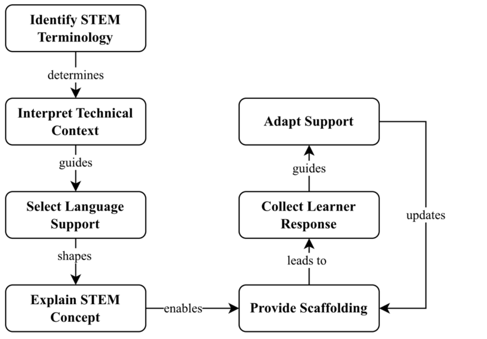
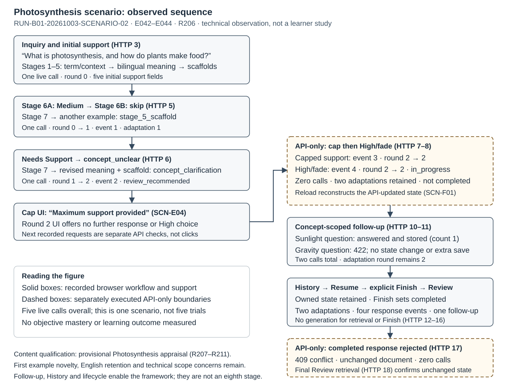

# Assignment 5 — Working paper

## Title

Evaluating Adaptive LLM Scaffolding for Burmese-Speaking STEM Learners

## Abstract

Burmese-speaking STEM learners need contextual explanations of English terminology and unfamiliar concepts. This study evaluates a Context-Aware Adaptive STEM Scaffolding Framework and a bilingual large language model proof of concept. Conceptual evaluation combines GenAI critique, literature analysis, informed argument and a historical scenario. Design evaluation uses functionality and usability criteria, static and dynamic analysis, bounds analysis, simulation, black-box and white-box testing, literature comparison and a live scenario. Recorded evidence supports bounded routing, response traceability and persistence under tested conditions. Researcher-endorsed content review recorded 18 Pass, 71 Partial and two Fail judgements across 91 delivered outputs. Technical usability inspection found six criteria Pass and three Partial. The framework has a literature-grounded rationale, but terminology interpretation and content adequacy remain partial. The contribution is an evaluated integration of bounded, learner-responsive support; improved learning, calibrated scaffolding and an optimal adaptation dose remain unestablished.

## Keywords

- Adaptive STEM Scaffolding
- Burmese-Speaking Learners
- Large Language Models
- STEM Terminology Support
- Task–Technology Fit
- Design Science Evaluation

## 1. Evaluation Context

This project addresses three related requirements: contextual support for specialised English STEM terminology, conceptual explanation beyond translation, and structured learner-responsive assistance for Burmese-speaking learners. RQ1 concerns terminology support; RQ2 concerns explanation; RQ3 concerns adaptive scaffolding. These are the supplied research motivations, not newly measured estimates of language barriers or learner difficulties. Local REQ-01–03 labels connect them to evaluation criteria and recorded findings.

Two artefacts were selected: Assignment 3's Context-Aware Adaptive STEM Scaffolding Framework and Assignment 4's bilingual LLM proof of concept. Original conceptual inputs, the final interpretation in E056 §26, and executable B01 remain distinct. B01 production is commit `37faefa236829aa3d79e023faa1fb72a086b5c2a`; ROOTTESTS-02 separately identifies the extended tests/configuration in the root project.

The evaluation asks whether the responsibilities are defensible and whether the implementation instantiates them within its bounds. Conceptual methods combine GenAI critique, literature evaluation, informed argument and a historical scenario. Design methods combine criteria-based inspection, static/dynamic and bounds analysis, simulation, external/internal testing, literature comparison and a fresh scenario. Following [Venable et al. (2016)](https://doi.org/10.1057/ejis.2014.36), these predominantly artificial evaluations support bounded claims rather than utility in authentic learner practice. The evidence archive preserves exact recorded runs and qualifications; no participant learning experiment or independent expert interview was conducted.

## 2. Conceptual Artefact Evaluation

Conceptual evaluation examines the framework's responsibilities and rationale, rather than treating diagram completeness as educational validation. Four complementary methods informed refinement; their sources and identities constrain the strength of convergence.

### 2.1 Artefact Selection and Evaluation Criteria

The framework was selected because it coordinates terminology, context, language strategy, core explanation, scaffolding, learner response and adaptation across all three requirements. Figure 1 preserves the original diagram; the final interpretation adds bounded reconsideration without inventing an eighth stage. Table 1 operationalises C1–C5 as requirement coverage, coherence, theoretical consistency, literature consistency and scenario applicability. Coverage means that a responsibility is present, not that exactly seven stages are uniquely necessary. The original interview's C4 assessed boundary completeness, whereas protocol C4 assesses literature consistency; E057's crosswalk prevents conflation. The evaluated conceptual refinement and the original interview input are consequently not interchangeable artefacts (E049–E059; R001–R005). These distinctions govern subsequent synthesis.

**Figure 1. Selected Context-Aware Adaptive STEM Scaffolding Framework.**
Reproduced unchanged from the supplied Assignment 3, Artefact 3, Figure 3,
PDF page 7. Seven responsibilities connect terminology, context, language,
concept explanation, scaffolding, learner response and support adaptation.

*Note.* This is the original topology, not a retrospectively redrawn Assignment
3 artefact. Assignment 5's final interpretation is E056 §26: Stage 6 is
self-reported support need; Stage 7 may revisit language/core meaning or
terminology/context where required, beyond the original drawn Stage 7 → 5
arrow. The PoC's 6A/6B subdivisions, deterministic routes, High-to-fade,
two-round maximum and explicit Finish are implementation refinements explained
in the paper, not labels present in the original image. There is no eighth
stage or implication of one LLM call per stage. TTF motivates task alignment,
not measured learner fit (Goodhue & Thompson, 1995); scaffolding provides a
critical benchmark, not a claim of demonstrated learning (van de Pol et al., 2010).

Source: [original Assignment 3](../../docs/INFOSYS_720_Assignment_3.pdf),
[refined framework E056 §26](../01_conceptual/framework_refinements.md#26-frozen-refined-framework-for-assignment-5),
[current argument E058/E059](../01_conceptual/informed_argument/traceability_v2.md).
The retained crop contains only the original diagram; its source hash, page,
render/crop command and visual inspection are recorded in the intake metadata.

**Table 1. Conceptual Artefact Evaluation Criteria and Methods**

| Criterion | Method | Evidence | RQ mapping |
| --- | --- | --- | --- |
| C1 — PIRQOA coverage: explicit responsibility for each requirement | CA-GAI, CA-LIT, CA-ARG, CA-SCN | E049–E056, E058–E059; R001 | RQ1, RQ2, RQ3 |
| C2 — Logical coherence: dependencies, feedback decisions and justified re-entry | CA-GAI, CA-ARG, CA-SCN | E049–E050, E054–E056, E058–E059; R002 | RQ1, RQ2, RQ3 |
| C3 — Theoretical consistency: task alignment, contingency/fading and self-report boundary | CA-LIT, CA-ARG, CA-GAI | E049–E052, E055–E056, E058–E059; R003 | RQ1, RQ2, RQ3 |
| C4 — Literature consistency: direct/transferable support, mismatch and unsupported assumptions | CA-LIT, triangulated with CA-GAI | E049–E052, E057–E059; R004 | RQ1, RQ2, RQ3 |
| C5 — Scenario applicability: stage inputs, decisions, support and unresolved transitions | CA-SCN, CA-ARG | E054–E056, E058; R005 | RQ1, RQ2, RQ3 |

*Table 1 note.* Criteria/methods are condensed from protocol §5.2, not new
acceptance rules. Evidence includes performed source methods and later
refinement/current argument; their temporal identities remain distinct.
Original GENAI-01 C4 means completeness/boundary clarity, **not** protocol
literature consistency. E057's crosswalk applies; its original response is not
treated as a direct C4 literature appraisal. The GenAI model did not browse.
CA-ARG v2 strengthens scholarly reasoning but does not retroactively expose
the refined framework to the original interview. All RQs are coverage
contributions, not declarations of empirical success.

### 2.2 GenAI Interview

GENAI-01 used a fresh Temporary Chat on 28 September 2026, with nine fixed questions and no browsing. The interface reported GPT-5.6 Sol with High reasoning; that interface label is recorded provenance, not independent provider-version verification. The original framework, requirements, theoretical framing and Photosynthesis scenario were supplied as text. Responses and coded analysis were retained separately (E049–E050).

The critique recognised PIRQOA coverage and progression beyond translation, but identified self-report, unreliable interpretation, explanation quality and underspecified decisions as risks. Its distinction between core explanation and assistance prompted boundary clarification. Suggestions were not accepted automatically: literature, informed argument and scenario findings supplied supporting or limiting reasons. Table 2 retains the native judgements rather than converting them into implementation passes. Reported confidence is not measured certainty or transferable authority. The model neither evaluated the eventual B01 routes nor independently validated the refined framework. Its contribution is structured challenge to assumptions, not expert testimony, learner observation or empirical evidence of effectiveness (R013–R017).

### 2.3 Academic Literature Evaluation

The conceptual comparison reused Assignment 2's 17-study corpus, four themes and twelve sub-themes, rather than conducting a new systematic search ([Htet, 2026](../../docs/INFOSYS_720_Assignment_2.pdf)). Nineteen recorded findings linked prior research to the seven responsibilities and the GenAI concerns (E051–E052; R018–R036). The source set supports an integration opportunity within that review boundary; it cannot establish a universal gap. A single database, English records and an open-access filter constrain coverage, while the supplied PDF does not reconstruct every screening decision.

Native-language technical assistance offers a relevant precedent in Sinhala programming education ([Athukorala & De Silva, 2025](https://doi.org/10.7763/IJCTE.2025.V17.1378)), but neither its language nor its outcomes transfer directly to Burmese STEM learners. Scientific-paper translation motivates selective English-term retention ([Kleidermacher & Zou, 2026](https://doi.org/10.18653/v1/2026.findings-eacl.204)); researchers' preferences do not validate novice comprehension. Guided multilingual interaction in [Kuzu (2026)](https://doi.org/10.1007/s10758-026-09974-7) raises a counterargument: independently selected menu assistance is not equivalent to teacher-mediated facilitation.

These relationships support explicit context, language and assistance responsibilities, not the precise topology, route table or two-round policy. Assignment-mediated comparisons retain secondary attribution rather than implying unread originals were inspected. The historic 2026 Tran summary is not silently substituted with the separately consulted 2023 preprint. Support levels therefore express warranted relationships and transfer limits, not application accuracy or learning-effect estimates (E047, E059). The reviewed studies therefore function as bounded comparisons: their affordances suggest relevant responsibilities, while their settings and assessment modes limit what the framework can legitimately inherit directly.

### 2.4 Informed Argument

Informed argument connects research warrants to mechanisms, removal tests and counterarguments, as descriptive IS evaluation requires ([Hevner et al., 2004](https://doi.org/10.2307/25148625), p. 86, Table 2). The current argument evaluates the final interpretation; its additional sources are not attributed retrospectively to the original interview or frozen SLR (E058–E060).

[Goodhue and Thompson (1995)](https://doi.org/10.2307/249689) motivate examining technology in relation to supported tasks. Applying that organisational warrant here is a design inference, not a validated educational fit scale. Removing target/context identification risks explaining the wrong sense; [Tran et al. (2023)](https://arxiv.org/abs/2301.06767v1) motivate explicit domain terminology, not proof of deterministic ATE. Removing language selection leaves retention incidental; its novice suitability still needs assessment. Removing core meaning could leave examples without an explicit concept. [Sweller (1988)](https://doi.org/10.1207/s15516709cog1202_4) supplies supplementary instructional rationale, not measured load reduction; [Ji et al. (2024)](https://arxiv.org/abs/2202.03629v7) support treating generated-content reliability separately from fluency.

[Van de Pol et al. (2010)](https://doi.org/10.1007/s10648-010-9127-6) distinguish contingency, fading and responsibility transfer. Their benchmark warrants purposeful assistance and responsive adjustment, but self-report cannot establish competence-sensitive contingency. Without purposeful scaffold selection, examples or hints may be present without responding to the learner's expressed support need. Self-evaluation can be inaccurate ([Dunlosky & Rawson, 2012](https://doi.org/10.1016/j.learninstruc.2011.08.003)); that does not invalidate every response. Removing response collection or adaptation breaks the feedback mechanism, yet withholding generation after High does not demonstrate mastery. Target identification and core meaning are Conceptually justified; the other five responsibilities are Justified with qualification. Alternative combined stages or teacher-mediated designs remain plausible (R006–R012).

### 2.5 Scenario Evaluation

The historical Photosynthesis record illustrates core explanation, structured support and a check–example–check sequence (E054; R005). It makes the framework understandable as an interaction, but does not document the exact response triggering adaptation, second adaptation, fade/cap, follow-up answer or complete lifecycle. Original execution date, model and commit are unrecorded. The observed example cannot establish why one strategy was selected or whether perceived understanding changed. Consequently, scenario applicability remains partial despite the historical positive judgement. The fresh design walkthrough is separate evidence and cannot retrospectively fill these gaps. This method establishes plausible responsibility enactment, not a participant's concept acquisition or the completeness of every transition. Those gaps remain unresolved.

### 2.6 Triangulation, Refinement, and Conceptual Evaluation Summary

Across methods, coordination beyond translation is defensible, while diagnosis and decision precision remain limiting. Refinement clarified Stage 4 meaning versus Stage 5 assistance, Stage 6 self-reported need, and bounded Stage 7 reconsideration of language, meaning or intended context (E055–E056; R037–R079). These are analytical responsibilities, not seven mandatory provider calls. Exact implementation choices remain project policies.

Table 2 separates native method judgements from the current synthesis: C1 is Fully supported for responsibility coverage; C2–C5 are Partially supported. Shared literature and scenarios are not independent replications, and the updated argument does not constitute another learner study. Optional expert evaluation was intentionally skipped. The contribution is accountable conceptual integration, with theoretical and empirical limits still explicit. Refinement is not replication.

**Table 2. Conceptual Artefact Evaluation Results**

| Method / object | Recorded finding | Qualification / counterevidence | Result and evidence |
| --- | --- | --- | --- |
| CA-GAI — original nine-question interview | C1 Fully covered; C2/C3 Acceptable with minor issues; historical C4 Mostly complete; C5 Applicable with minor issues | One no-browse model critique of the supplied original framing. Self-reported confidence is not certainty, expert validation or learner evidence; stage/decision underspecification remains | R013–R017; E049–E050, E057 |
| CA-LIT — retained Assignment 2 corpus | Terminology/context, bilingual explanation and structured/adaptive support have literature relationships; nineteen findings retain their native support labels | Transfer across languages/domains; exact routes, topology and cap not directly validated. No fresh SLR and no Burmese-specific effectiveness rate | R018–R036; E051–E052 |
| CA-ARG — current literature-grounded v2 | Target identification and core meaning Conceptually justified; other five responsibilities Justified with qualification | Cited warrant → mechanism → removal test → counterargument. Local TTF fit, self-report contingency and exact language/route choices remain design inferences | R006–R012; E056, E058–E060 |
| CA-SCN — historical supplied Photosynthesis interaction | Core explanation, structured support and check–example–check sequence instantiate the responsibilities | Exact selected response/trigger, second adaptation, fade/cap, follow-up answer and lifecycle evidence are missing; not a B01 execution or learner experiment | R005; E054–E057 |
| Current conceptual synthesis — derived, not a fifth independent method | C1 Fully supported for responsibility coverage; C2–C5 Partially supported | A defensible refined framework, not a uniquely necessary seven-stage topology, validated fit scale or educational-effectiveness finding. Shared sources are not independent replications | R001–R005; E056–E059; interpretation E067 |

*Table 2 note.* Native method judgements are retained rather than averaged.
Historical triangulation (R037–R061) and refinement decisions (R062–R079) are
derived analyses, not extra independent methods. Hevner et al. (2004, p. 86,
Table 2) warrant literature-grounded informed argument; the implemented
mechanisms are project inferences. Goodhue and Thompson (1995) and van de Pol
et al. (2010) motivate task alignment and a demanding scaffolding benchmark.
No competence diagnosis, calibrated fading or responsibility transfer was
measured. E059/E040 retain abstract/excerpt/full-text access and version limits.

## 3. Design Artefact Evaluation

Design evaluation examines B01 behaviour through controlled, database-backed, live-provider and inspection evidence. Successful mechanics and delivered-content adequacy are assessed separately.

### 3.1 FURPS Functionality and Usability Criteria

FURPS was operationalised as thirteen Functionality and nine Usability criteria, not five independently scored dimensions (Table 3). Protocol 2.1 fixes recorded response, lifecycle and persistence oracles. Mechanical checks enable the substantive terminology/explanation/adaptation tasks without proving educational benefit. Composite Functionality outcomes all remain Partial; Usability has six Pass and three Partial. These judgements include coverage limits and counterevidence, rather than promoting criteria from isolated passing branches (R080–R101).

**Table 3. FURPS Functionality and Usability Criteria**

| Criterion | Evaluation focus | Recorded checks | RQ contribution |
| --- | --- | --- | --- |
| F1 — Inquiry handling | Valid initialisation; controlled rejected input | BB01/02/20, WB04, dynamic retrieval | RQ1–3, enabling |
| F2 — Terminology/context | Intended STEM meaning; explicit ambiguity/repair | BB03/08, SIM13–16, exact-output review | RQ1 |
| F3 — Bilingual support | Preference/override and useful term retention without material mistranslation | BB04/08, simulation content review, WB06 | RQ1 |
| F4 — Structured support | Meaningful explanation/example/technical/reflection and revealable hint | BB05, simulation/scenario, WB04 | RQ2 |
| F5 — Learner response | Three self-reports; optional five help choices; valid event/input combinations | BB06–08/23, WB01, persisted events | RQ3 |
| F6 — Adaptive support | Deterministic route and meaningful change; High fades | BB06–10, WB01, simulation/content review | RQ1–3, route-dependent |
| F7 — Adaptation bound | Stored rounds 0–2; no third adaptation; event/state consistency | BB09–11/24, bounds, WB01/05, real DB concurrency | RQ3 |
| F8 — Scoped follow-up | Current context, unrelated-topic boundary, 500 characters and two questions | BB12/13/21, WB03, stored follow-ups | RQ3 |
| F9 — Persistence | Durable content/events/interpretation/follow-ups and atomic updates | BB09–16, WB05, dynamic/bounds retrieval | RQ3, enabling |
| F10 — Learning History | Owned sessions, newest-first, accurate state | BB14/22, UI/API ownership | RQ3, enabling |
| F11 — Review/Resume | Reconstruct stored state; preserve completion and bounds | BB15/16/24, WB02, scenario | RQ3, enabling |
| F12 — Preferences | Valid persistence, rejected inputs, original session snapshots | BB04/17, WB06, UI/reload | RQ1/RQ3, enabling |
| F13 — Error handling | Stable controlled faults/recovery and no invalid content writes | BB02/18–24, WB02–04, injected faults/UI | RQ1–3, enabling |
| U1 — Task clarity | Inquiry purpose and entry evident | Structured inspection, Home and keyboard | RQ1–3, enabling |
| U2 — Information structure | Explanation areas and hint distinguishable | Initial/adapted/follow-up hierarchy | RQ2, enabling |
| U3 — Interaction clarity | Stage 6A/6B, skip/back and consequences clear | Three responses, all choices, keyboard | RQ3, enabling |
| U4 — Feedback visibility | Pending/adapting and updated support visible | Loading, routes, fade/cap and recovery | RQ3, enabling |
| U5 — Navigation consistency | Inquiry/History/Review/Resume/preferences reachable | Navigation and modal focus | RQ3, enabling |
| U6 — Bilingual readability | Legible glyphs/wrapping without clipping | Viewports/locales/themes and overrides; semantics separate | RQ1/RQ2, enabling |
| U7 — State visibility | Self-report, route, limits and completion distinguishable | Status/round/event/interpretation displays | RQ3, enabling |
| U8 — Error clarity | Understandable localised error and recovery action | Failure/retry/scope/ownership inspection | RQ1/RQ3, enabling |
| U9 — Consistency | Labels and interaction patterns across configurations | Locale/theme/width and keyboard matrix | RQ1–3, enabling |

*Table 3 note.* Condensed protocol §5.3–5.4 criteria; the full protocol remains
the oracle. FURPS is operationalised here as **Functionality and Usability**,
not all five dimensions independently scored. Provider, reliability and timing
observations inform the specified checks but do not create new P/R/S grades.
Results remain F1–F13 all Partial (R080–R092); U1–U9 six Pass/three Partial
(R093–R101). U6 is visual-only; self-report is not mastery. Technical inspection
is not a participant study or full WCAG conformance audit.

### 3.2 Analytical Evaluation

Static structure, observed runtime and boundary instrumentation answer different questions and should not be conflated.

#### 3.2.1 Static Analysis

The formal static run examined layer separation, validation, ownership, persistence and controlled error contracts, alongside lint, TypeScript and production-build checks (E001–E003; R102–R115). Its first integration attempt was environment-blocked; the unchanged permitted retry passed under recorded conditions. Earlier services/DAO coverage remains scoped accordingly. Compilation and architecture inspection establish structural consistency, not successful live generation or scientific accuracy (R215).

#### 3.2.2 Dynamic Analysis

Dynamic records trace creation, responses, corrected context, follow-up, persistence and recovery; a manual twelve-screen pass adds technical browser observation (E004–E013). DYN-05/06 retain indirect provider-count Partial Pass. DYN-10's incorrect response-property assertion and adjudication remain visible. Fifteen successful initial requests across five fixed inquiries had median 3.331 seconds, range 2.593–4.640. These local sequential timings are descriptive, not adaptation-latency, load or production-SLA evidence. Screenshots corroborate presentation, not observed learning (R116–R128, R225).

#### 3.2.3 Optimisation / Bounds Analysis

Seventeen deterministic-provider/real-MongoDB cases passed for stored rounds, fade/cap events, completion, invalid state and contention (E014–E017; R129–R145). High persists fade without generation or increment; a support-needed response at round two persists an event without round three. Atomic updates preserve accepted event/adaptation consistency. However, BND-15 made two provider calls while accepting one write. The stored bound is therefore not a global cost ceiling. “Optimisation” here denotes bounded behavioural analysis, not maximising learning, an experimentally optimal dose or unrestricted performance optimisation. Explicit Finish remains separate from self-reported High.

### 3.3 Simulation

The fixed multi-domain corpus comprised 48 planned main attempts and seven language/context supplements, giving 55 full-run attempts with a live provider and isolated database (E018–E021). Results were 44 technical Pass, eight controlled initial ambiguities without sessions, and three technical Fail. SIM05-C aborted at 52.825 seconds despite a configured 20-second timer; SIM-CM-13/16 rejected purported corrections leaving concept/domain unchanged. Unreached downstream steps are not successful delivery.

Separately, 91 delivered outputs received 18 Pass, 71 Partial and two Fail ratings (E022–E023). The researcher endorsed AI-assisted worksheets after review; this is not independent expert assessment or 91 learners. Gravity's mass/weight wording used `အစုလိုက်အပြုံလိုက်` instead of `ဒြပ်ထု`; an ion definition's `မရှိတော့ဘဲ` reversed the nonzero-charge meaning. Later adaptations do not repair the initial text. Safe rejection and non-mutation demonstrate control, not reliable intended-route delivery or uniformly adequate support (R198–R205).

### 3.4 Black-Box and White-Box Testing

Public HTTP/browser assessment recorded 24 black-box cases: 21 Pass, two Partial and one Fail (E024–E027). BB07/08 exercise route/rendering contracts but do not assess semantic novelty. BB22 expected missing-identity rejection, whereas the public proxy provisions an anonymous cookie and returns empty History; the frozen-oracle Fail remains, without an observed foreign-session leak. A supplemental zero-round ambiguity assertion also failed: accepted generated remaining-ambiguity support consumes a round. Counting therefore matters. Driver adjudications and first attempts remain separate, not erased by rechecks. External evidence consequently supports tested public behaviour within its fixture and boundary conditions, rather than universal output adequacy (R153–R176, R216–R217).

White-box evaluation used the root project, with 361 deterministic and twelve isolated MongoDB tests: 373 unique tests, not additional tests for repeated commands (E033–E035). WB01–WB06 passed structurally, including 39 route/round combinations and DAO, legacy, error and lifecycle assertions. V8 covered 42 files: 72.54% statements, 76.37% branches, 64% functions and 73.75% lines. Mocked boundaries establish exercised logic; real database tests support persistence. Neither certifies live content, and unexercised code remains. This complements public observations without turning shared fixtures into independent replications or combining browser/database observations into V8 totals (R146–R152).

### 3.5 Informed Argument and Scenario

Eight design arguments connect cited warrants, implemented features, observations and counterarguments: two Supported and six Partially supported (E039–E041). [Goodhue and Thompson (1995)](https://doi.org/10.2307/249689) motivate relevance to terminology, explanation and responsive assistance tasks; feature availability alone cannot demonstrate learner fit. [Van de Pol et al. (2010)](https://doi.org/10.1007/s10648-010-9127-6) provide the distinction between responsive support and diagnosed contingency. Persisted history enables accountable continuity, but does not itself transfer responsibility. [Hevner et al. (2004)](https://doi.org/10.2307/25148625) warrant knowledge-base-grounded argument as complementary evaluation, not developer assertion or replacement for behavioural checks. Failures constrain the proposed mechanisms rather than being excused by their theoretical rationale (R177–R184).

The fresh Photosynthesis walkthrough records two adaptations, four response events, one stored follow-up and completed round two (E042–E044; Figure 2). Fifteen technical checks passed. Cap, High-at-cap and post-completion response checks were API-only, not learner clicks. Browser Resume/Review reconstructed the same state. Content remains provisionally Partial: bacterial/chloroplast scope wording, extensive nontechnical English retention and limited first-example novelty remain concerns. The simulation endorsement does not cover this output. One coherent workflow cannot cancel earlier failures or measure participant learning (R206–R211).

**Figure 2. Photosynthesis Scenario Evaluation Flow.** Reconstruction of
`RUN-B01-20261003-SCENARIO-02` from retained HTTP, provider, state and browser
records (E042–E044; R206). Solid arrows follow the recorded sequence. Dashed
boundaries identify separately executed API-only checks, not learner clicks.
Stages 1–5 are responsibilities within one initial generation, not five calls.

*Note.* The learner actions are scripted technical observations. At round 2
the UI does not offer another response or High; API-only requests add the
third capped and fourth fade events before reload and follow-up. High does
not complete the session. The unrelated gravity question is rejected without
saving a second follow-up or changing the active concept. Resume, explicit
Finish and Review reconstruct the same session. Its content remains
provisional and the timing observations do not establish performance targets.
History, follow-up and lifecycle are enabling interactions, not an eighth stage.

Figure source: [recorded scenario, actions/state trail](../02_design/scenario/photosynthesis_scenario.md#3-expected-and-actual-scenario-actions).
The SVG contains editable text/shapes; the adjacent PNG is a rendered insertion
copy of the same SVG, not independent evidence. Their identities and visual
check are recorded in the Step 24 manifest/intake.

### 3.6 Academic Literature Evaluation

Thirteen design comparisons included all five Assignment 2 SSR systems: one Strong, nine Moderate, two Limited and one Contradictory/uncertain (E045–E048). The Sinhala assistant offers a technical-language precedent ([Athukorala & De Silva, 2025](https://doi.org/10.7763/IJCTE.2025.V17.1378)); Assignment 2's dictionary, video, lyric and bilingual Telugu learning platform comparisons illustrate additional structured affordances ([Htet, 2026](../../docs/INFOSYS_720_Assignment_2.pdf)). These are reported comparisons, not fresh system executions or proof of absent features. The comparison also retains reported Telugu personalisation, but does not equate language acquisition with STEM concept learning. The PoC integrates contextual support but lacks comparator modalities. Selective retention has a research warrant, yet novice terminology quality remains partial ([Kleidermacher & Zou, 2026](https://doi.org/10.18653/v1/2026.findings-eacl.204)). DL12's Strong concerns critical evaluation, not strong content; DL13 does not validate the exact fade/dose policy. Corpus and access limits preclude superiority claims (R185–R197).

### 3.7 Design Evaluation Summary

Table 4 shows stronger bounded mechanics than content or live delivery. Structured usability inspection found six criteria Pass and U5/U8/U9 Partial (E036–E038). Modal focus and English-only errors in Burmese UI have severity 2; a generic correction badge on remaining ambiguity has severity 1. The preference-save infrastructure-fault UI was Not assessed. Distributed viewport/locale/theme and keyboard inspection is neither participant usability nor physical-phone/full-WCAG evaluation. Visual Burmese readability does not validate scientific wording. Overall, routes and reconstruction are implemented under tested conditions, while meaningful novelty, dependable correction and scientific explanation quality remain partial. Completion of evaluation methods therefore does not imply an all-pass artefact or educational effectiveness.

**Table 4. Design Artefact Evaluation Results**

| Method | Recorded result | Material qualification / failure | Result and evidence |
| --- | --- | --- | --- |
| Static analysis | Formal STA-01–14 inspections/checks recorded; dependency and layer/validation contracts traced | First STA-04 integration attempt Blocked by environment; unchanged permitted retry passed. Original coverage was services/DAO, not full-project coverage. Inspection is not runtime content validation | R102–R115, R215; E001–E003 |
| Dynamic analysis | DYN-01–13 workflow/persistence/recovery observations and manual 12-screen pass recorded. Fifteen initial timings: 2.593–4.640 s; median 3.331 s | DYN-05/06 retain indirect-count Partial Pass; DYN-10 driver property-path error adjudicated without erasing original. Local sequential timings are descriptive, not SLA/load evidence | R116–R128, R225; E004–E013 |
| Bounds analysis | All 17 deterministic-provider/real-DB cases Pass; fade/cap/lifecycle and stored atomic bounds exercised | BND-15: two provider calls, one accepted write. Stored bound is not a provider-cost ceiling or pedagogically optimal dose | R129–R145; E014–E017 |
| Simulation | 55 attempts: 44 technical Pass, eight controlled initial ambiguities, three technical Fail. Separate 91 delivered-output ratings: 18 Pass, 71 Partial, two Fail | SIM05-C abort observed at 52.825 s; SIM-CM-13/16 unchanged corrections rejected. Endorsed gravity mass/weight and ion net-charge errors remain. No-session/dependent unreached steps are not successful delivery; no learner effect | R198–R205; E018–E023 |
| Black-box | 24 assessed cases: 21 Pass, two Partial, one Fail; public HTTP/browser/state evidence retained | BB07/08 fixture novelty Not assessed. BB22 missing-identity 400 oracle contradicts actual proxy 200/provisioned identity; Fail retained, not an observed foreign leak. Supplemental zero-round ambiguity assertion also Fail | R153–R176, R216–R217; E024–E027 |
| White-box | WB01–06 structural Pass; 361 deterministic + 12 real-MongoDB tests. 42-file V8: statements 72.54%, branches 76.37%, functions 64%, lines 73.75% | 373 unique tests, not extra tests per repeated command. ROOTTESTS-02 production remains B01. Coverage excludes unexercised paths; browser/database observations not merged into V8; mocks do not certify live quality | R146–R152; E033–E035 |
| Structured usability inspection | Nine criteria: six Pass, three Partial; 133 retained captures across distributed configurations | U5/U8/U9 Partial. USI-01 modal focus and USI-02 English errors in Burmese UI severity 2; USI-03 ambiguity badge severity 1. Preference-save fault UI Not assessed; no participants/physical-phone/full WCAG study | R093–R101, R212–R214, R218–R221; E036–E038 |
| Design informed argument | Eight feature arguments: two Supported, six Partially supported | Literature-grounded mechanism rationale, not learner outcomes. Shared technical/literature inputs are not independent replications; self-report responsiveness is not calibrated scaffolding | R177–R184; E039–E041 |
| Fresh Photosynthesis scenario | One live walkthrough: 15 technical checks Pass; two adaptations, four response events, one stored follow-up, completed round 2 | Cap/High-at-cap/post-completion checks are API-only. Content provisional with scope, English-retention and novelty qualifications; no new human endorsement | R206–R211; E042–E044 |
| Design literature comparison | 13 comparisons: one Strong, nine Moderate, two Limited, one Contradictory/uncertain | Five SSR systems and selected corpus; source-access/transfer limits. DL12 Strong warrants critical evaluation, not strong PoC content; DL13 does not validate dose/fade. No superiority claim | R185–R197, R223; E045–E048 |

*Table 4 note.* The first six rows fulfil the required method summary; the
remaining four retain completed supplementary evaluation rather than omitting
its limits. Scales and denominators differ and are not pooled into a success
rate. Controls converge on narrow state/safety properties (E067 INT-01–06);
content and overall RQ support remain partial. Later successful runs do not
erase earlier failures. Expert interviews were Skipped (R220), not replaced
by GenAI critique or AI-assisted endorsed worksheets. Evaluation in controlled
settings does not establish naturalistic learner utility (Venable et al., 2016).

## 4. Results and Interpretation

Interpretation combines evidence while preserving native scales. Narrow mechanical support, partial delivery/content, conceptual rationale and unsupported effects remain distinct.

### 4.1 Consolidated Results

E061/E062 retain 225 results, rather than 225 independent tests or participants. External observations, instrumented bounds and internal assertions converge on application-controlled routing, event/adaptation persistence and lifecycle reconstruction. High/fade and cap behaviour have instrumentation beyond earlier indirect observations. Corrected-context follow-up remains concept-scoped and leaves adaptation state unchanged. These are exercised implementation properties, not universal guarantees (E015, E024–E026, E033–E035; E067 INT-01–06).

The evidence matters. A structurally accepted output can contain a scientific or Burmese error; plausibility can coexist with weak novelty. The two endorsed content Fail remain despite later better support. Eight no-session ambiguities and three live delivery Fail constrain dependable interpretation and adaptation. The fresh scenario corroborates integration but retains provisional content judgements and API-only boundaries. Safe errors support non-corruption without establishing successful assistance (E019–E023, E042; R198–R211).

Accordingly, all thirteen Functionality criteria remain Partial, while Usability retains six Pass/three Partial. Stronger mechanical subclaims do not promote these composite judgements. Literature support likewise warrants a mechanism, not an observed benefit. Bounds, coverage, screenshots and output ratings have different units; averaging them would hide the distinction being evaluated. Historical attempts, oracle discrepancies and derived analyses stay traceable to records rather than becoming extra confirmations. This convergence supports bounded implementation credibility with unresolved semantic, delivery and interaction limitations, not a general reliability rate (E062, E067).

### 4.2 PIRQOA / RQ Traceability

The recorded 24-chain PIRQOA matrix links problems, requirements, RQs, objectives, responsibilities, criteria and existing R/E records (E064–E066; Table 5). Each RQ remains Partially supported overall; populated traceability is not complete requirement satisfaction.

For RQ1, contextual terminology and selective bilingual treatment provide a defensible approach. Corrected interpretations and language routes instantiate it, while unchanged-correction rejection and Burmese terminology errors limit dependable intended-meaning support. Neither validated ATE nor measured reduction in language barriers follows (REQ-01; R008, R081–R082, R200–R205).

For RQ2, core explanations, examples, reflection and hints demonstrate assistance beyond word substitution. Mixed definitions and first-example repetition qualify usefulness; this evaluation did not measure conceptual understanding or retention. Structured output is an enabling representation, not evidence that the learner acquired its meaning (REQ-02; R083, R159–R160, R203–R210).

For RQ3, optional self-reported need drives deterministic routes, bounded generation and durable interaction history. Concurrency and lifecycle evidence support those mechanics, but not calibrated contingency, educational fading, transfer or optimal dose. Self-report, cap and explicit Finish are different constructs; a completed session is not mastery (REQ-03; R143–R151, R180–R181, R222).

**Table 5. PIRQOA Evaluation Traceability**

| Problem / issue | Requirement, RQ and objective | Artefact / responsibilities | Criteria | Recorded support and remaining gap | Trace |
| --- | --- | --- | --- | --- | --- |
| English STEM terminology, limited Burmese resources and misleading literal translation; insufficient contextual language support | REQ-01 / RQ1: identify specialised terms and provide contextual Burmese support while retaining useful English terms. Objective: multilingual STEM terminology support | Refined conceptual framework and B01 PoC; Stages 1–3, bounded Stage 7 repair | C1–C5; F1–F3/F12–F13; U1/U6/U8 | Partially supported overall: target/context interpretation and selective bilingual presentation are instantiated. Intended-sense repair, reliable Burmese terminology and novice suitability remain incomplete; gravity/ion errors and rejected unchanged corrections persist. No validated ATE or measured barrier reduction | E064 rows 1–7; key R001–R008, R080–R082, R200–R205, R210; E019/E021–E023/E042/E056/E058–E059; E067 INT-07/08/11/12 |
| Translation alone insufficient for conceptual support; limited explanation beyond isolated words | REQ-02 / RQ2: provide clear concepts and examples beyond translation. Objective: conceptual STEM explanation | Refined conceptual framework and B01 PoC; Stages 2, 4–5 and bounded Stage 7 revision | C1–C5; F4/F6; U2/U6 | Partially supported overall: explanations, examples, reflection and hints supply structured assistance. Mixed adequacy, material definitions/terminology and limited novelty prevent consistently-correct-support or improved-understanding/retention claims | E064 rows 8–13; key R009–R010, R083, R094, R159–R160, R203–R210, R217; E022–E026/E042/E056/E058–E059; E067 INT-08/11/14 |
| Static/unstructured assistance; insufficient adaptive scaffolding | REQ-03 / RQ3: structured, learner-responsive bounded assistance. Objective: adaptive scaffolding approach | Refined framework and B01 PoC; Stages 5, 6A/6B, 7; scoped follow-up and state continuity enable these responsibilities | C1–C5; F5–F13; U3–U5/U7–U9 | Partially supported overall: stated need drives deterministic routes, stored bounds and continuity in tested paths. Narrow mechanics strongly supported; live failures, BB22 and interface defects remain. No objective mastery, calibrated fading/transfer, optimal dose or learner effectiveness | E064 rows 14–24; key R011–R012, R084–R092, R143–R151, R174, R180–R181, R199–R201, R212–R214, R222; E015/E021/E024–E026/E033–E040/E058–E059; E067 INT-01–06/09/10/13/15–17 |

*Table 5 note.* This is a three-row presentation condensation of E064, not a
replacement for its full 24-row, 13-column matrix or a new assessment. “Rows”
refer to data rows, excluding the CSV header. The trace cell selects key
existing findings; full result/evidence unions remain in E064. Requirements
and objectives are condensed from protocol §3; the three RQs are:

1. RQ1: How can specialized English STEM terminology be supported for Burmese-speaking learners?
2. RQ2: How can LLM-based support help learners understand STEM concepts beyond translation?
3. RQ3: How can LLM-based scaffolding provide structured and adaptive support for Burmese-speaking STEM learners?

Local REQ IDs are evaluation-tracking labels, not original assignment labels.
Problem statements are the supplied motivation, not a new prevalence estimate.
Criterion coverage and complete traceability do not establish full requirement
satisfaction. Hashes establish identity, not content correctness or public release.

### 4.3 What the Evaluation Does and Does Not Show

The contribution is an evaluated coordination of responsibilities and tested controls, with content and intended-meaning repair still partial. [Venable et al. (2016)](https://doi.org/10.1057/ejis.2014.36) distinguish artificial from naturalistic evaluation; synthetic inquiries, controlled providers and evaluator inspection cannot substitute for authentic learner practice. Reused outputs, shared fixtures, argument versions and derived matrices do not create independent replications. Purposive cases, stochastic generation and limited configurations constrain generalisation.

No participant learning/satisfaction study, independent expert review, calibrated fit/dose assessment or full accessibility audit was conducted. The preference-save fault UI and fixture semantic novelty remain unassessed. Source warrants retain abstract/excerpt or assignment-mediated limits; citing them does not validate Burmese equivalents. The two-round state bound does not cap concurrent provider work, and the configured abort is not a hard twenty-second wall-clock guarantee. These limits preclude superiority, uniform correctness and educational-effectiveness claims (R217–R225; E067).

Evidence hashes establish identity, not truth or sharing consent. Restricted cookie-bearing originals require controlled retention and separately reviewed, labelled redacted derivatives before distribution; no release clearance follows from this paper's evidence traceability (E057). Such release review remains separate from substantive evaluation.

## 5. Conclusion

The framework and PoC offer an evaluated integration of contextual terminology support, explanation beyond translation and bounded response-driven assistance. Literature-grounded reasoning supports the responsibilities, while external observations and internal/state tests corroborate routing, persistence and continuity controls. These results establish a defensible implementation demonstration, not uniformly adequate tutoring.

RQ1–RQ3 remain partially supported: terminology fidelity, scientific adequacy and dependable meaning repair limit the broader requirements. Self-reported need guides assistance without diagnosing competence; High-to-fade, two stored adaptations and explicit completion are policies, not mastery or an optimal instructional dose. Mixed content and interface findings remain part of the contribution rather than exceptions hidden by coverage.

Future work should address the Burmese/STEM errors, delivery failures and interaction defects under a newly identified baseline with affected reruns. Appropriate learner and independent content assessment would then be needed to examine benefit in practice. This evaluation establishes neither improved learning nor calibrated educational scaffolding.

## References

Athukorala, K. S. N., & De Silva, D. I. (2025). Bridging language barriers in programming education: Java programming assistance tool for Sinhala native speakers. *International Journal of Computer Theory and Engineering, 17*(3), 151–169. [https://doi.org/10.7763/IJCTE.2025.V17.1378](https://doi.org/10.7763/IJCTE.2025.V17.1378)

Dunlosky, J., & Rawson, K. A. (2012). Overconfidence produces underachievement: Inaccurate self evaluations undermine students' learning and retention. *Learning and Instruction, 22*(4), 271–280. [https://doi.org/10.1016/j.learninstruc.2011.08.003](https://doi.org/10.1016/j.learninstruc.2011.08.003)

Goodhue, D. L., & Thompson, R. L. (1995). Task-technology fit and individual performance. *MIS Quarterly, 19*(2), 213–236. [https://doi.org/10.2307/249689](https://doi.org/10.2307/249689)

Hevner, A. R., March, S. T., Park, J., & Ram, S. (2004). Design science in information systems research. *MIS Quarterly, 28*(1), 75–105. [https://doi.org/10.2307/25148625](https://doi.org/10.2307/25148625)

Htet, N. L. (2026). *Scaffolding low-resource STEM education with large language models* [Unpublished course assignment]. University of Auckland.

Ji, Z., Lee, N., Frieske, R., Yu, T., Su, D., Xu, Y., Ishii, E., Bang, Y., Chen, D., Dai, W., Chan, H. S., Madotto, A., & Fung, P. (2024). *Survey of hallucination in natural language generation* (Version 7) [Preprint]. arXiv. [https://arxiv.org/abs/2202.03629v7](https://arxiv.org/abs/2202.03629v7)

Kleidermacher, H. C., & Zou, J. (2026). Science across languages: Assessing LLM multilingual translation of scientific papers. In V. Demberg, K. Inui, & L. Marquez (Eds.), *Findings of the Association for Computational Linguistics: EACL 2026* (pp. 3932–3947). Association for Computational Linguistics. [https://doi.org/10.18653/v1/2026.findings-eacl.204](https://doi.org/10.18653/v1/2026.findings-eacl.204)

Kuzu, T. E. (2026). AI-supported translanguaging processes in primary school: Empirical insights into ChatGPT's role in multilingual interactions. *Technology, Knowledge and Learning*. Advance online publication. [https://doi.org/10.1007/s10758-026-09974-7](https://doi.org/10.1007/s10758-026-09974-7)

Sweller, J. (1988). Cognitive load during problem solving: Effects on learning. *Cognitive Science, 12*(2), 257–285. [https://doi.org/10.1207/s15516709cog1202_4](https://doi.org/10.1207/s15516709cog1202_4)

Tran, H. T. H., Martinc, M., Caporusso, J., Doucet, A., & Pollak, S. (2023). *The recent advances in automatic term extraction: A survey* (Version 1) [Preprint]. arXiv. [https://arxiv.org/abs/2301.06767v1](https://arxiv.org/abs/2301.06767v1)

van de Pol, J., Volman, M., & Beishuizen, J. (2010). Scaffolding in teacher–student interaction: A decade of research. *Educational Psychology Review, 22*(3), 271–296. [https://doi.org/10.1007/s10648-010-9127-6](https://doi.org/10.1007/s10648-010-9127-6)

Venable, J., Pries-Heje, J., & Baskerville, R. (2016). FEDS: A framework for evaluation in design science research. *European Journal of Information Systems, 25*(1), 77–89. [https://doi.org/10.1057/ejis.2014.36](https://doi.org/10.1057/ejis.2014.36)
