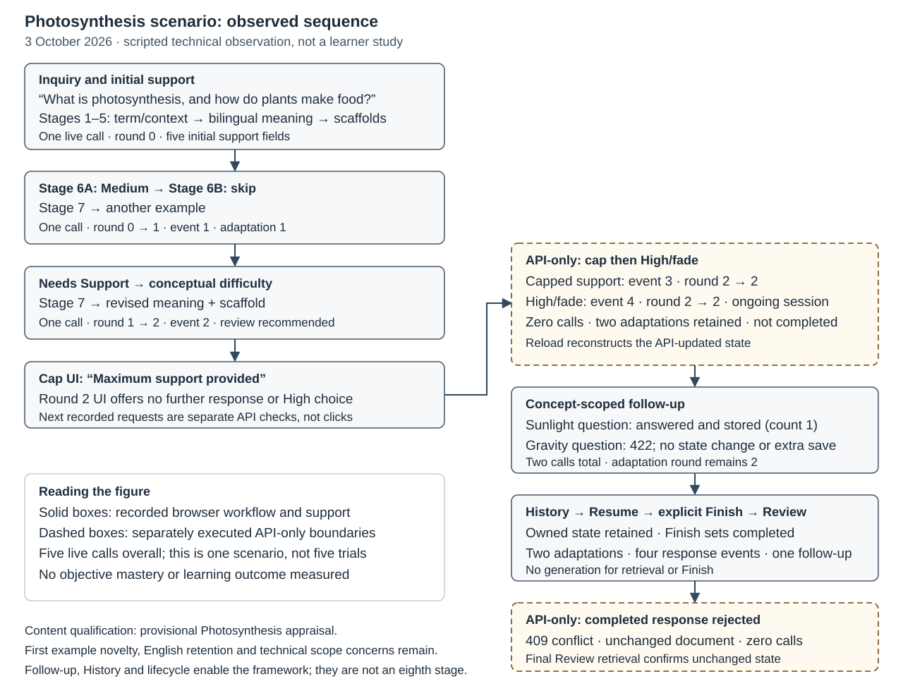

# Evaluating Adaptive LLM Scaffolding for Burmese-Speaking STEM Learners

## Abstract

Burmese-speaking STEM learners may require contextual support for English terminology and unfamiliar concepts. A Context-Aware Adaptive STEM Scaffolding Framework and a bilingual large language model application were evaluated through complementary conceptual and design methods. Conceptual evaluation combined GenAI critique, literature analysis, informed argument and a photosynthesis scenario. Design evaluation comprised functionality and usability assessment, static and dynamic analysis, bounds analysis, simulation, black-box and white-box testing, literature comparison and a live scenario. Application-controlled routing, response persistence and session continuity were supported under tested conditions. Among 91 delivered outputs, 18 were rated pass, 71 partial and two fail. Supplementary assessment of 32 saved outputs identified bilingual errors without revising these ratings. Six usability criteria were rated pass and three partial. The contribution is an evaluated integration of terminology support, structured conceptual explanation and bounded, learner-responsive assistance. Educational effectiveness and the pedagogical suitability of support levels and the two-adaptation limit were not established.

## Keywords

- Adaptive STEM Scaffolding
- STEM Terminology Support
- Burmese-Speaking Learners
- Large Language Models
- Bilingual Learning
- Educational Information Systems

## 1. Introduction

Burmese-speaking STEM learners may need English STEM terms and unfamiliar concepts explained in context, rather than translated word for word. An approach combining terminology support, conceptual explanation and help based on learner responses was evaluated. The proposed support was assessed, but how often learners experience these difficulties and how serious they are were not measured. Three research questions guided the evaluation.

1. RQ1 — How can specialised English STEM terminology be supported for Burmese-speaking learners?
2. RQ2 — How can LLM-based support help learners understand STEM concepts beyond translation?
3. RQ3 — How can LLM-based scaffolding provide structured and adaptive support for Burmese-speaking STEM learners?

Two artefacts were examined. Seven support responsibilities are defined in the Context-Aware Adaptive STEM Scaffolding Framework and implemented in a bilingual large language model (LLM) proof-of-concept application. Learners enter a STEM inquiry, receive structured support, report their support need and can request a revision within a fixed limit. Responses and support history are stored for later review.

Conceptual evaluation included GenAI critique, literature analysis, informed argument and a photosynthesis scenario. Design evaluation included criteria-based inspection, static and dynamic analysis, bounds analysis, simulation, black-box and white-box testing, literature comparison and a fresh scenario. Methods were selected from the analytical, experimental, testing and descriptive categories of Hevner et al. (2004). [Venable et al. (2016)](https://doi.org/10.1057/ejis.2014.36) distinguish evaluation in controlled settings from evaluation in real use. Most activities used controlled tests, scripted inquiries or structured inspection. Behaviour was assessed under these conditions, but usefulness during everyday study was not established. No participant learning experiment or independent expert interview was conducted.

## 2. Conceptual Artefact Evaluation

The framework's responsibilities and design rationale were examined through four methods. Assumptions were challenged through a GenAI interview. Relevant prior studies and their limits were examined through literature comparison. Reasons for the proposed design and possible objections were considered through informed argument. Whether the stages could be applied coherently was examined through a photosynthesis scenario.

### 2.1 Artefact Selection and Evaluation Criteria

Seven responsibilities are coordinated in the framework. These are identifying STEM terminology, interpreting technical context, selecting language support, explaining core meaning, providing scaffolding, collecting learner responses and adapting support. Together, they address the three research questions. Figure 1 shows the original framework before its feedback decisions were clarified using evaluation findings. In the refined design, language support, core meaning or intended context can be reconsidered without adding an eighth stage. The stages represent design responsibilities, not seven separate model calls.

**Figure 1. Context-Aware Adaptive STEM Scaffolding Framework before refinement.**

*Note.* The original framework is shown unchanged. Later refinements allow language support, core explanations and intended meaning to be revisited within fixed limits. These additional routes are not shown in the diagram.

Five criteria were used to assess whether the requirements were addressed and the educational rationale was reasonable (Table 1). Coverage of support responsibilities, relationships between stages, consistency with theory and literature, and use in a scenario were examined. Each method provided evidence within its own limits. Requirement coverage means that necessary support responsibilities are included. It does not mean that exactly seven stages are the only valid design.

**Table 1. Conceptual Evaluation Criteria and Methods**

| Criterion | Evaluation question | Methods |
| --- | --- | --- |
| C1 — Requirement coverage | Does the framework assign responsibilities for terminology, explanation and adaptive assistance? | GenAI critique, literature analysis, informed argument, conceptual scenario |
| C2 — Logical coherence | Are stage relationships, feedback decisions and limited revisiting of earlier stages reasonable? | GenAI critique, informed argument, conceptual scenario |
| C3 — Theoretical consistency | Are task needs, responsive support, gradual withdrawal and self-report limits recognised? | Literature analysis, informed argument, GenAI critique |
| C4 — Literature consistency | Are relevant studies, limits of applying their findings here and unsupported assumptions identified? | Literature analysis, informed argument, GenAI critique as supplementary challenge |
| C5 — Scenario applicability | Can the seven stages be applied meaningfully to a learning situation? | Conceptual scenario, informed argument |

*Note.* These criteria assess whether the framework addresses the support responsibilities required by RQ1–RQ3. They do not measure learning outcomes.

### 2.2 GenAI Interview

Nine fixed questions were asked in a fresh Temporary Chat without browsing. GPT-5.6 Sol with High reasoning was displayed in the interface, but the provider version was not independently verified. The persona of a critical evaluator of a conceptual artefact in information systems research was assigned through the context prompt. Strengths and weaknesses were to be identified, evidence separated from judgements and assumptions, and the supplied artefact assessed before redesigns were suggested. The framework, requirements, theories and photosynthesis scenario were supplied as text. The original framework, not later refinements, was assessed. Responses and their analysis were retained separately.

Responses were grouped as support, concern, missing element, unsupported assumption, suggested improvement or out of scope, then linked to the conceptual criteria. Requirement coverage and support beyond translation were recognised. Risks in self-report, interpretation, explanation quality and adaptation decisions were also identified. Core explanation and additional assistance were distinguished, helping clarify their roles. Suggestions were compared with literature, informed argument and scenario findings before acceptance. The original judgements are retained in Table 2. Confident wording was not treated as proof. The interview challenged assumptions but did not provide expert testimony or evidence of learner benefit.

Interview scope and principal findings are summarised in Table H1.

### 2.3 Academic Literature Evaluation

An existing set of 17 studies was used for conceptual literature evaluation. No new search was conducted. Nineteen findings were linked to the seven responsibilities and concerns raised in the GenAI critique. Each comparison considered what was supported, whether findings from other settings could apply here and what this meant for the framework. The proposed design was evaluated without claiming that no similar approach exists elsewhere.

Native-language technical help has been studied in Sinhala programming education ([Athukorala & De Silva, 2025](https://doi.org/10.7763/IJCTE.2025.V17.1378)). However, those findings cannot be applied directly to Burmese STEM learners. Retaining selected English terms is supported by research on scientific-paper translation ([Kleidermacher & Zou, 2026](https://doi.org/10.18653/v1/2026.findings-eacl.204)). The reported preferences do not establish whether beginners understand those terms. Teacher-guided multilingual interaction in [Kuzu (2026)](https://doi.org/10.1007/s10758-026-09974-7) highlights another limit. Selecting help from a menu without a teacher is not equivalent to teacher-guided support.

Responsibilities for context, language and assistance were supported by these comparisons, but the exact stages, routes and two-round policy were not validated. Some comparisons used secondary summaries rather than original studies. Those comparisons were therefore not independent checks of the original research. Differences in language, learners and setting also limit how far the findings can be applied here.

The conceptual literature comparison is summarised in Table H1.

### 2.4 Informed Argument

Informed argument was applied to the original seven-stage framework shown in Figure 1, before refinement. Each responsibility and its relationships were examined for usefulness, consequences of removal and remaining objections. Scholarly sources were used, following descriptive evaluation in information systems research ([Hevner et al., 2004](https://doi.org/10.2307/25148625), p. 86, Table 2). Later application routes and limits were not treated as features of the original framework.

Whether technology suits its intended tasks should be considered ([Goodhue & Thompson, 1995](https://doi.org/10.2307/249689)). This supports task-focused terminology, explanation and assistance, but task–technology fit was not measured. The wrong concept could be explained without term and context interpretation. Domain terminology requires attention ([Tran et al., 2023](https://arxiv.org/abs/2301.06767v1)), although context can also help determine a term's meaning. The one-way link in the diagram may therefore be insufficient in ambiguous cases. Selected English terms can be useful in scientific translation ([Kleidermacher & Zou, 2026](https://doi.org/10.18653/v1/2026.findings-eacl.204)), but their retention needs a clear rationale. Without conceptual explanation, examples may not communicate the underlying meaning. Structured support has an instructional rationale in considering cognitive demands ([Sweller, 1988](https://doi.org/10.1207/s15516709cog1202_4)), but cognitive load was not measured. Fluent generated content is not necessarily reliable ([Ji et al., 2024](https://arxiv.org/abs/2202.03629v7)).

Support adjusted to learner need, gradual withdrawal and transfer of responsibility are central to scaffolding ([van de Pol et al., 2010](https://doi.org/10.1007/s10648-010-9127-6)). Examples and hints alone do not establish these qualities. The response-to-adaptation link provides a basis for revising scaffolding, but the choice of adaptation is not explained in the original diagram. Self-reported understanding may also be inaccurate ([Dunlosky & Rawson, 2012](https://doi.org/10.1016/j.learninstruc.2011.08.003)). Feedback would be lost if response collection or adaptation were removed, but appropriate support and fading are not established by the loop alone. Term identification and conceptual explanation were rated conceptually justified. The other five responsibilities were justified with qualification. Clearer explanation/scaffolding roles, language-selection principles and adaptation decisions were therefore needed.

The informed-argument summary and scholarly basis are provided in Table H1.

### 2.5 Scenario Evaluation

The photosynthesis scenario was used to assess whether the seven conceptual stages could be applied coherently to a STEM-learning situation, not to test software execution. Photosynthesis and its plant-biology context were identified, and Burmese explanations with selected English terms were provided, illustrating Stages 1–3. Core meaning was explained in Stage 4. Examples, reflection and a hint illustrated Stage 5. Self-report choices represented Stage 6, while an additional rice-plant example represented Stage 7. A return from adaptation to scaffolding was therefore illustrated.

All seven responsibilities had meaningful roles in the scenario. However, reasons for retaining particular English terms and the learner response triggering the additional example were not specified. These gaps limit assessment of language selection and response-to-adaptation decisions. The scenario supports conceptual applicability, not measured learning or optimal adaptation. A separate application walkthrough is reported in Section 3.5.

The conceptual scenario's findings and limitations are summarised in Table H1.

### 2.6 Triangulation, Refinement, and Conceptual Evaluation Summary

Combining terminology, explanation and responsive assistance beyond translation was supported across the methods. Accurate diagnosis of learner need and the best adaptation decisions were not established. In the refinement, Stage 4 core explanation was separated from Stage 5 additional support. Stage 6 was defined as self-reported need. Language, meaning or intended context could be revisited in Stage 7 within a fixed limit. These routes and limits are design rules, not validated teaching recommendations.

Original method judgements and the combined conclusions are separated in Table 2. C1 is fully supported for responsibility coverage, while C2–C5 are partially supported. Some methods used the same literature or scenario. Agreement therefore does not always provide independent evidence. The responsibilities have a reasoned basis, but exactly seven stages have not been shown to be necessary.

**Table 2. Conceptual Evaluation Results**

| Method / object | Recorded finding | Limits of the evidence | Requirement contribution |
| --- | --- | --- | --- |
| GenAI critique of original framework | Support responsibilities fully covered. Stage relationships and theory acceptable with minor issues. Scope mostly complete. Scenario applicable with minor issues | One model critique without browsing. Unclear support decisions and self-report risks remain. No human-expert or learner evidence | RQ1–RQ3 — challenges the proposed terminology, explanation and response/adaptation responsibilities |
| Earlier literature corpus | Nineteen findings linked prior research to terminology support, context interpretation, bilingual explanations and adaptive assistance | Findings from other languages and subjects may not apply here. Exact stages, routes and two-adaptation limit untested by those studies. No new search | RQ1–RQ3 — literature support for the responsibilities, not measured effectiveness |
| Informed argument of original framework | Term identification and conceptual explanation conceptually justified. Five other responsibilities justified with qualification. Stage relationships and remaining objections examined | Language-selection and adaptation rules unclear. Task suitability, support matched to competence and appropriate fading not established | RQ1 — terms/context/language, RQ2 — explanation/support, RQ3 — response/adaptation |
| Conceptual photosynthesis scenario | All seven responsibilities illustrated. Core meaning distinguished from scaffolding. Self-report choices, another example and a repeated check illustrated feedback | Reasons for retained English terms and the response triggering adaptation unspecified. Appropriate matching of support to learner need not established | RQ1 — terms/context/language, RQ2 — explanation/scaffolding, RQ3 — response/adaptation relationships |
| Current synthesis | Responsibility coverage (C1) fully supported. Stage relationships, theory, literature and scenario applicability (C2–C5) partially supported | Combines four methods, not an additional independent evaluation. Improved learning not demonstrated | RQ1–RQ3 — responsibility coverage supported, coherence, theory, literature and scenario support qualified |

*Note.* “fully supported” means the criterion was supported within the evaluation's scope. “partially supported” means support was found, but important gaps remain. Neither rating demonstrates educational effectiveness. Each method's rating scale is retained, not averaged. The interview's fourth criterion concerned scope and limits rather than literature consistency, so those judgements are kept separate.

## 3. Design Artefact Evaluation

Overlapping explanation/scaffolding roles and unclear adaptation decisions were identified in conceptual evaluation. These roles were separated in the application, learner self-reports clarified and support routes limited.

In Stages 1–5, terminology is identified, context interpreted, language support selected, core meaning explained and scaffolding provided. Responses are collected in Stage 6 and support adapted in Stage 7. Stage 6A records overall self-reported need. Optional Stage 6B records the help requested.

High, Medium and Needs Support are offered in Stage 6A. After Medium or Needs Support, Stage 6B offers a simpler explanation, another example, language help, conceptual clarification or intended-meaning correction. Routes follow application rules. If Stage 6B is skipped, another example is provided for Medium and a simpler explanation for Needs Support. High records fade without generating support or using a round. Up to two adaptations are stored. Later responses are recorded without a third adaptation. Finish completes the session separately. Two concept-specific follow-ups are allowed without using adaptation rounds. Language help can display both languages without changing saved preferences. History, Resume and Review restore stored interactions.

Production code was kept unchanged. Local evaluation used macOS 26.6.2, Node.js 26.4.0, npm 11.17.0, Next.js 16.3.4, MongoDB 8.2.6 and Vitest/V8 4.1.11. Live generation used the OpenAI Responses API, configured as `gpt-5.4-mini` and reporting `gpt-5.4-mini-2026-03-17`. Strict structured output and a 20-second timeout were configured, without custom sampling or automatic retry. Live-provider, simulated-provider, database and browser results were kept separate.

### 3.1 FURPS Criteria and Usability Inspection

FURPS covers functionality, usability, reliability, performance and supportability. Thirteen functionality and nine usability criteria were assessed (Table 3), without separate grades for other dimensions. Expectations were defined before testing. Technical behaviour and content quality were rated separately. Scientific correctness, context, language, explanation and adaptation were examined, not output structure alone.

Desktop/simulated mobile layouts, English/Burmese interfaces, light/dark themes and keyboard interaction were inspected in Chrome (Tables F1–F2). Home, preferences, initial support and Stage 6B covered all eight combinations. Other states covered selected combinations. Delayed simulated responses exposed waiting states without external calls.

**Table 3. Functionality and Usability Criteria**

| Criterion | Evaluation focus | Checks | Outcome / RQ |
| --- | --- | --- | --- |
| F1 — Inquiry handling | Session creation and safe rejection of invalid input | HTTP requests, output validation, stored-session retrieval | partial, RQ1–RQ3, enabling |
| F2 — Terminology/context | Intended STEM meaning and correction of misunderstanding | Interpretation/correction routes, simulation, content review | partial, RQ1 |
| F3 — Bilingual support | Preferences, language-help display and useful English terms | Display checks, unchanged saved preferences, terminology review | partial, RQ1 |
| F4 — Structured support | Explanation, example, technical detail, reflection and revealable hint | Output contracts, browser inspection, content review | partial, RQ2 |
| F5 — Learner response | Three self-reports, five optional help choices and valid input combinations | Route/input tests and persisted events | partial, RQ3 |
| F6 — Adaptive support | Rule-based route, useful revision and no generation after High | Route tests, simulation and content review | partial, RQ1–RQ3, depends on route |
| F7 — Adaptation bound | Rounds 0–2 and consistent response/adaptation records | Limit, completion and simultaneous-request database tests | partial, RQ3 |
| F8 — Scoped follow-up | Current concept, unrelated-topic rejection, 500-character and two-question limits | HTTP, service and persistence tests | partial, RQ3 |
| F9 — Persistence | Stored support, responses, interpretations and safe updates | Retrieval and database tests | partial, RQ3, enabling |
| F10 — History | Learner ownership, newest-first ordering and accurate state | HTTP and interface inspection | partial, RQ3, enabling |
| F11 — Review/Resume | Restored session state, completion and limits | Session-transition tests and scenario | partial, RQ3, enabling |
| F12 — Preferences | Saved settings and unchanged preferences for earlier sessions | Validation, save/reload and saved-preference tests | partial, RQ1/RQ3, enabling |
| F13 — Error handling | Controlled failures/recovery without invalid writes | Injected faults, malformed outputs and browser recovery | partial, RQ1–RQ3, enabling |
| U1 — Task clarity | Inquiry purpose and entry evident | Home and keyboard inspection | pass, RQ1–RQ3, enabling |
| U2 — Information structure | Explanation areas and hint distinguishable | Organisation of initial, revised and follow-up support | pass, RQ2, enabling |
| U3 — Interaction clarity | Response choices, skip/back and consequences clear | Two-level response and keyboard inspection | pass, RQ3, enabling |
| U4 — Feedback visibility | Pending/adapting and revised support visible | Loading, routes, fade/cap and recovery | pass, RQ3, enabling |
| U5 — Navigation consistency | History, Review, Resume and preferences reachable | Navigation and modal focus | partial, RQ3, enabling |
| U6 — Bilingual readability | Readable characters and line wrapping without cut-off text | Screen sizes, interface languages, themes and bilingual display | pass, RQ1/RQ2, visual only |
| U7 — State visibility | Self-report, route, limits and completion distinct | Status, events and interpretation displays | pass, RQ3, enabling |
| U8 — Error clarity | Localised error and recovery action understandable | Failure, retry and ownership inspection | partial, RQ1/RQ3, enabling |
| U9 — Consistency | Labels/interactions consistent across configurations | Language, theme, screen width and keyboard checks | partial, RQ1–RQ3, enabling |

*Note.* “enabling” means that an interaction or storage function supports the workflow, not that the educational requirement was met. Bilingual readability refers to visual presentation, not accuracy of meaning. Usability ratings are based on technical inspection, not a participant study or full accessibility audit.

Six usability criteria were pass and three partial. Modal keyboard focus and English-only errors in the Burmese interface caused difficulties but allowed workarounds. A correction label was a cosmetic issue. Infrastructure failures when saving preferences were not assessed.

### 3.2 Analytical Evaluation

Static, dynamic and bounds analysis examined code structure, runtime behaviour and state limits respectively.

#### 3.2.1 Static Analysis

Fourteen checks examined separation of software layers, input validation, learner ownership, storage and error handling. Lint, TypeScript, tests and production-build checks were also completed. An integration test was initially blocked by an environment issue. It passed when rerun without code changes.

#### 3.2.2 Dynamic Analysis

Session state and recovery were examined through thirteen runtime cases and twelve browser captures. Two cases remained partial pass because provider calls were inferred rather than directly counted. A test assertion was corrected, but the first attempt was retained. Fifteen initial requests had a median response time of 3.331 seconds, ranging from 2.593–4.640 seconds. These requests were run one at a time locally, not under load.

#### 3.2.3 Optimisation / Bounds Analysis

Seventeen cases with fixed responses and real MongoDB passed checks for fade, the adaptation limit, completion and simultaneous requests. Updates prevented a third stored adaptation. However, simultaneous requests made two provider calls for one saved adaptation. The limit therefore guarantees neither a spending limit nor the best support amount.

Scopes, timings and observations are summarised in Tables B1–B2.

### 3.3 Simulation

Sixteen fixed STEM inquiries followed three response paths, with seven additional language/context cases (Appendix A). Scientific expectations were defined beforehand. Handlers, services and storage were tested with a live provider and isolated database, excluding browser/public-proxy requests. Of 55 attempts, 44 were technical pass, eight returned controlled ambiguity without sessions, and three were fail. Cancellation was delayed to 52.825 seconds. Two corrections were rejected because interpretations were unchanged. Unreached steps produced no delivered output.

Of 91 delivered outputs, 18 were rated pass, 71 partial and two fail (Tables C1–C3). Assessment used postgraduate STEM knowledge, native Burmese fluency and advanced English proficiency, without an independent second assessor or verified expertise in every domain. Mass was mistranslated as `အစုလိုက်အပြုံလိုက်` rather than `ဒြပ်ထု`. The ion wording `net charge မရှိတော့ဘဲ` denied net charge, contradicting the English definition and later charge statement. Later adaptations did not repair these stored errors.

#### 3.3.1 Supplementary Bilingual Error Assessment

Burmese meaning and clarity were checked in 104 matching English–Burmese passages from 32 selected outputs. Every delivered main concept and all three language-help cases were included. Categories were adapted from [Freitag et al. (2021)](https://doi.org/10.1162/tacl_a_00437) and the [MQM Council (n.d.)](https://www.themqm.org/mqm-pillars/the-mqm-core-typology/). Unexplained English and problems shared by both languages were added as categories. Scientific references supported meaning checks (Table C5).

Four issues across three outputs were labelled major and 27 minor. Major issues changed or seriously obscured scientific meaning. Minor issues reduced clarity but left meaning recoverable. Ten concerns shared by both languages were not counted as translation errors (Tables C4–C5). Gravity and ion errors explain existing fail ratings. Unclear pH wording was labelled major in one passage, but the output remained partial. Original totals of 18 pass, 71 partial and two fail were unchanged.

No independent qualified bilingual review, standard MQM score or validated Burmese glossary was available. Outputs were deliberately selected, not randomly sampled. The findings therefore do not show how common these errors were across all simulation outputs.

### 3.4 Black-Box and White-Box Testing

Public HTTP requests and browser actions were tested in 24 cases. Twenty-one were pass, two partial and one fail (Table D1). New versus repeated support was unassessed in two cases. Missing identity returned an anonymous cookie and HTTP 200 instead of expected HTTP 400, without observed access to another learner's session. A separate check failed because clarification for unresolved ambiguity used an adaptation round.

Routing, ownership, errors, older sessions and simultaneous requests were tested using simulated responses and isolated MongoDB. Commands `npm test`, `npm run test:coverage` and `npm run test:integration` ran 373 unique tests, including 39 route/round combinations. Across 42 files, V8 coverage was 72.54% statements, 76.37% branches, 64% functions and 73.75% lines (Tables E1–E2). Coverage identifies exercised code, not live-content quality. Separate database/browser observations were excluded.

### 3.5 Informed Argument and Scenario

Of eight literature-based arguments, two were supported and six partially supported (Table H2). Design choices were compared with observations and objections following [Hevner et al. (2004)](https://doi.org/10.2307/25148625). Task–Technology Fit supports matching help to tasks, but suitability for learners was not measured ([Goodhue & Thompson, 1995](https://doi.org/10.2307/249689)). Whether support matches learner competence cannot be established from self-report or history ([van de Pol et al., 2010](https://doi.org/10.1007/s10648-010-9127-6)). Controls were introduced in response to generated-content risks ([Ji et al., 2024](https://arxiv.org/abs/2202.03629v7)). Protection of stored state was supported by tests, not those sources. Bilingual errors further limit the conclusions.

Two adaptations, four response events, one follow-up and completion were recorded in a photosynthesis walkthrough. Fifteen technical checks passed (Figure 2, Tables G1–G2). The adaptation limit and post-completion behaviour were checked through application programming interface (API) requests rather than learner clicks. Stored state was restored through Resume/Review. Content remains provisionally partial because of overly broad scientific wording, unexplained nontechnical English and similar examples.

**Figure 2. Recorded Photosynthesis walkthrough.**

*Note.* Solid boxes show browser actions and support. Dashed boxes show API-only checks. High records fade without generation or completion. Finish completes the session. This is one technical scenario, not a learner study. Detailed checks and provisional content findings are reported in Appendix G.

### 3.6 Academic Literature Evaluation

Thirteen literature comparisons examined relevant capabilities, conflicting evidence and limits of applying findings here (Table H3). Sinhala programming assistance provides a native-language example ([Athukorala & De Silva, 2025](https://doi.org/10.7763/IJCTE.2025.V17.1378)). Selected English terms can be retained in scientific translation, but suitability for Burmese beginners remains unproven ([Kleidermacher & Zou, 2026](https://doi.org/10.18653/v1/2026.findings-eacl.204)). Ratings concern literature support, not content quality. Secondary summaries limit some comparisons. Better performance and the fade/limit policy were not validated.

### 3.7 Design Evaluation Summary

Methods, results, limitations and research-question links are summarised in Table 4.

**Table 4. Design Evaluation Results**

| Method | Recorded result | Material qualification | Requirement contribution |
| --- | --- | --- | --- |
| Static analysis | Fourteen structure and verification checks completed | Integration passed on rerun without code changes after an environment issue. Earlier coverage included only services/database access | RQ1–RQ3 — input validation, ownership and storage checks |
| Dynamic analysis | Thirteen runtime cases, twelve-screen manual inspection, fifteen initial timings, median 3.331 s | Provider calls were inferred in two partial cases. A test assertion was corrected, retaining the first attempt. No load testing | RQ1–RQ3 — observed context, support, response and session recovery |
| Bounds analysis | Seventeen cases passed with fixed responses and a real database | Concurrent requests made two provider calls but saved one adaptation. The round limit does not guarantee a spending limit | RQ3 — adaptation limit and stored fade/limit responses |
| Simulation | 55 attempts — 44 technical pass, eight controlled initial ambiguities, three technical fail | One cancellation was delayed. Two corrections returned unchanged interpretations and were rejected. Later steps were not reached | RQ1 — ambiguity/repair, RQ2 — generated support, RQ3 — live response paths |
| Delivered-content assessment | 91 outputs — 18 pass, 71 partial, two fail | One assessor. Mass/weight and ion-charge errors remain in stored text | RQ1 — terminology/language, RQ2 — scientific explanation, RQ3 — adaptation appropriateness |
| Supplementary bilingual assessment | 32 saved outputs, 104 paired passages, four major and 27 minor issues, ten concerns shared by both languages | Exploratory assessment of deliberately selected outputs, no independent qualified review. Original content ratings unchanged | RQ1 — terms/translation meaning, RQ2 — scientific meaning, RQ3 — language-help limits |
| Black-box testing | 24 assessed cases — 21 pass, two partial, one fail | New versus repeated support unassessed in two cases. Missing identity behaved unexpectedly. Remaining ambiguity consumed a round in another check | RQ1–RQ3 — observable contracts, including failed identity/ambiguity expectations |
| White-box testing | Six groups of internal checks passed, 373 unique tests, coverage across 42 files | Mock outputs cannot establish live-content quality. Some code remains untested. Browser/database checks are outside coverage totals | RQ1–RQ3 — internal rules/routes, RQ3 — storage/session recovery |
| usability inspection | Nine criteria — six pass, three partial, 133 captures | Modal focus/translation issues rated severity 2, ambiguity label severity 1. Preference-save failure untested. No participants | RQ1/RQ2 — readable support, RQ3 — understandable response/state interaction |
| Design informed argument | Eight arguments — two supported, six partially supported | Literature supports the rationale, not measured learning or independent confirmation | RQ1–RQ3 — reasons for design choices and remaining objections |
| Fresh photosynthesis scenario | Fifteen technical checks pass, two adaptations, four events, one stored follow-up | High, cap and post-completion checked through API only. Content provisional due to broad claims, unexplained English and similar examples | RQ1–RQ3 — one integrated workflow, with terminology/explanation qualifications |
| Design literature comparison | Thirteen comparisons — one strong, nine moderate, two limited, one contradictory/uncertain | Some studies had limited access or relevance here. Better content and an ideal adaptation limit were not demonstrated | RQ1–RQ3 — relevant prior systems and unvalidated support rules |

*Note.* For technical checks, pass means expected behaviour was confirmed, fail means a required check failed, and partial means evidence or coverage was incomplete. Content ratings follow Table C2. These assessments measure different things and are not combined into one success rate. Later successful checks do not erase earlier failures.

## 4. Results and Interpretation

Technical behaviour, successful delivery, content quality and design rationale are considered separately. Educational effects were not measured.

### 4.1 Consolidated Results

The original combined analysis contains 225 findings, including criteria ratings and further analysis of earlier results. These are not 225 independent tests or participants. Routing, response/adaptation storage and session recovery were supported by external observations, bounds tests and internal checks. Provider calls during fade and at the adaptation limit were directly counted in later checks, extending earlier indirect observations. Follow-up used the corrected concept without changing adaptation state. The findings apply to tested conditions, not every possible use.

The supplementary bilingual assessment was recorded separately. Existing gravity and ion errors, unclear pH wording and further language problems were identified. Ten concerns involved scientific meaning in both languages, not translation errors. Content limitations were clarified, but learning outcomes were not established. The 41 recorded issues and 104 examined passages are not additional independent simulation runs.

Outputs can have the required structure yet contain scientific or Burmese-language errors, or repeat earlier support. The two content fail ratings remain despite better later outputs. Sessions were not created for eight ambiguous initial responses, and three live attempts failed. These results limit confidence in interpretation and adaptation. The combined workflow was demonstrated in the fresh scenario, but content ratings remain provisional and some checks used only the API. Stored state can be protected through error handling without guaranteeing useful help.

All thirteen functionality criteria remain partial. Six usability criteria were pass and three partial. Technical checks alone do not show that educational requirements were met. A design rationale can be supported by literature without demonstrating learner benefit. Bounds tests, coverage, screenshots and content ratings were not averaged because different qualities were measured. Earlier attempts, differences between expected and observed behaviour, and later analyses were kept separate. Content, delivery and interface problems remain unresolved despite support for tested controls.

### 4.2 Research Question Traceability

Twenty-four documented chains linked problems, requirements, questions, objectives and artefacts to evaluation criteria and findings. Methods and outcomes are mapped to the questions in Tables 2–4. The problems, requirements and objectives behind each conclusion are shown in Table 5. All three questions remain partially supported. A complete mapping does not mean that every requirement was met.

For RQ1, a reasonable approach to terminology was provided through context interpretation and selective bilingual support. Concept-correction and language-help routes were implemented. However, corrections returning unchanged interpretations were rejected, and Burmese terminology errors remained. Reliable automatic term extraction and reduced language barriers were not established.

For RQ2, support beyond word-for-word translation was provided through core explanations, examples, reflection and hints. Content quality was limited by incorrect definitions and repeated examples. Understanding and retention were not measured. Explanations were made available, but whether learners understood them was not established.

For RQ3, predefined routes were selected from self-reported need, generation was limited and response history was stored. These controls were supported by simultaneous-request and session-transition tests. Support matched to assessed competence, appropriate withdrawal, transfer of responsibility and an ideal two-adaptation limit were not demonstrated. Self-report, reaching the adaptation limit and choosing Finish are different actions. Completing a session does not show mastery.

Terminology and meaning problems in the bilingual assessment further limit RQ1 and RQ2. Unclear wording and scientific concerns shared by both languages remained after language help, limiting claims about adaptation quality under RQ3. All three conclusions remain partially supported. Earlier ratings are not independently confirmed by reassessing the same outputs.

**Table 5. Research Questions, Artefact Mechanisms and Evaluation Conclusions**

| Problem / issue | Requirement, question and objective | Artefact mechanisms | Support and remaining gap |
| --- | --- | --- | --- |
| Difficult English STEM terms, limited Burmese resources and misleading word-for-word translations | RQ1 — explain English STEM terms in context using Burmese, retaining useful English terms. Objective — support STEM terminology in both languages | Term and context interpretation, selective bilingual explanations and a limited concept-correction route | partially supported — routes implemented, but Burmese errors and unsuccessful corrections limit accuracy. Reliable term extraction and reduced language barriers remain unproven |
| Translation alone does not explain STEM concepts | RQ2 — explain concepts clearly with examples, not translation alone. Objective — support conceptual STEM explanation | Core explanations, examples, technical detail, reflection prompts, hints and revised explanations | partially supported — explanations delivered, but errors and repeated examples remain. Improved understanding and retention were not measured |
| Fixed or unstructured help does not adequately respond to learner needs | RQ3 — provide structured help based on learner responses. Objective — support adaptive scaffolding | Self-reports, optional help choices, predefined routes, two-adaptation limit, stored history and concept-scoped follow-up | partially supported — storage and session recovery checks passed. Delivery, identity and interface issues remain. Competence assessment, appropriate fading and ideal adaptation limit unproven |

*Note.* Full research questions appear in Section 1. Criteria and findings in Tables 1–4 support these conclusions. The problems explain the research motivation, not their measured frequency. Implemented features and successful technical checks do not establish educational effectiveness.

### 4.3 What the Evaluation Does and Does Not Show

The application's routing, storage and session recovery were supported under tested conditions. Consistently accurate content and reliable correction of misunderstood concepts were not established. Following [Venable et al. (2016)](https://doi.org/10.1057/ejis.2014.36), controlled evaluation is distinguished from everyday learner use. Selected cases, variable model responses and limited configurations prevent generalisation to all uses. More detail, not independent confirmation, is obtained by reassessing the same outputs.

No learner study, independent expert review, assessment of suitable support levels or full accessibility audit was conducted. Recovery from preference-save failures and whether support differed from earlier explanations in two cases remain untested. Some literature comparisons used abstracts or summaries, which do not validate Burmese terms. Concurrent requests can make extra provider calls despite the two-adaptation limit. Cancellation can also exceed the configured twenty seconds. Better content than other systems and improved learning were not demonstrated.

The bilingual sample deliberately included outputs with known concerns. Its error counts cannot represent all outputs. Identified issues and proposed Burmese wording require independent qualified review. A major issue in one passage does not replace the original whole-output rating or technical test result.

## 5. Conclusion

Contextual STEM terminology support, explanations beyond translation and help based on learner responses were combined in the framework and application. The design rationale was supported by literature. Routing, storage and session recovery were supported by technical tests and observations under tested conditions. Operation of the design was demonstrated, not consistently accurate or effective tutoring.

All three research questions remain partially supported. Burmese terminology errors, scientific errors, unsuccessful concept corrections and interface problems remain. Some errors were clarified through supplementary bilingual assessment, but original ratings were unchanged and overall translation quality was not established. Support is guided by learner self-reports, not measured competence. Fade is recorded after High without generating support or completing the session. The two-adaptation limit and separate Finish action are design choices, not evidence of mastery or ideal support levels.

Content errors, delivery failures and interface problems should be corrected in future work. Each revised version should be recorded and affected tests rerun. Independent content review and studies with learners are then needed to assess usefulness, learning and whether support matches learner needs.

## References

Athukorala, K. S. N., & De Silva, D. I. (2025). Bridging language barriers in programming education: Java programming assistance tool for Sinhala native speakers. *International Journal of Computer Theory and Engineering, 17*(3), 151–169. [https://doi.org/10.7763/IJCTE.2025.V17.1378](https://doi.org/10.7763/IJCTE.2025.V17.1378)

Clark, M. A., Douglas, M., & Choi, J. (2018). *Biology* (2nd ed.). OpenStax. [https://openstax.org/books/biology-2e/pages/1-introduction](https://openstax.org/books/biology-2e/pages/1-introduction)

Dunlosky, J., & Rawson, K. A. (2012). Overconfidence produces underachievement: Inaccurate self evaluations undermine students' learning and retention. *Learning and Instruction, 22*(4), 271–280. [https://doi.org/10.1016/j.learninstruc.2011.08.003](https://doi.org/10.1016/j.learninstruc.2011.08.003)

Flowers, P., Theopold, K., Langley, R., & Robinson, W. R. (2019). *Chemistry* (2nd ed.). OpenStax. [https://openstax.org/books/chemistry-2e/pages/1-introduction](https://openstax.org/books/chemistry-2e/pages/1-introduction)

Freitag, M., Foster, G., Grangier, D., Ratnakar, V., Tan, Q., & Macherey, W. (2021). Experts, errors, and context: A large-scale study of human evaluation for machine translation. *Transactions of the Association for Computational Linguistics, 9*, 1460–1474. [https://doi.org/10.1162/tacl_a_00437](https://doi.org/10.1162/tacl_a_00437)

Goodhue, D. L., & Thompson, R. L. (1995). Task-technology fit and individual performance. *MIS Quarterly, 19*(2), 213–236. [https://doi.org/10.2307/249689](https://doi.org/10.2307/249689)

Hevner, A. R., March, S. T., Park, J., & Ram, S. (2004). Design science in information systems research. *MIS Quarterly, 28*(1), 75–105. [https://doi.org/10.2307/25148625](https://doi.org/10.2307/25148625)

Ji, Z., Lee, N., Frieske, R., Yu, T., Su, D., Xu, Y., Ishii, E., Bang, Y., Chen, D., Dai, W., Chan, H. S., Madotto, A., & Fung, P. (2024). *Survey of hallucination in natural language generation* (Version 7) [Preprint]. arXiv. [https://arxiv.org/abs/2202.03629v7](https://arxiv.org/abs/2202.03629v7)

Kleidermacher, H. C., & Zou, J. (2026). Science across languages: Assessing LLM multilingual translation of scientific papers. In V. Demberg, K. Inui, & L. Marquez (Eds.), *Findings of the Association for Computational Linguistics: EACL 2026* (pp. 3932–3947). Association for Computational Linguistics. [https://doi.org/10.18653/v1/2026.findings-eacl.204](https://doi.org/10.18653/v1/2026.findings-eacl.204)

Kuzu, T. E. (2026). AI-supported translanguaging processes in primary school: Empirical insights into ChatGPT's role in multilingual interactions. *Technology, Knowledge and Learning*. Advance online publication. [https://doi.org/10.1007/s10758-026-09974-7](https://doi.org/10.1007/s10758-026-09974-7)

MQM Council. (n.d.). *The MQM core typology*. [https://www.themqm.org/mqm-pillars/the-mqm-core-typology/](https://www.themqm.org/mqm-pillars/the-mqm-core-typology/)

Sweller, J. (1988). Cognitive load during problem solving: Effects on learning. *Cognitive Science, 12*(2), 257–285. [https://doi.org/10.1207/s15516709cog1202_4](https://doi.org/10.1207/s15516709cog1202_4)

Tran, H. T. H., Martinc, M., Caporusso, J., Doucet, A., & Pollak, S. (2023). *The recent advances in automatic term extraction: A survey* (Version 1) [Preprint]. arXiv. [https://arxiv.org/abs/2301.06767v1](https://arxiv.org/abs/2301.06767v1)

Urone, P. P., & Hinrichs, R. (2022). *College physics* (2nd ed.). OpenStax. [https://openstax.org/books/college-physics-2e/pages/1-introduction-to-science-and-the-realm-of-physics-physical-quantities-and-units](https://openstax.org/books/college-physics-2e/pages/1-introduction-to-science-and-the-realm-of-physics-physical-quantities-and-units)

van de Pol, J., Volman, M., & Beishuizen, J. (2010). Scaffolding in teacher–student interaction: A decade of research. *Educational Psychology Review, 22*(3), 271–296. [https://doi.org/10.1007/s10648-010-9127-6](https://doi.org/10.1007/s10648-010-9127-6)

Venable, J., Pries-Heje, J., & Baskerville, R. (2016). FEDS: A framework for evaluation in design science research. *European Journal of Information Systems, 25*(1), 77–89. [https://doi.org/10.1057/ejis.2014.36](https://doi.org/10.1057/ejis.2014.36)

## Appendix A. Fixed Simulation Inquiries

**Table A1. Main Simulation Input Corpus**

| Domain | Exact inquiry |
| --- | --- |
| Biology | What is photosynthesis, and how do plants make food? |
| Biology | What is DNA? |
| Biology | What is osmosis? |
| Physics | What is gravity? |
| Physics | What is electric current? |
| Physics | What is momentum? |
| Chemistry | What is pH? |
| Chemistry | What is an ion? |
| Chemistry | What is a catalyst? |
| Computing | What is inheritance in object-oriented programming? |
| Computing | What is an algorithm? |
| Engineering | What is carbon fibre? |
| Ambiguous | What is a cell? |
| Ambiguous | What is current? |
| Ambiguous | What is a network? |
| Ambiguous | What is inheritance? |

*Note.* Each inquiry was attempted once on each path in Table A3, giving 48 main attempts. Seven additional attempts tested language help and intended-concept correction. No session was created after a controlled ambiguous initial response, so later steps were neither executed nor counted as successful. The inquiries were selected for evaluation, not to represent all STEM inquiries or learners. Different text may be generated on another run.

### A.1 Supplementary inputs and response paths

The main inquiries are listed in Table A1. Inputs, technical outcomes and content ratings are linked through case identifiers in the following tables. Each A, B or C suffix identifies a separate run, not a learner.

**Table A2. Supplementary Language and Context Inputs**

| Case | Exact inquiry | Clarification | Language |
| --- | --- | --- | --- |
| SIM-LANG-01 | What is electric current? | Not supplied | bilingual |
| SIM-LANG-02 | What is electric current? | Not supplied | english |
| SIM-LANG-03 | What is electric current? | Not supplied | burmese |
| SIM-CM-13 | What is a cell? | I mean a biological cell | bilingual |
| SIM-CM-14 | What is current? | I mean electric current | bilingual |
| SIM-CM-15 | What is a network? | I mean a computer network | bilingual |
| SIM-CM-16 | What is inheritance? | I mean inheritance in object-oriented programming | bilingual |

**Table A3. Planned Main Simulation Paths**

| Path | Recorded sequence | Purpose |
| --- | --- | --- |
| A | Initial support, High, Finish | Fade without another generated output |
| B | Initial support, Medium with optional help skipped, High, Finish | Default another-example adaptation |
| C | Initial support, simpler explanation, conceptual clarification, cap check | Two adaptations and the stored-round limit |

## Appendix B. Analytical Evaluation Records

Code structure, runtime behaviour and session limits were examined through analytical evaluation. Observed behaviour is distinguished from content quality and guaranteed performance.

**Table B1. Analytical Evaluation Summary**

| Method and scope | Principal result | Important qualification |
| --- | --- | --- |
| Static analysis — 14 checks, supported by lint, TypeScript, build and test verification | Software-layer separation, validation, learner-owned storage and controlled error handling were supported | An integration test was initially blocked by an environment issue. It passed when rerun without code changes. Earlier coverage included services/database access only |
| Dynamic analysis — 13 workflow cases and 12 browser observations | Creation, adaptation, corrected context, concept-specific follow-up, Review/Resume and recovery were observed | Two fade/limit cases remained partial pass because provider calls were inferred rather than directly counted |
| Timing — 15 sequential initial requests across five inquiries | Median 3.331 s, range 2.593–4.640 s | Local initial-generation timing, not load performance or an established service-level target |
| Bounds — 17 cases with fixed responses and a real database | Stored adaptations remained within rounds 0–2, including simultaneous requests | Two provider calls were made for one saved adaptation. The round limit does not guarantee a spending limit |

**Table B2. Illustrative Runtime and Boundary Observations**

| Situation | Observed result | Interpretation |
| --- | --- | --- |
| High self-report | Fade recorded, no adaptation or round increment, Finish remains separate | No additional generated support, not evidence of mastery |
| Further support after round two | Response recorded without a third adaptation | The application enforces its stored-round bound |
| Reload an unfinished session | Adaptations, responses and limit feedback restored | Continuity under the inspected conditions |
| Controlled provider failure and recovery | Safe HTTP 502, question retained, successful resubmission after normal configuration restored | Recovery observed without invalid data being stored |
| Two simultaneous adaptation requests | One update accepted and one rejected as a conflict, but two provider calls | Safe storage updates do not prevent duplicate generation |

## Appendix C. Simulation Results and Content Assessment

Fixed inputs and paths are listed in Appendix A. Artificial identities and an isolated database were used with a live provider. Technical execution, original content ratings and supplementary bilingual findings were assessed separately and were not combined into one score.

**Table C1. Technical Simulation Outcomes**

| Outcome | Attempts | Meaning and noticeable example |
| --- | --- | --- |
| Technical pass | 44 | Expected routes and stored state were confirmed. High generated no output, and adaptations were stored within the two-adaptation limit |
| Controlled initial ambiguity | 8 | Current/network inquiries without context returned ambiguity and created no session. These were not delivered explanations or content pass ratings |
| Technical fail | 3 | An electric-current request was cancelled at 52.825 s despite a 20 s timer. Biological-cell and programming-inheritance corrections were rejected because interpretations remained unchanged |

Only delivered support received content ratings. Fade, limit responses and unreached steps added no outputs. Scientific correctness, contextual relevance, English/Burmese quality, explanation beyond translation and suitability of adaptation were assessed. Each applicable dimension received 2 for adequate, 1 for limited quality/minor issues or 0 for a serious error or missing content. Adaptation was not scored for initial outputs.

**Table C2. Original Delivered-Output Content Ratings**

| Rating | Outputs | Decision rule |
| --- | --- | --- |
| pass | 18 | Every applicable dimension scored 2 |
| partial | 71 | At least one dimension scored 1, with no 0 |
| fail | 2 | At least one dimension scored 0. The gravity and ion initial outputs contained material Burmese errors |

**Table C3. Selected Examples Across Simulation Paths**

| Tested support or boundary | Recorded example | Content or technical judgement |
| --- | --- | --- |
| Initial explanation | A photosynthesis output connected light energy, water/carbon dioxide and sugar production in both languages | Original content pass |
| Another example after Medium | A chloride-ion example used Cl⁻ and explained excess electrons and negative charge | Original content pass. It did not overwrite the failed initial ion definition |
| Simpler explanation | An ion revision clearly restated electron/proton imbalance | Original content partial because little additional help with the concept was provided |
| Conceptual clarification | A photosynthesis revision added energy conversion and a factory analogy | Original content partial. Chemical energy and explanatory vocabulary still needed Burmese support |
| Language help, bilingual preference (SIM-LANG-01) | Electric current was described explicitly as charge per second, but charge/circuit/rate lacked useful Burmese pairing | Original content partial |
| Language help, English preference (SIM-LANG-02) | The bilingual override worked, but Burmese speed wording conflicted with a later correct charge-per-second statement | Original content partial |
| Language help, Burmese preference (SIM-LANG-03) | The revision distinguished current from charge, but both languages retained speed-like wording without a clear quantity-per-time explanation | Original content partial |
| Intended-meaning correction | Cell and inheritance clarifications failed when the returned interpretation did not change | Technical fail. No correction adaptation was delivered for content assessment |
| Fade and cap | No support was generated after High. Requests at the limit added a response record without round three | Technical behaviour only, not additional content ratings |

### C.1 Focused Bilingual Error Assessment

Thirty-two saved outputs were selected using known content concerns. Every delivered main concept, all three language-help cases and selected adaptations were included. All 104 matching passages were examined using categories informed by Freitag et al. (2021) and MQM Council (n.d.). Accessibility and problems shared by both languages were added as local categories. Selection was not random, and earlier findings were known. English was used for comparison, not assumed to be scientifically correct. Scientific references and stored text were checked separately. No approved Burmese glossary or independent qualified verification was available.

**Table C4. Supplementary Annotation Summary**

| Category | Findings | What was assessed |
| --- | --- | --- |
| Meaning / accuracy | 9 | Reversed statements or changed quantities, rates or conditions |
| Terminology | 6 | Incorrect or inconsistent technical terms |
| Omission / addition | 1 | A useful term explanation lost between languages |
| Fluency / script | 8 | Awkward wording and unintended third-language fragments |
| Accessibility / retention | 7 | Unexplained English vocabulary in beginner/language-help support |
| Shared content limitation | 10 | Scientific conditions missing or unclear in both languages, not translation errors |

Of 41 recorded issues, four were major across three outputs, 27 were minor and ten were concerns shared by both languages. Major or minor issues were identified in 21 selected outputs. No specific issue was identified in six outputs, and only shared concerns were identified in five. These were not new pass ratings. The other 59 delivered outputs were not examined here.

**Table C5. Illustrative English/Burmese Findings**

| Example | English excerpt | Burmese excerpt | Assessment | Revision direction |
| --- | --- | --- | --- | --- |
| Photosynthesis, initial explanation | capture light energy and store it as sugar | အလင်းရဲ့ စွမ်းအင်ကို ဖမ်းယူပြီး သကြားအဖြစ် သိမ်းထားတတ်ပြီး | Meaning preserved in the compared passage. Original output pass | Retained English STEM terms were not automatically counted as errors |
| Gravity, simple definition | objects with mass | အလေးချိန်ရှိတဲ့ အရာဝတ္ထုတွေ | major — mass becomes weight | Use ဒြပ်ထု (mass), not weight |
| Gravity, technical definition | interaction between masses | အစုလိုက်အပြုံလိုက်ရှိတဲ့ အရာဝတ္ထုတွေ | major — physical mass is described as a group or collection | Use ဒြပ်ထုရှိသော အရာဝတ္ထုများ |
| Ion, technical definition | acquires a nonzero net charge | net charge မရှိတော့ဘဲ | major — Burmese incorrectly states that net charge is absent | State that net charge is nonzero, not absent |
| pH, simple definition | pH 7 is neutral | pH 7 ဆိုရင် မကြားနေတဲ့ အခြေအနေပါ။ | major under local passage rules — neutrality is unclear and contradicts the correct hint | Use clear neutral wording and specify the 25 °C condition |
| Current, initial language-help case | how much charge is moving each second | charge ဘယ်လောက်မြန်မြန် ရွေ့နေသလဲ | minor — charge quantity per second becomes movement speed | Explain charge amount crossing a point per second |
| Current, English-preference language revision | flow of electric charge | electric charge စီးဆင်းတဲ့ အရှိန် | minor — speed terminology remains although a later sentence gives correct units | Use စီးဆင်းနှုန်း with an explicit quantity-per-time explanation |
| Photosynthesis, conceptual revision | stored chemical energy | သိမ်းဆည်းထားနိုင်တဲ့ chemical energy | minor — meaning preserved, but a key term is not explained in Burmese | Pair chemical energy with ဓာတုစွမ်းအင် |
| Photosynthesis, initial explanation | a green pigment called chlorophyll | အရွက်ထဲက chlorophyll က အလင်းစွမ်းအင်ကို ဖမ်းယူပြီး | minor omission — chlorophyll is retained without the green-pigment description | Explain chlorophyll as an အစိမ်းရောင်ရောင်ခြယ်ပစ္စည်း |
| Current, Burmese-preference initial example | bulb lights up | မီးလုံး روشن ဖြစ်လာတာပါ။ | minor — an Arabic-script fragment interrupts Burmese | Replace the fragment with မီးလုံး လင်းလာသည်။ |
| Current, Burmese-preference language revision | how fast charge is passing a point | charge ဘယ်လောက်မြန်မြန် ဖြတ်သန်းနေသလဲ | shared-content concern — speed-like wording is used in both languages | Revise both versions to charge quantity per unit time |

*Note.* Scientific checks used Urone and Hinrichs (2022, Sections 6.5 and 20.1) for mass, weight and current, Flowers et al. (2019, Sections 2.6 and 14.2) for ions and pH, and Clark et al. (2018, Section 8.1) for photosynthesis. Scientific meaning, not certified Burmese wording, is supported by these sources. Excerpts are copied exactly from saved outputs. Suggested revisions were not applied to stored text. Both gravity issues belong to one failed output. The original pH rating remains partial despite a major passage-level issue. Totals remain 18 pass, 71 partial and two fail. Reused evidence, assessor limitations and deliberate selection prevent claims about overall translation accuracy or learner benefit.

## Appendix D. Black-Box Testing Records

Externally visible behaviour was checked through public HTTP requests and browser actions using controlled provider responses. Of 24 cases, 21 were pass, two partial and one fail. Observations are grouped below, not counted as additional cases.

**Table D1. External Behaviour and Material Qualifications**

| Area tested | Illustrative observation | Outcome or limitation |
| --- | --- | --- |
| Inquiry and structured support | Valid inquiry created retrievable support. Empty/malformed input was rejected. A 1,000-character inquiry was accepted and 1,001 rejected | pass within tested inputs |
| Response routes and bounds | High faded, all five optional help routes and skip were tested, and requests at the limit added no third adaptation | Default/selected adaptation cases remained partial because new versus repeated support was not assessed |
| Follow-up and continuity | Relevant answer persisted without changing adaptation state. Unrelated query was rejected. Two questions were allowed, a third rejected. Review/Resume restored stored history | pass for tested external contracts |
| Preference and error handling | New settings were saved without changing earlier session preferences. Simulated provider/malformed-output failures returned safe errors without invalid writes | pass, not evidence of live-content quality |
| Ownership and absent identity | Foreign sessions were inaccessible, but absent identity returned an anonymous cookie and HTTP 200 empty History rather than expected HTTP 400 | One case remains fail. No foreign-session leak was observed |
| Retained subchecks | No round use was expected for unresolved ambiguity, but a generated clarification used one. Initial browser-check conditions were later corrected | The failed check and earlier observations remain recorded. Rechecks do not erase them |

## Appendix E. White-Box Testing and Coverage

The root application was tested through 361 deterministic tests and twelve isolated MongoDB tests, giving 373 unique tests. The 39 route/round combinations are included in that total. Repeated commands are not additional tests.

**Table E1. Structural Areas Exercised**

| Area | Representative assertion | Recorded result |
| --- | --- | --- |
| Routing and two-adaptation bound | High caused no provider call or increment. Support at the cap created no round three. Optional routes and invalid inputs were checked | Structural group pass |
| Ownership and lifecycle | Other learners' sessions were protected. Repeated Finish caused no further change. Completed sessions rejected responses. Older sessions remained retrievable | Structural group pass |
| Concept-scoped follow-up | Corrected concept/latest support were used. Unrelated questions and exceeded number/length limits were handled without changing adaptation state | Structural group pass |
| Provider and output contracts | Timeout, refusal, missing text, invalid JSON and invalid structured content were rejected before invalid data was stored | Structural group pass |
| Persistence and concurrency | Corrections, responses and adaptations were stored consistently. Competing requests respected adaptation/follow-up limits and ownership | Structural group pass, using real database checks |
| Preferences and language override | Valid settings were saved, invalid writes rejected, earlier session preferences unchanged and both languages displayed for language help | Structural group pass |

**Table E2. Application-Wide V8 Coverage**

| Metric | Covered / total | Coverage |
| --- | --- | --- |
| Statements | 708 / 976 | 72.54% |
| Branches | 627 / 821 | 76.37% |
| Functions | 128 / 200 | 64.00% |
| Lines | 680 / 922 | 73.75% |

*Note.* Coverage includes 42 executable files. Separate database/browser observations are not added to V8 totals. Passing checks and coverage show tested logic, not complete correctness, accurate Burmese or educational effectiveness. Some paths remain untested.

## Appendix F. Structured Usability Inspection

Desktop 1440 × 900 and simulated mobile 390 × 844 layouts, English/Burmese interfaces, light/dark themes and keyboard interaction were inspected. Home, preferences, initial support and Stage 6B were checked in all eight combinations. Other states were checked across selected combinations. Waiting states were inspected using delayed simulated responses without external calls. No participant study, physical-phone test, satisfaction assessment or full accessibility audit was conducted.

Browser captures containing cookies must be kept securely. Sensitive details must be removed and the copies checked before sharing. Recording evidence does not itself give permission to release those captures.

**Table F1. Usability Outcomes and Observed Examples**

| Criterion | Outcome | Illustrative observation |
| --- | --- | --- |
| Task clarity | pass | Labelled inquiry and keyboard submission made the starting action clear |
| Information structure | pass | Explanation, example, technical detail, reflection and hint were distinguishable |
| Interaction clarity | pass | Three self-reports, five optional help choices and skip/back were usable |
| Feedback visibility | pass | Pending/adapting, fade, cap and completion feedback were visible |
| Navigation consistency | partial | History/Review/Resume worked, but keyboard focus was not kept within or restored after the preferences modal |
| Bilingual readability | pass | Burmese characters and mixed-language text wrapped without significant cut-off. Visual readability, not meaning, was checked |
| State visibility | pass | Routes, limits and history were distinguishable, but one ambiguity label was inconsistent |
| Error clarity | partial | Recovery controls worked, but errors were explained only in English within the Burmese interface |
| Consistency | partial | Modal focus, untranslated errors and the ambiguity label remained inconsistent |

*Note.* Six criteria were pass and three partial. Table F2 identifies the material interface issues affecting these ratings.

**Table F2. Material Interface Issues**

| Issue | Task effect | Severity |
| --- | --- | --- |
| Preference modal did not contain or restore focus | Keyboard navigation reached background controls, requiring extra navigation | 2 |
| English-only errors in Burmese interface | Recovery meaning was unavailable in the selected language although retry controls worked | 2 |
| Generic Concept Correction label during unresolved ambiguity | Correction was suggested by the label, although unresolved meaning was accurately recorded | 1 |

*Note.* Severity 1 means a cosmetic issue, 2 a difficulty with a workaround and 3 a blocked task or seriously misleading behaviour. Error presentation after an infrastructure failure when saving preferences was not assessed.

## Appendix G. Photosynthesis Scenario Records

A separate walkthrough was conducted with beginner, guided and Burmese-with-English-term preferences. Fifteen technical checks passed within one session, not fifteen independent scenarios. Two adaptations, four response events, one stored follow-up and completion were recorded.

**Table G1. Scenario Workflow and Observation Boundaries**

| Action | Observed result | Boundary |
| --- | --- | --- |
| Initial inquiry and hint | Photosynthesis/plant biology and five bilingual support fields were created. Hint was revealed | Browser observation with stored-state checks |
| Medium, optional help skipped | Another example was stored at round one | Browser action. Earlier support was largely repeated |
| Needs Support, conceptual clarification | Core meaning and factory analogy revised at round two. Limit and Finish appeared | Browser action. No further response choice was offered |
| Cap and High at cap | Each added a response event without another adaptation or provider call | Separate API checks, not learner clicks. High did not complete the session |
| Relevant/unrelated follow-up | Sunlight question answered and stored. Gravity question rejected without changing the session | Concept-scoped support, not general chat |
| History, Resume, Finish and Review | Stored interaction restored. Session completed through Finish. Further response rejected | Browser recovery plus a separate post-completion API check |

**Table G2. Provisional Scenario Content Assessment**

| Observation | Qualification |
| --- | --- |
| Light energy and material inputs distinguished | Main meaning matched across languages, but wording could wrongly imply that photosynthetic bacteria have chloroplasts |
| Round-two factory analogy clarified making rather than taking food | Earlier support was largely repeated in the first additional example. Understanding was not established by the analogy |
| Burmese support retained useful STEM terms | Nontechnical English such as root, leaf and raw materials also remained. Chemical energy needed an explicit Burmese explanation |
| Sunlight follow-up explained energy for sugar production | One relevant answer does not show that every related or unrelated question would be correctly classified |

Content remains provisionally partial. This walkthrough is separate from the original 91-output simulation assessment and does not erase its failures.

## Appendix H. Supporting Conceptual and Design Evaluations

Evaluation through critique, literature, informed argument and scenarios is summarised below. These activities are not additional software tests or independent learner studies. Scholarly sources and access limitations are explained in Sections 2 and 3.

**Table H1. Conceptual Evaluation Activities**

| Activity and scope | Principal finding | Boundary or refinement |
| --- | --- | --- |
| GenAI interview — nine fixed questions and 47 coded findings | Requirement coverage and support beyond translation were recognised. Self-report, adaptation decisions and overlapping explanation/scaffolding roles were challenged | Critique, not expert testimony. Clearer explanation/scaffolding roles and limited revisiting of earlier stages were informed by the findings |
| Literature comparison — existing 17-study corpus, 19 findings | Contextual terminology, selective language support and structured assistance were justified in principle | Findings from other languages/subjects and secondary summaries have limits. Exact stage relationships and adaptation rules were not validated |
| Informed argument — original seven-stage framework | Term identification and conceptual explanation were conceptually justified. Five responsibilities were justified with qualification. Later refinements were excluded | Tran et al. (2023), Goodhue and Thompson (1995), Sweller (1988), Ji et al. (2024), Kleidermacher and Zou (2026), van de Pol et al. (2010), and Dunlosky and Rawson (2012) support design reasons and objections, not learner outcomes |
| Conceptual photosynthesis scenario | All seven stages applied meaningfully. Core explanation and scaffolding distinguished. Another example illustrated adaptation returning to scaffolding | Language-selection reasons and the triggering learner response unspecified. Applicability illustrated, not measured learning or optimal adaptation |

*Note.* Table 2 reports the final conceptual evaluation synthesis.

**Table H2. Design Informed-Argument Conclusions**

| Mechanism examined | Scholarly basis, design inference and limitation | Conclusion |
| --- | --- | --- |
| Terminology/context and intended-meaning correction | Tran et al. (2023) and Goodhue and Thompson (1995). The intended concept may still be misunderstood or left uncorrected | partially supported |
| Selective bilingual language support | Kleidermacher and Zou (2026) and Goodhue and Thompson (1995). Term retention does not guarantee clear Burmese support | partially supported |
| Core explanation and additional support | Athukorala and De Silva (2025) and van de Pol et al. (2010). Structured content can remain inaccurate or repetitive | partially supported |
| Optional stated-need collection | van de Pol et al. (2010) and Goodhue and Thompson (1995). Stated need is recorded, but competence is not measured | supported for stated-need collection only |
| Limited adaptation and fade | van de Pol et al. (2010). Routing and storage controls work, but suitable support levels and adaptation limits remain unproven | partially supported |
| Concept-scoped follow-up | Goodhue and Thompson (1995), applied to the supporting task. Tested topic limits do not establish accuracy for every question | supported for the tested scoped mechanism |
| History and preference continuity | Goodhue and Thompson (1995), applied to task continuity. Storage works, but interface problems and unmeasured task suitability remain | partially supported |
| Application-controlled boundaries | Controls were introduced in response to generated-content risks described by Ji et al. (2024). Stored-state protection was supported by tests, not directly validated by that literature. Duplicate calls and delivery failures remain | partially supported |

**Table H3. Design Literature Comparison Summary**

| Rationale rating | Comparisons | Interpretation |
| --- | --- | --- |
| strong | 1 | Critical evaluation of specialised/low-resource output was well justified. Output quality was not certified |
| moderate | 9 | Native-language help, structured explanation, multilingual interaction and adaptive support had relevant prior examples, but findings may not apply here |
| limited | 2 | Term-identification and workflow evidence did not establish extraction accuracy or suitability for learners |
| contradictory/uncertain | 1 | Stopping generation after High and the two-adaptation limit were not validated as teaching decisions |

Five previously reviewed systems were included in the thirteen comparisons. No comparison system was newly run. A literature-based rationale, working software and educational usefulness are different claims. Conclusions for each research question and their limitations are mapped in Table 5.
